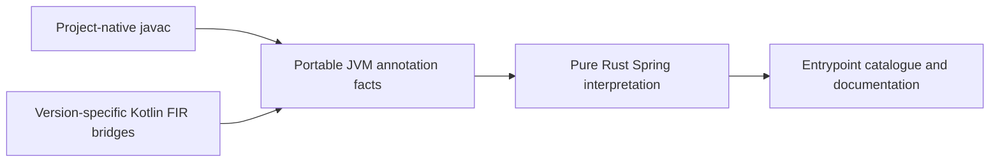

# Built-in analysis modules

Codeclew 0.7 separates compiler observations from framework interpretation.
The registry exposed by `clew capabilities` identifies the Java 17+ adapter,
installed Kotlin compiler workers, and the Spring interpreter. A registered
module reports its implementation digest, compiler/JVM requirements, supported
input/output schemas, and operation scope. Registration does not qualify a
project or grant mutation capability.

```mermaid
flowchart LR
  J[Project-native javac] --> F[Portable JVM annotation facts]
  K[Version-specific Kotlin FIR bridges] --> F
  F --> S[Pure Rust Spring interpretation]
  S --> E[Entrypoint catalogue and documentation]
```

## Compiler boundary

`clew-facts` owns `jvm-annotation-facts/1.0`: resolved annotation uses and
definitions, member defaults and annotations, typed values, use-site targets,
source/binary origins, class hierarchy, method overrides, inherited callable
identity and coverage. Values distinguish constants, enums, class literals,
arrays, nested annotations and unresolved values. Origin offsets, when present,
are compiler UTF-16 code-unit coordinates; the surrounding declaration retains
its own source binding and coordinate contract.

Java uses javac observations. Kotlin has small FIR bridges for 2.1, 2.3 and 2.4;
the installed worker registry determines which are available. The bridges have
no Spring annotation names, alias policy or endpoint registration rules. They
retain existing declaration, call, body and control-flow facts independently.
Annotation definition types and unavailable defaults cannot erase the containing
method's language type facts.

The closed fact contract checks compiler authority, binding to the enclosing
declaration, value/hierarchy depth and record budgets. COMPLETE cannot coexist
with extraction boundaries. Unavailable annotation metadata remains explicit;
for example some Kotlin metadata exposes defaults as expression stubs.

## Framework boundary

`clew-framework-spring` is a Rust library over portable facts. It has no compiler
API, filesystem callback or project mutation operation. One implementation
interprets HTTP mappings, listeners/handlers and schedules, including defaults,
composed aliases, repeatable annotations, inherited methods and concrete bean
context. Existing runtime-activation and outbound-client boundaries remain.

New results have schema `spring-entrypoints/0.2` and authority
`FRAMEWORK_DERIVED`. Their derivation records the module, policy version,
implementation digest, input digest, input schema/compiler authority and
coverage. Consumers keep this provenance separate from compiler observations.
Documentation freshness includes the derived result. Inherited entrypoints
also retain the concrete bean in their documentation identity, preventing two
beans from overwriting observations for the same inherited implementation.

Retained `spring-entrypoints/0.1` compiler projections remain compatibility
inputs. New workers emit portable facts. Missing portable and legacy inputs
produce an extraction boundary in catalogues, not a successful empty catalogue.

## JVM selection

The Kotlin module requirement selects JDK 21 before worker launch.
`CODECLEW_WORKER_JAVA_HOME` is an explicit selection; an incompatible explicit
choice fails instead of silently falling through. Otherwise discovery checks
JAVA_HOME, PATH and platform JDK installations. The generated worker launcher
uses the selected JDK only for the analyzer process.

Native build subprocesses keep the project environment. Maven's reported build
JVM and Gradle's toolchain model determine JDK classes used during analysis.
The analyzer and project JDK fingerprints are separate semantic inputs. The
persistent project-model cache permits a distinct project JDK and invalidates
changed JDK identities or launcher environments.

## Extension scope

This release uses statically linked framework packages and the existing worker
transport. To add a framework, consume a declared portable schema and expose a
separate versioned derivation with bounded output and coverage. If additional
compiler facts are needed, extend the compiler-neutral contract and validate
its bridges before adding framework rules. To add a language/compiler worker,
register its runtime requirements and schemas, then qualify the affected
operations. Do not infer support solely from a version label.

Independent installation of arbitrary modules, a plugin marketplace, dynamic
native libraries and a Kotlin 1.9 compiler pack are outside this iteration.

## Optional C# component

The `csharp` runtime component (`workers/dotnet`) is the first adapter whose
toolchain is optional. The bootstrap registry declares it with executor `DOTNET`,
toolchain key `dotnet` and protocol `codeclew-csharp-analyzer.v1`. Without a .NET
10+ SDK, the component is omitted from the capsule rather than failing it.
`analysis_modules` and the documentation module catalogue then report it as not
installed. The protocol is a one-shot process: a JSON request on stdin, and NDJSON
facts in a private file whose trailer binds the fact count and digest.

```mermaid
flowchart LR
  P[Project SDK design-time Compile] --> W[Roslyn worker]
  W --> F[C# compiler facts + clr-attribute-facts/1.0]
  F --> A[Pure Rust ASP.NET Core interpretation]
  A --> E[Entrypoint catalogue and documentation]
```

`clew-facts` owns `clr-attribute-facts/1.0`: resolved method and containing-type
attributes, inherited attributes allowed by `AttributeUsage`, overridden-method
attributes, and typed constructor and named arguments. Attribute types carry their
base classes and interfaces, so derived routing attributes are recognized
without a compiler. `clew-framework-aspnetcore` applies the default MVC
application model: controller and action discovery, route selectors, template
combination and token replacement. Non-public controllers, conventional routes,
minimal APIs and API-version segment formats remain boundaries, never guessed
routes. C# identities use the portable JVM grammar (`method:class:Ns.Type#Name(desc)`)
so documentation consumes them like javac facts. The erasure of CLR signatures
into descriptor grammar is itself a recorded boundary.

## Current Rust registration seam in the source tree

The Rust source path already builds a Cargo-authorized syntax index before it
registers `RustAdapterV2` with `AdapterRegistry`. The registered handshake
provides the adapter id and digest, Rust language and fact capability, and an
exact toolchain authority. Registry selection checks that language, capability
and toolchain; the adapter checks the compilation identity and emits a
conformant fact stream. Its attempt receipt remains attached to the generated
fact run and marks coverage `PARTIAL`, certainty `UNSURE`, and the Rust name
resolution and cfg/macro verification obligations. This is syntax authority;
it does not claim semantic compiler analysis.

The focused parity test in `crates/clew/src/rust_adapter_v2.rs`
(`registered_rust_adapter_preserves_facts_authority_and_cache_identity`)
exercises that real adapter through the registry. It checks ordered facts and
CAS payloads against direct translation, toolchain rejection before sink
events, scope digest changes, and the compiler-store key derived from the
registered handshake. The existing fake-language registry test in
`crates/clew/src/adapter_v2.rs` covers the generic extension path. This
registration seam does not make Rust parsing or index construction pluggable,
define a public adapter ABI, or change the static module installation limits
described above.
