# Codeclew cold start v2

Status: approved for implementation. Independent adversarial review completed
after four rounds with `PASS` and no remaining P0/P1 findings.

## Goal

Replace request-oriented startup with two resource-aware, recoverable DAGs:

1. a content-addressed runtime-capsule build;
2. an immutable repository analysis generation.

After a generation reaches `READY`, `resolve`, context creation, context
expansion, graph queries, and candidate validation must read immutable CAS
objects. They must never rediscover the project model, walk the repository, or
start a compiler analysis implicitly.

The design is language-neutral. Kotlin 2.1, 2.3, and 2.4 are the first adapters,
not assumptions embedded in the core.

## Observed baseline

The cancelled 2026-08-21 K21 context attempt ran for more than 60 minutes.
Process and Java thread samples found four repeated costs:

- sequential declaration/CFG JSON normalization in
  `index -> declarationJson -> resolvedIdentityTypes -> cfgRecords`;
- repository tree traversal in
  `resolveSymbol -> findFunction -> compilationSourceFiles -> projectModelFiles`;
- a new `analyzeWithK2` from `resolveSymbol` after the full index already existed;
- no progress events before the final bounded JSON response.

The worker used roughly 2 GiB RSS and usually one useful execution thread.
Filesystem traversal often dominated CPU because the checkout contains large
derived output trees. The defect is architectural: model discovery, source
discovery, compiler analysis, and packing are repeated by independent RPCs.

## Normative DAG

```dot
digraph cold_v2 {
  rankdir=LR;

  subgraph cluster_runtime {
    label="Runtime capsule v2";
    R0[label="Filtered source and toolchain inventory"];
    R1[label="FD-safe stage, verify, seal read-only"];
    R2[label="Cargo build"];
    R3[label="One parallel Gradle build for K21/K23/K24"];
    R4[label="Parallel package, hash, verify"];
    R5[label="Atomic capsule publish and lease"];
    R0 -> R1;
    R1 -> R2;
    R1 -> R3;
    R2 -> R4;
    R3 -> R4;
    R4 -> R5;
  }

  subgraph cluster_repository {
    label="Repository generation v2";
    G0[label="Filtered immutable RepositoryInputSnapshot"];
    G1[label="Parallel BuildModelProviders"];
    G2[label="DerivedAnalysisInputManifest"];
    G3[label="CompilationGenerationKey and DAG"];
    G4[label="Parallel AnalyzeGeneration attempts"];
    G5[label="Canonical external sort and shards"];
    G6[label="Completeness receipts and query indexes"];
    G7[label="Atomic READY generation"];
    G8[label="Bounded context and expand reads"];
    G0 -> G1 -> G2 -> G3 -> G4 -> G5 -> G6 -> G7 -> G8;
  }
}
```

## Snapshot authority

Repository capture uses three filtered Git views:

- `git ls-files --stage`;
- `git ls-files --cached`;
- `git ls-files --others --exclude-standard`.

All use fixed negative pathspecs for root and nested `.semantic-thread`.
BEFORE/AFTER streams and captured bytes are compared byte-for-byte. Staged
objects are read through `cat-file --batch`; working bytes, modes, and symlink
targets are captured fd-relative.

The snapshot does not use `git status`, `diff`, `write-tree`, a full index
digest, or HEAD as semantic identity. Base and target OIDs remain publication
authority only. Changes exclusively inside ignored legacy trees cannot affect
retry, keys, outputs, or syscalls against that subtree.

Providers execute only against a sealed disposable snapshot. A provider that
requires Git receives a deterministic synthetic read-only Git view. Escaping,
dangling, absolute, or uncaptured symlinks fail closed. Gitlinks are explicitly
unsupported in v2 until a sealed contract is added.

Provider outputs, generated sources, effective classpaths, plugins, wrappers,
configs, and toolchains are sealed in a `DerivedAnalysisInputManifest` before a
generation key is computed. Pre/post manifest verification surrounds every
provider and adapter attempt. Mutation produces `FAILED_MUTATED_INPUT` and
prevents publication.

## Generic provider and adapter API

Build systems and languages are separate extension points.

`BuildModelProvider` returns generic `CompilationDescriptor` values containing:

- compilation ID and language URI;
- source and generated-source CAS references;
- classpath, toolchain, plugin, and canonical opaque option references;
- dependency compilation IDs;
- build and test operations;
- origin and completeness evidence.

`LanguageAdapter` is selected by language URI, capability URI, and toolchain
constraint. Its v2 RPC surface is:

- `Handshake`;
- `AnalyzeGeneration` (streaming);
- `QueryGeneration`;
- `ValidateCandidate`;
- `Cancel`;
- `Shutdown`.

Transport protobuf is not evidence. The core decodes closed typed structures
and owns canonicalization and CAS publication. A fake `.zeta` provider/adapter
must be dynamically registerable without changing or recompiling the core.

## Multicore scheduler

The supervisor provides:

- an async orchestration lane for child processes, IPC, locks, journals, and
  blocking I/O;
- a bounded work-stealing CPU pool for hashing, validation, normalization, and
  canonicalization;
- resource descriptors with minimum/expected/maximum RSS, CPU range, maximum
  instances, and exclusivity keys;
- dominant-resource fair admission with aging and reservations;
- bounded channels no larger than twice their consumer count;
- streaming backpressure instead of whole-generation buffering.

Available CPU and memory come from host and cgroup authority. Codeclew reserves
`max(1 GiB, 15%)` for the system and admits no more than 70% of usable memory.
Live process-tree RSS updates EWMA estimates. Exceeding hard admission limits
returns typed `RESOURCE_LIMIT` rather than relying on OOM.

Every child has an owned process group/session. Cancellation first requests a
graceful stop, then terminates the verified process group. Linux uses pidfds;
macOS verifies process start time before signaling. Gradle is invoked once with
parallel K21/K23/K24 tasks and no daemon. JVM heap is derived from the admitted
reservation with native headroom; a fixed 2 GiB heap is not a contract.

## Deterministic CAS

Immutable objects include:

- `RepositoryInputSnapshot`;
- `BuildModel`;
- `DerivedAnalysisInputManifest`;
- syntax, semantic, relation, diagnostic, and query shards;
- `GenerationManifest`;
- `CompletenessReceipt`.

Canonical evidence v1 uses ordered fields, explicit defaults, NFC UTF-8, no
floats, no untyped maps, and no unknown fields. Parallel producers write sorted
runs. A deterministic external merge orders by `FactKey` and greedily packs
exact canonical records into shards no larger than 8 MiB. Job count and arrival
order cannot affect shard boundaries or digests. `jobs=1` and `jobs=N` must
produce byte-identical objects and generation digests.

CAS writes use directory authority, `openat2` or component-by-component
`openat(O_NOFOLLOW)`, owner/mode validation, same-filesystem temporary files,
file fsync, atomic rename, and parent fsync. Reads rehash content while holding a
shared lease. Corrupt objects are quarantined atomically.

## Incremental generations and BTA24

A stable compiler-store key identifies adapter, toolchain, and build config.
Immutable `READY` generations form parent/delta chains. Reuse requires
authoritative per-file and cross-boundary receipts. Classpath, config, plugin,
or toolchain changes force a full generation. Unknown invalidation forces full
analysis or a non-complete result; it can never produce false `COMPLETE`.

K24 BTA implements this generic generation/delta contract. Compaction publishes
a new immutable generation and never mutates parents. Compiler output from a
crashed attempt remains attempt-private and cannot be reused. Only verified
snapshot, model, and derived-manifest objects may survive retry. Rust
normalization starts only after a sealed `AnalysisAttemptComplete`.

## Completeness and conditional evidence

Each required domain has an independent vector:

- support: `SUPPORTED | UNSUPPORTED`;
- coverage: `COMPLETE(scopeDigest) | PARTIAL(observedScopes, boundaries) |
  UNKNOWN`;
- certainty: `VERIFIED | UNSURE(checkSet)`;
- canonical obligations.

Meet/union operations are associative, commutative, idempotent, and never
upgrade evidence. `UNKNOWN` absorbs; complete evidence combines only for the
same scope digest. Publication requires every required domain to be supported,
complete for the expected scope, verified, and obligation-free. Other results
may compile and test but finish publication-blocked.

## Lifecycle and observability

Generation ledger states are:

`CREATED -> SNAPSHOTTED -> MODELED -> ANALYZING -> FINALIZING -> READY`

with terminal `FAILED` and `CANCELLED` states. One leader exists per generation
key; waiters attach. Model and compiler run exactly once per uninterrupted
attempt. A `READY` generation references exactly one sealed successful compiler
stream. Retry counts are explicit.

Progress events go to stderr at every transition and at least every five
seconds. They report phase, queued/running/done units, hits/misses, CPU, RSS,
bytes, retries, and resource waits. Stdout remains the bounded final result.

Raw child output is bounded in memory. A streaming sanitizer persists only
allowlisted relative or tokenized diagnostics. Unknown lines become source,
severity, digest, and byte count; raw bytes are discarded. Synthetic secrets,
personal paths, and binary output must never appear in persisted state.

## State, threat model, and GC

All v2 state lives only in `CODECLEW_HOME/v2`. v2 never lists, probes, imports,
mutates, or deletes v1 namespaces. Capsule adapters are trusted
content-addressed code. PROJECT_NATIVE build scripts are user-authorized and are
not claimed to be sandboxed from HOME or network. EXTERNAL remains sealed.

The core alone can publish CAS objects; adapters receive no CAS publication
authority. Candidate validation operates on an immutable
`CandidateInputSnapshot`, not a mutable worktree path.

GC roots include runtime leases, sessions, run ledgers, generation references,
and retained candidate Git refs. Marking occurs under a GC lock. Unreachable
objects move to quarantine after a grace period and are deleted only with no
leases. v2 GC never enumerates v1.

## Implementation order

1. P0: schemas v2, current trace, baseline, conformance properties.
2. P1: StateAuthority v2, CAS, leases, quarantine, GC roots.
3. P2: async resource DAG, journal, progress, cancellation.
4. P3: generic provider/adapter registry and fake-language conformance.
5. P4: isolated parallel sealed runtime-capsule DAG.
6. P5: filtered repository capture and materialization.
7. P6: model providers and derived manifests.
8. P7: streamed analysis protocol and canonical external sort.
9. P8: Kotlin 2.1/2.3/2.4 `AnalyzeGeneration` adapters.
10. P9: immutable query indexes and bounded context readers.
11. P10: incremental generations and BTA24.
12. P11: candidate snapshots, validation, cancel/resume.
13. P12: atomic production cutover and deletion of v1 production flow.
14. P13: acceptance, benchmarks, paired comparison, push, and CI.

## Release gates

Correctness covers clean/dirty repositories, Kotlin 2.1/2.3/2.4, Gradle,
Maven, EXTERNAL, concurrent mutation, provider sharing, fake adapter, tamper,
symlink/fd races, candidate authority, and completeness no-upgrade properties.

Lifecycle covers cancellation in every state, crash/retry accounting, one
leader per key, no surviving process tree, and GC-reader races.

Privacy and legacy tests require arbitrary tracked/untracked root or nested
`.semantic-thread` content to make no syscall/key/output difference. Synthetic
secret and path emitters may persist only digests.

Efficiency gates require exact model/compiler/source-scan counters, no duplicate
repository walks, shards no larger than 8 MiB, bounded queues, memory admission,
no OOM, and progress silence below five seconds.

Pinned multicore corpora include runtime Codeclew, at least twelve independent
compilations, and one K24 monolith. On at least eight physical cores:

- runtime multicore wall time is at most 0.65 of `jobs=1`;
- multi-compilation generation is at most 0.60 of `jobs=1`;
- all output digests are identical;
- the monolith publishes an Amdahl work/span report and proves exactly one
  sealed compiler stream instead of claiming a false parallel ratio.

Warm gates remain:

- launcher p95 <= 1 second;
- session open p95 <= 2 seconds;
- context create/expand p95 <= 30 seconds;
- K24 unchanged internal p95 <= 300 ms;
- K24 unchanged end-to-end p95 <= 2 seconds;
- no Cargo, rustc, Gradle, Maven, source scans, cache copies, or legacy probes.
