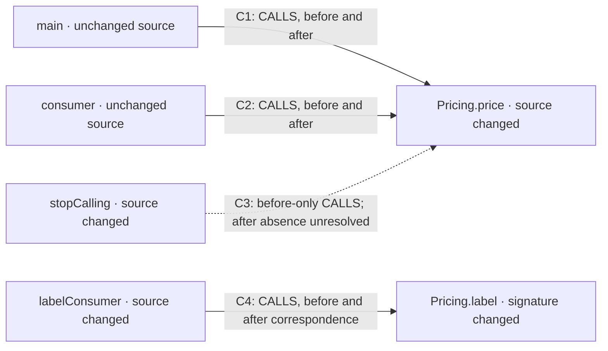

# Explain saved edits before committing

This is an agent-authored explanation of a retained Kotlin qualification result,
not a runtime trace. The development branch implements the workflow; no new
packaged release is implied.

Download and open the [interactive offline report](../../site/working-tree-example.html).
Its nodes and arrows open the before/after code and claims. The
[machine-readable explanation](../../site/evidence/working-tree-example.json)
contains complete claim IDs, compiler fact references, byte anchors and snapshot
bindings. [Qualification measurements](../../site/evidence/working-tree-qualification.json)
record the executed checks separately from the static findings below.

## The observed change

`Pricing.price()` changes from `1` to `3` in the saved file while the staged
version is `2`. `Pricing.label(Int)` becomes `Pricing.label(Long)` and its direct
consumer is edited to pass a Long. A call is removed from `stopCalling()`.



Arrows describe compiler relations in the selected `:/main` compilation; they do
not establish execution order, runtime failure or test coverage. C1/C2/C4 are
observed on both sides. C3 retains its before evidence and stays `UNRESOLVED` for
the after claim because relation coverage is partial. The four callers are
verification candidates, including callers whose own source is unchanged.

| Claim | Retained edge ID | Authority |
| --- | --- | --- |
| C1 | `sha256:4e5ad693be3c13e9c968dfdf03b687ec55eb8a23542531b704cc0fcff840cdfe` | Compiler relation; affected-candidate interpretation is static-derived. |
| C2 | `sha256:a7d8626d5041c5fc54e5ccc8fdc57b9df6e8e0b8fdf4738ec95c57db9105623e` | Compiler relation; unchanged caller text does not prove unchanged behavior. |
| C3 | `sha256:48dc9df2efa648f3977feeb40f9ef6d335b116f67ed3202e9b919bb997769e97` | Before compiler relation; after claim unresolved. |
| C4 | `sha256:77ed3d25c12edf29e4ff87c2cf11bfe047458f8d7e60e28950e327961ee9523c` | Compiler relations joined through explicit declaration correspondence. |

These are all four retained direct edges in this fixture report. Its twelve
nodes also include changed declarations without a resolved direct relation.
Thirteen unresolved relations remain visible in the machine-readable evidence.
This is not a whole-repository no-impact conclusion.

## Exact source behind C2 and C3

In `src/main/kotlin/Price.kt`, the changed callee is:

```kotlin
// Before, bytes 37–57
fun price(): Int = 1
// After, bytes 37–57
fun price(): Int = 3
```

C2's caller retains this exact declaration on both sides, at bytes 105–146 before
and 106–147 after:

```kotlin
fun consumer(): Int = Pricing.price() + 1
```

C3's caller changes from bytes 194–234 before to 196–222 after:

```kotlin
// Before
fun stopCalling(): Int = Pricing.price()
// After
fun stopCalling(): Int = 0
```

The snapshot bindings are:

- Before: `sha256:9f11f44b1c03257734891f488fc95321d22ad4c1f01f5ad023f66540e091e6d1`.
- After: `sha256:25c0338831404941d58ab252b4fdb0e95aa7abdca43cea2537c615226cd35ab7`.
- Comparison: `comparison:sha256:7a4fdee8c247753f345530f128e961b669b428f988b11fcb6084468d7d691e05`.

The exact retained windows and CAS content references are in `sources` in the
linked JSON. The fixture and comparison retention root were collected after the
qualification. The standalone report remains readable; these old IDs are not
live CLI handles and the uncommitted bytes have no fabricated commit URL.

## Repeat the workflow

```sh
clew change inspect --repo <repo> --target-ref <branch> \
  --language kotlin --profile kotlin-jvm-gradle-analysis \
  --compilation :/main --working-tree --base HEAD
clew change graph --comparison <returned-id>
clew change render --comparison <returned-id> --output <new-report.html>
clew change check-freshness --comparison <returned-id>
clew change source --comparison <returned-id> --node <returned-node-id> --side after
clew change forget --comparison <returned-id>
```

Use discovered project-specific compilation IDs. Tests must be selected
explicitly. The separate main-plus-test qualification found a direct
`PriceTest.kt` relation, but inspection never executes tests. Rust follows the
same retained-source workflow with syntax authority and unresolved semantic
impact.

Keep validity, freshness and coverage separate. A subsequent saved edit produces
`LIVE_CHANGED` while retained source remains valid. Repeat rendering produces
identical bytes without a compiler or build tool. Capture a new comparison to
explain current edits, and select relevant project checks rather than treating
a relation count as sufficient validation.
