# Codeclew Agent-Development Roadmap

## Document authority

- **Status:** approved execution sequence; G0 is in progress.
- **Date:** 2026-08-27.
- **Baseline:** `59cde2cf114f9bf46af5e112704514725ed981ac` on `main`.
- **Objective:** prove a locally useful agent-development workflow that preserves
  evidence from intent through documentation, coordinates changes across local
  repositories, and adds compiler-backed language profiles without overstating
  certainty.
- **Execution rule:** finish one narrow slice and its Definition of Done before
  starting the next. A plan update, harness extension, or extra end-to-end run is
  not progress by itself.
- **Progress control:** at least once per hour, record one newly accepted artifact,
  test result, measurement, or removed blocker. If none exists, stop the current
  line and reduce the next slice.

This document is the execution authority for work after the completed Kotlin
multi-service descriptor implementation. Existing plans remain historical design
and evidence records; they do not override the ordering or completion gates below.

## Product result

The target workflow lets an agent:

1. open an evidence-bound development record for a concrete intent;
2. inspect and change one or more explicitly selected local repositories;
3. retain a trace from requirements to facts, operations, validation, and normal
   repository documentation;
4. prepare all repository candidates before updating any target ref;
5. validate the combined candidate state and optionally bind observed scenario
   receipts;
6. publish in a declared order, recover by roll-forward after partial publication,
   and never claim cross-repository atomicity;
7. use the same bounded semantic envelope for Kotlin, Java, TypeScript/JavaScript,
   and, if its artifact-fit gate passes, C#; and
8. demonstrate a measurable advantage over an equal-budget default local agent.

## Current proven baseline

- The `./clew` RELEASE launcher reports version `0.2.4` and `PILOT_READY`.
- Kotlin 2.4.10 Gradle supports compiler-backed mutation.
- Kotlin 2.4.0 Gradle and Kotlin 2.3.0 Maven are read-only previews.
- Python and Rust provide conditional syntax-backed mutation with native
  validation and explicit obligations.
- Multi-repository threads provide read-only composition.
- The S4K harness, its fast self-tests, macOS Seatbelt adapter, descriptor gate,
  and shape-oracle builder exist. No measured S4K pilot has completed.
- The original private S4K-R1 corpus and benchmark were never tracked and are no
  longer available. Their public digests remain historical evidence and must not
  be overwritten or represented as reproducible inputs.

These facts do **not** yet prove an evidence-native development record,
coordinated multi-repository mutation, Java/TypeScript/C# support, or an overall
advantage over default agent use.

## Product and authority invariants

1. **Facts before claims.** Exact claims require an exact source authority.
   Declared topology, lexical matches, partial projections, and runtime
   observations keep distinct certainty labels.
2. **No certainty promotion by aggregation.** Combining several conditional facts
   never makes them exact.
3. **One-repository authority remains independent.** Each repository owns its
   session, immutable plan, candidate, validation, publication, and recovery.
4. **No distributed-atomicity claim.** A workspace coordinates a saga; it does not
   pretend that Git refs in separate repositories update atomically.
5. **Prepare before publish.** No member ref changes until all required candidates
   and the combined candidate view are ready.
6. **Normal documentation is part of the change.** Canonical README, ADR, runbook,
   and API-documentation edits are ordinary planned writes. Generated dossiers
   and graph overlays are deterministic projections, not a second canon.
7. **Private inputs remain private.** Absolute paths, repository names, source
   bodies, credentials, raw model output, and private benchmark oracles never enter
   Git or public evidence.
8. **Warm means warm.** A warm measurement may not invoke Cargo, Rustc, Gradle,
   Maven, Java/Kotlin workers, target-project processes, network access, or cache
   copying unless that measurement explicitly qualifies a different contour.
9. **No framework semantics in core.** Spring, Kafka, OpenAPI, Launchpad, and other
   domain knowledge enter through typed providers and receipts, never through
   hard-coded core service identities.
10. **Publication is explicit.** Preparation never grants publication authority;
    checked target authority and user-approved publication remain separate.

## Execution graph

```dot
digraph codeclew_agent_development_roadmap {
  rankdir=LR;
  node [shape=box];

  G0 [label="G0\nS4K-R2 benchmark gate"];
  M1 [label="M1\nMissionAuthority + ChangeSpec"];
  M2 [label="M2\nEvidence-native Development Record"];
  W1 [label="W1\nThin Workspace\n2-4 local repositories"];
  L1 [label="L1\nCommon semantic envelope"];
  J1 [label="J1\nJava read-only profile"];
  C1 [label="C1\nKotlin-Java convergence gate"];
  W2 [label="W2\nPrepare-all + AfterWorkspace"];
  W3 [label="W3\nScenario receipts"];
  W4 [label="W4\nOrdered publish saga + recovery"];
  T1 [label="T1\nTypeScript compiler profile"];
  T2 [label="T2\nJavaScript authority modes"];
  P1 [label="P1\nPolyglot local pilot"];
  CS0 [label="CS0\nC# artifact-fit gate"];
  CS1 [label="CS1\nRoslyn profile"];
  Q1 [label="Q1\nDefault-vs-Codeclew qualification"];

  G0 -> M1 -> M2 -> W1;
  M2 -> L1 -> J1;
  W1 -> C1;
  J1 -> C1;
  C1 -> W2 -> W3 -> W4;
  W2 -> T1 -> T2 -> P1;
  W4 -> P1;
  P1 -> CS0;
  CS0 -> CS1 [label="PASS"];
  CS0 -> Q1 [label="STOP/DEFER"];
  P1 -> Q1;
  CS1 -> Q1;
}
```

## G0 — Re-freeze and run S4K once

### Why this comes first

The existing Kotlin thread is the only implemented compiler-backed
multi-repository analysis contour. Measuring it once prevents the roadmap from
building record, workspace, and language abstractions around an unproven value
hypothesis.

### S4K-R1 disposition

S4K-R1 remains identified by its 2026-08-25 date and historical corpus and
benchmark digests. The missing private files are not reconstructed from public
aggregate evidence. Existing R1 evidence is not edited, imported into R2, or used
as an R2 oracle.

### S4K-R2 refreeze protocol

R2 is a direct versioned cutover, not backward compatibility:

1. Select 11 distinct, clean local Kotlin repositories and bind exact Git
   revisions before authoring tasks. Every repository must pass current Codeclew
   admission for the read-only Kotlin descriptor contour.
2. Freeze the existing experiment shape: 10 tasks, 8 provider/consumer pairs,
   20 critical sides, 20 alternating Default/Codeclew arms, and the existing
   three scenario classes. Do not add tasks merely to improve a metric.
3. Author each task from an existing code relationship. Independently record at
   least one approved file and compiler-visible declaration per side. Build the
   74 manual-verification obligations from the frozen CONTRACT/REQUEST/RESPONSE
   profiles before any arm runs.
4. Store `corpus.json`, `benchmark.json`, shape oracle, raw outputs, and reviewer
   manifests only below a new mode-0700 private root; files are mode 0600.
5. Introduce R2 schema/date/digest constants explicitly. Keep R1 public evidence
   immutable and publish R2 aggregate evidence under a new filename and schema.
6. Freeze model, reasoning effort, prompt profiles, answer schema, resource
   budgets, executable digests, alternating order, and scoring before the first
   paid arm.
7. Run fast self-tests and exactly one no-paid preparation/dry run. A dry-run
   failure may be fixed and prepared again because no model arm has run; every
   material harness change requires a new authority and review.
8. After paid admission, execute exactly one 20-arm experiment. There is no retry,
   resume, result repair, or task substitution. Cancellation, ambiguous
   accounting, residual processes, or authority drift makes that root terminal
   and quarantined.
9. Run the existing 30-invocation warm audit, create the private draft, obtain the
   independent value verdict, and project a privacy-safe aggregate.
10. Record PASS or the exact failed gates. A failure is a product finding, not
    permission to tune the corpus or rerun the paid experiment.

The R2 harness change is deliberately minimal: version/date/digest authority and
new aggregate identity. It must not add new metrics, recovery machinery, task
classes, or language support without evidence from the measured failure.

### S4K-R2 adoption criteria

- 10/10 tasks have both declared members and all 20 sides remain critical;
- top-10 approved-file recall is at least 80%;
- exact descriptor claims have zero false positives;
- every required manual-verification category is named;
- Codeclew passes at least as many tasks as Default and has no critical member
  miss;
- median noncached input tokens are at least 30% lower than Default and median
  opened-file count is no greater;
- warm p95 is at most 10 seconds and the forbidden-process/network/cache-copy
  audit is clean;
- public evidence contains no private paths, names, source, packages, or
  credentials;
- implementation and value review have no unresolved P0/P1 finding.

### Definition of Done

- New private corpus and benchmark pass closed-schema, path, revision, Git blob,
  and digest validation.
- The no-paid preparation succeeds under a fresh private experiment root.
- Exactly 20 paid arms and 30 warm invocations finish under one sealed authority.
- A new checked-in R2 aggregate passes its public verifier.
- The outcome is stated narrowly as qualified or not qualified; no failed gate is
  hidden and R1 evidence is unchanged.

## M1 — Mission authority and ChangeSpec

### Practical purpose

Agents currently receive context, plans, runs, and explanations, but those
objects do not form one durable answer to “why was this changed and what proves
it?”. M1 adds the smallest authority that binds those existing immutable objects
without creating a second transaction system.

### Slice

- `MissionAuthority`: mission ID, exact member sessions, target authorities,
  runtime/profile authorities, and append-only event head.
- `ChangeSpec`: intent, requirements, non-goals, acceptance criteria, and docs
  policy, each with stable IDs.
- Events bind existing context, plan, run, explanation, candidate, and validation
  IDs by digest; events never copy mutable projections as authority.
- Public surface: `mission open`, `mission inspect`, `mission status`, and
  `mission close`. Mutation still uses existing one-repository commands.

### Definition of Done

- Replaying the append-only events yields byte-identical mission status.
- Changing any bound session, target, spec, or event byte changes authority.
- Missing, stale, foreign, or terminal member authority fails closed.
- Stdout is bounded and path-free; full records stay in private managed state.
- Unit tests cover create-once, duplicate/idempotent append, truncated event,
  foreign authority, and concurrent append.
- One real Kotlin task retains a requirement-to-context-to-plan-to-run trace.

## M2 — Evidence-native Development Record

### Practical purpose

M2 turns the mission from a ledger into a reviewable development artifact.
Documentation becomes grounded in facts and validations instead of a narrative
written after the code has changed.

### Slice

- Typed links: requirement -> claim/evidence -> operation -> validation -> docs.
- Claim certainty: `EXACT`, `OBSERVED`, `DECLARED`, `CONDITIONAL`, or `UNSURE`.
- The agent writes explanations; Codeclew validates references, source authority,
  freshness, coverage, and certainty. It does not generate prose in the core.
- Canonical docs are planned repository writes. A deterministic dossier and DOT
  overlay are generated from the record for review and handoff.
- A docs policy states which requirements need canonical documentation and which
  may remain only in the dossier.

### Definition of Done

- Every changed production file and acceptance criterion is either linked to
  evidence/validation/docs or appears as an explicit unresolved obligation.
- Selecting a dossier graph node yields node-specific evidence, not one shared
  evidence block.
- A stale source or validation invalidates only dependent claims and the aggregate
  readiness status becomes conditional.
- Generated Markdown/DOT are deterministic and contain no absolute paths.
- On a held-out set, first-pass complete development records improve by at least
  20 percentage points, docs/verification recall reaches 90%, false
  CURRENT/VERIFIED claims are zero, handoff inspection cost falls 30%, and
  Codeclew overhead stays within 20%.

## W1 — Thin multi-repository Workspace

### Practical purpose

A thread answers read-only questions but does not define a durable development
unit. W1 binds two to four explicitly selected missions/sessions so later
language and transaction work share one composition boundary.

### Slice

- `WorkspaceCatalogProvider` resolves an explicit local manifest to exact,
  path-free member aliases and session authorities.
- `WorkspaceAuthority` binds ordered members, declared dependency edges, and the
  mission/ChangeSpec authority.
- `workspace inspect` and `workspace context` compose existing facts by reference;
  no mega-index and no automatic repository discovery.
- Independent certainty axes are preserved:
  `DECLARED_CATALOG`, `COMPILER_SHAPE`, `VERIFIED_ARTIFACT_OWNERSHIP`,
  `CONTRACT_VERIFIED`, `OBSERVED_RUNTIME`, and `UNKNOWN`.

### Definition of Done

- Two to four clean local repositories open as exact independent sessions and one
  deterministic workspace.
- Member ordering does not change authority, but any member/edge/revision change
  does.
- Closing the workspace never closes, mutates, publishes, or collects a member.
- Context respects one global byte/fact/file budget and retains member evidence
  authorities.
- Required-member recall is at least 90% with zero critical miss on a small
  frozen local set.

## L1 — Common semantic envelope

### Practical purpose

Language adapters need a small shared vocabulary for composition, evidence, and
documentation. They do not need one universal type system.

### Slice

The common envelope contains only `Symbol`, `DeclarationShape`, `Relation`,
`SourceAnchor`, `Boundary`, and `ChangeObservation`. Each fact carries language,
extractor, compilation, revision, evidence, certainty, and completeness authority.
Language-specific payloads remain opaque and versioned.

### Definition of Done

- Existing Kotlin facts project losslessly into the envelope.
- Unknown language-specific fields round-trip without being interpreted by core.
- Cross-language composition cannot promote certainty or invent a relation.
- Envelope queries remain bounded and deterministic.

## J1 — Java read-only profile

### Practical purpose

Java is the highest-value adjacent language because Kotlin services routinely
depend on Java declarations and share Gradle/Maven/JDK infrastructure.

### Slice

- JDK 21, Gradle and Maven model extraction through project-native launchers.
- Compiler-backed types, methods, constructors, fields, annotations as syntax,
  call/type-use relations, source anchors, and explicit unresolved boundaries.
- No Spring meaning, HTTP equivalence, generated-code ownership, or binary/source
  compatibility verdict in v1.
- Read-only first; mutation is not admitted by J1.

### Definition of Done

- At least 10 real Java tasks reach exact symbol/shape accuracy >=95%, top-10
  relevant-file recall >=80%, and zero false exact relation claims.
- Gradle and Maven fixtures plus real repositories pass cold, incremental,
  unchanged, corruption, and cancellation tests.
- Warm query p95 is <=10 seconds and stdout <=64 KiB.
- An unsupported build or unresolved classpath produces a typed boundary rather
  than syntax-backed exactness.

## C1 — Kotlin/Java convergence gate

### Practical purpose

The JVM value is cross-language navigation, not two isolated indexes. C1 proves
that both adapters describe the same JVM identities without confusing source
syntax with callable or binary compatibility.

### Definition of Done

- Kotlin callers resolve selected Java declarations and Java callers resolve
  selected Kotlin declarations under one exact classpath authority.
- Overloads, static/instance members, constructors, nullability boundaries, and
  generated/local declaration gaps remain explicit.
- At least three mixed-JVM tasks pass exact navigation with zero false ownership
  or compatibility claims.

## W2 — Prepare-all and candidate AfterWorkspace

### Practical purpose

Cross-service work is safe only when all candidates can be inspected and tested
together before any target ref moves.

### Slice

- Each member keeps an independent immutable plan and candidate worktree.
- `workspace prepare` starts or attaches idempotently to member runs and reaches
  `PREPARED_ALL` only when all required candidates are valid.
- `AfterWorkspace` binds every before/candidate OID, plan, evidence, validation,
  and unresolved obligation.
- Failure compensates only un-published derived candidates; source refs and user
  worktrees are never reset.

### Definition of Done

- Fault injection at every member boundary proves zero ref updates before
  `PREPARED_ALL`.
- Repeating prepare attaches to existing runs and produces the same
  `AfterWorkspace` authority.
- Candidate build/test validation can refer to other candidate revisions without
  replacing member authority.
- Dirty, stale, missing, or terminal members fail with actionable typed status.

## W3 — Scenario receipts

### Practical purpose

Compiler facts prove code shape, not deployed behavior. Scenario receipts let a
local environment such as Launchpad add observed evidence without making it part
of core or upgrading it to compiler certainty.

### Slice

- `ScenarioProvider` describes a bounded validation action.
- `RuntimeEvidenceProvider` returns immutable `ScenarioReceipt` objects.
- A receipt binds desired workspace authority, resolved candidate authority,
  provider/version/config, observations, status, time window, and retained raw
  evidence digest.
- The Launchpad adapter maps its desired/resolved/observed topology and phased
  run record into these interfaces. No service ID or Launchpad runtime code is
  copied into Codeclew core.

### Definition of Done

- One real local multi-service scenario produces deterministic path-free receipt
  projection and retained private raw evidence.
- Re-running with the same request either attaches idempotently or creates a new
  explicitly distinct observation; it never overwrites a receipt.
- `OBSERVED_RUNTIME` remains independent of `COMPILER_SHAPE` and
  `CONTRACT_VERIFIED`.
- Provider absence leaves an explicit unverified obligation and does not block
  compiler-only preparation unless the ChangeSpec requires the scenario.

## W4 — Ordered local publish saga and recovery

### Practical purpose

Independent Git repositories cannot be published atomically. A transparent,
recoverable saga is safer than either manual publication or a false transaction
claim.

### Slice

- Publication order and roll-forward policy are sealed before the first ref
  update.
- Each step rechecks exact target authority and records an append-only result.
- Once any candidate OID is published, automatic rollback is forbidden.
- Recovery reports the remaining safe roll-forward actions. Checked-out branch
  reconciliation is hooks-disabled, noninteractive, fast-forward-only, and dirty
  worktrees block it.

### Definition of Done

- Fault injection covers every transition from `PREPARED_ALL` through partial
  publication to `PUBLISHED_ALL` or `RECOVERY_REQUIRED`.
- No published candidate becomes unreachable by Git GC.
- Repeated publish/status/recover is idempotent and never updates an unintended
  ref.
- Recovery reaches a terminal truthful state in 100% of controlled cases.
- At least three independent JVM multi-service cases complete
  prepare/validate/publish/recover before mutation is advertised.

## T1/T2 — TypeScript and JavaScript profiles

### Practical purpose

TypeScript covers the next common service/UI boundary and its compiler API
supports a strong local profile. JavaScript can reuse the adapter, but its
authority must degrade when the project lacks checked types.

### Slice

- TypeScript compiler API with exact `tsconfig` project authority, symbols,
  signatures, imports/exports, references, source anchors, and unresolved dynamic
  boundaries.
- JavaScript uses the same adapter with explicit modes: typed by declarations,
  checked by `checkJs`, or syntax/lexical conditional.
- No npm package ownership or framework-route meaning without sealed local
  artifacts/providers.

### Definition of Done

- Each profile has at least 10 real tasks, exact symbol/shape accuracy >=95%,
  top-10 relevant-file recall >=80%, zero false exact relations, warm query p95
  <=10 seconds, and stdout <=64 KiB.
- Project references, path aliases, declaration files, mixed JS/TS, and missing
  dependencies have explicit tests and authority states.
- One Kotlin/Java/TypeScript workspace task produces a coherent bounded record.
- Mutation stays disabled until three independent prepare/test/publish/recover
  cases pass for that exact profile.

## CS0/CS1 — C# artifact-fit gate and optional Roslyn profile

### Practical purpose

C# is valuable, but adding Roslyn/MSBuild before confirming runnable local
projects and toolchain authority would repeat the failed OpenAPI-profile mistake.

### CS0 Definition of Done

- Inventory local candidate repositories without publishing their identities.
- Confirm supported SDK/MSBuild availability, exact solution/project selection,
  restorable local dependencies, and at least 10 realistic tasks.
- Produce `PASS`, `STOP`, or `DEFER` with explicit failed dimensions.

Only `PASS` schedules CS1. `STOP` or `DEFER` proceeds directly to Q1 and records
C# as secondary backlog, not as a hidden completion gap.

### CS1 Definition of Done

- Roslyn-backed symbols, declaration shapes, references, source anchors, and
  boundaries meet the same language metrics as J1/T1.
- SDK-style projects and solutions have exact compilation authority; generators,
  missing workloads, and unresolved NuGet artifacts remain explicit boundaries.
- A polyglot workspace case demonstrates bounded composition without certainty
  promotion.

## Q1 — Final Default-vs-Codeclew qualification

### Practical purpose

Feature completion is insufficient. Q1 decides whether the whole workflow makes
an agent materially better on realistic local development tasks.

### Protocol

- Freeze held-out tasks before execution. Include single-repository analysis,
  documentation, one-repository change, cross-repository analysis, and
  multi-repository change/recovery.
- Same model, reasoning, task, repository revision, wall/tool/token limits, and
  native tool access for both arms. Only Codeclew receives its product commands.
- Score task acceptance, critical misses, false exact claims, evidence/doc
  completeness, repair loops, handoff cost, elapsed time, opened files/source
  bytes, and noncached tokens.
- Run one dry validation of the harness and one measured experiment. Do not tune
  the task set after seeing arm results.

### Definition of Done

- Codeclew task pass rate is not lower than Default.
- Critical misses and false exact claims are zero.
- Median noncached tokens are at least 30% lower.
- Documentation/verification recall is at least 90%.
- Multi-repository recovery terminality is 100% in the controlled cases.
- Public aggregate evidence is independently verifiable and privacy-safe.
- The final product claim lists exact qualified languages, build profiles,
  repository counts, operation classes, and unresolved boundaries.

## Deferred until evidence promotes them

- automatic repository discovery or remote repository access;
- framework-specific Spring, Kafka, HTTP, serialization, DI, or tracing semantics;
- OpenAPI/Protobuf/AsyncAPI/GraphQL packs;
- daemon, graph database, watcher, marketplace, or hosted collaboration;
- distributed rollback or an “atomic multi-repository commit” claim;
- mutation for a language profile that has not passed three independent
  transactional cases;
- broad benchmark/harness infrastructure not required by an observed failed gate.

## Overall completion audit

The roadmap is complete only when current checked artifacts prove every phase's
Definition of Done. A green narrow unit test cannot prove a broad product claim;
missing or indirect evidence counts as incomplete. The final audit must map every
requirement above to a retained artifact, test, measurement, or explicit
`STOP/DEFER` outcome allowed by this plan.
