# Codeclew Multi-Service Computational Thread — Kotlin Descriptor Navigation Plan

## Document status

- **Status:** S0, G1O, H1, G1K, S1K, S2K, and S3K completed. The S4K protocol
  and fail-closed harness are implemented and independently reviewed; measured
  pilot arms have not started.
- **Date:** 2026-08-25.
- **Execution order:** `S0 -> G1O(STOP) -> H1 -> G1K -> S1K -> S2K -> S3K ->
  S4K`.
- **Primary outcome:** An agent can bind exact evidence from 2-8 local analysis
  units, inspect one bounded cross-repository context, navigate compiler-proven
  Kotlin callable shapes and uses, compare exact projected shapes without
  overclaiming service-contract meaning, and validate that a proposed
  multi-repository investigation acknowledges both selected pair members and
  every unresolved obligation.
- **Product boundary:** The workflow is read-only. Cross-repository topology is
  `DECLARED_TOPOLOGY` unless a future, separately approved authority proves
  artifact ownership. Kotlin descriptor exactness never implies HTTP routing,
  behavioral compatibility, source compatibility, or binary compatibility.

## Decision history

The original Pareto plan selected OpenAPI 3.x as its first exact contract
profile, subject to a pre-implementation artifact-fit gate. That gate, now
named G1O, froze ten tasks over eight local service pairs and found no tracked
OpenAPI provider or consumer authority: `0 EXACT_COMPARABLE`, `0
DECLARED_NAVIGABLE`, and `10 NOT_USABLE_FOR_V1`. Its correct result was
`STOP_PROFILE_SELECTION`.

At H1 the user selected **Kotlin descriptors**. This is a replacement product
contour, not a relabelling of the failed OpenAPI evidence. Independent review
approved a deliberately conditional Kotlin navigation profile provided that:

1. exactness is limited to a closed K2 compiler-projected declaration shape;
2. cross-repository relations remain declared or unsure;
3. Spring/HTTP interpretation remains excluded;
4. a new G1K gate proves every pinned unit can produce sealed K2 facts and
   freezes a descriptor-specific benchmark before S1K implementation.

## Product decisions

| ID | Decision | Status | Practical reason |
| --- | --- | --- | --- |
| D1 | Keep `ThreadAuthority` above immutable one-repository sessions. | implemented | Existing build, candidate, recovery, and publication authority remains isolated. |
| D2 | Keep the first multi-repository release read-only. | implemented | Navigation is useful now; distributed mutation/publication is a different reliability problem. |
| D3 | Compose references and derived fact sets; never create a mega-generation. | implemented/required | Member generations retain their exact language and snapshot authority. |
| D4 | Use Kotlin Descriptor Navigation v1 after G1O failed, H1 selected it, and G1K passed. | implemented | The frozen local contour is Kotlin-heavy and produces qualified compiler descriptors on every pinned unit. |
| D5 | Separate projected-shape certainty from relationship authority. | required | An exact callable shape cannot prove which deployed service or endpoint it belongs to. |
| D6 | Reuse the built-in, runtime-versioned K2 descriptor/relation capability. | required | No new parser, worker protocol, or framework pack is needed for S1K. |
| D7 | Defer Spring and all other framework semantics. | required | Annotation composition, configuration, serialization, clients, and route inheritance need their own evidence and certainty model. |
| D8 | Support explicitly selected local repositories only. | implemented | No catalog, clone, credentials, or network authority is introduced. |
| D9 | Do not claim atomic multi-repository publication. | required | Git cannot atomically update independent repositories and this plan is read-only. |
| D10 | Treat coordinates, lexical matches, and external CallableIds without sealed artifact ownership as declared/unsure. | required | Current generations do not bind external classpath symbols to a selected provider repository revision. |

## Scope

### Included

- 2-8 explicitly selected local analysis units, including mixed-language S0
  composition and Kotlin-only descriptor qualification.
- Immutable thread and context authority with exact session, revision,
  generation, query-index, and evidence references.
- Compiler-backed Kotlin `FUNCTION`, `CONSTRUCTOR`, `CLASS`, `PROPERTY`, and
  `MUTABLE_PROPERTY` descriptors plus supported K2 relation/use facts.
- Exact lookup by full `symbolIdentity`, navigation lookup by CallableId family
  and bounded identifier terms, and explicit overload ambiguity.
- A thread-owned, content-addressed callable fact set and query index.
- Read-only before/after projected-shape observations and conditional
  change-set coverage validation.
- A frozen Default-versus-Codeclew value pilot over the same ten task IDs.

### Excluded

- OpenAPI, Protobuf, AsyncAPI, GraphQL, JSON Schema, database/configuration
  contracts, and remote reference resolution.
- Spring annotations, composed annotations, route paths/methods, HTTP status or
  payload semantics, Feign/generated-client ownership, Jackson/serialization,
  validation, security, DI, and framework startup.
- Kotlin source/binary compatibility verdicts; parameter names/defaults;
  inline/reified/suspend behavior; value-class boxing; reflection; type-alias
  semantics; Java declaration authority; generated/local declarations.
- Automatic topology discovery, dynamic plugins, daemon, graph database, UI,
  watcher, candidate creation, task execution, mutation, publication, or
  rollback across repositories.

## Global invariants

- **I1 — Session isolation:** Existing session schemas and one-repository
  lifecycle remain authoritative and unchanged in meaning.
- **I2 — Exact inputs:** Every member, fact, comparison, and verdict binds exact
  session, revision, snapshot, generation, compilation, runtime, extractor,
  profile, and evidence digests.
- **I3 — No certainty upgrade:** Partial, boundary, ambiguous, lexical, or
  truncated evidence never becomes exact through aggregation.
- **I4 — Global bounds:** All thread/profile/fact/query/source/stdout budgets are
  thread-global, explicit, and fail closed.
- **I5 — Read-only:** No thread command creates a candidate, starts a task run,
  updates a ref, or publishes a repository.
- **I6 — No new target execution:** G1K may prime existing qualified member
  generations. Warm S1K-S3K starts no Gradle, Maven, Java, Kotlin worker,
  compiler, target process, or network request.
- **I7 — Privacy:** Local managed evidence may contain bounded compiler
  identities and repository-relative source paths because agents need them for
  navigation. It never contains absolute paths, repository URLs, credentials,
  or unrelated source bodies. Checked-in gate/pilot summaries are stricter:
  aliases, counts, statuses, and digests only, with no package names,
  coordinates, paths, or source bodies from private projects.
- **I8 — Independent lifecycle:** Closing or collecting a thread never closes,
  aborts, publishes, or collects member sessions.
- **I9 — Derived-authority isolation:** S1K-S3K never mutate
  `ThreadAuthority`. Every durable result uses binding digest -> evidence CAS ->
  final authority digest -> deterministic projection, with a direct retained
  CAS closure.
- **I10 — Profile honesty:** Descriptor facts may prove only their closed
  compiler projection. They never imply framework routing, runtime behavior,
  service ownership, HTTP compatibility, or Kotlin source/binary compatibility.

## Kotlin Descriptor Navigation v1 contour

### Accepted source authority

S1K consumes only sealed `analysis:kotlin-semantic-facts` facts from a
`COMPILER_WORKER` generation whose semantic authority is K2, never a
syntax-only fallback. Accepted payload schemas are:

- `declaration-descriptor/0.1`;
- `declaration-relation/0.1`;
- `declaration-descriptor-boundary/0.1`;
- `declaration-relation-boundary/0.1`.

The expected authority is `K2_FIR` with `fir-facts-extractor/0.6`. Existing
closed semantic validators must be reapplied to every selected payload; the
generic `FactRecord` envelope alone is not sufficient authority.

### Derived fact model

`codeclew-kotlin-callable-fact/1.0` is a closed tagged union:

- `DECLARATION`: exact member/compilation/generation provenance, repository-
  relative source anchor and content CAS object, declaration kind, compiler
  identities, JVM descriptor where applicable, owner/containment, visibility,
  export boundary, modality, receiver, indexed parameters, return/property
  type and nullability, type parameters/bounds, and a `shapeDigest` that
  excludes location and member provenance.
- `USE`: K2-proven source owner, target CallableId, supported relation kind,
  source evidence, and `targetResolution`. Unless a complete exact symbol and
  same-snapshot dependency authority are present, target resolution is only
  `CALLABLE_FAMILY`.
- `BOUNDARY`: stable code/stage, member/compilation/subject, evidence reference,
  and required checks for every K2 or profile-level uncertainty.

Functions and constructors form the exact JVM-callable projection. Classes and
properties are supporting declaration shapes; property rows are not described
as exact JVM accessor descriptors.

`codeclew-kotlin-callable-fact-set/1.0` binds the thread and thread-context
authorities; sorted pair bindings; exact member session/snapshot/generation
authorities; compiler, adapter, extractor, runtime, and profile digests;
canonical fact shards; counts; budgets; completeness; and a dedicated query-
index reference. It is a thread-owned derived object, never a synthetic member
generation. To avoid a CAS identity cycle, the query-index manifest binds the
pre-publication fact-set `bindingDigest` and exact shard references; the final
fact-set authority then binds the resulting query-index CAS object. The index
never claims a final fact-set CAS reference that cannot yet exist.

### Independent result axes

`shapeStatus` is one of:

- `EXACT_PROJECTED_SHAPE_EQUAL`;
- `EXACT_PROJECTED_SHAPE_DELTA`;
- `UNSURE`;
- `NOT_COMPARABLE`.

`relationshipAuthority` is one of:

- `VERIFIED_SAME_SNAPSHOT_COMPILATION_DEPENDENCY`;
- `DECLARED_TOPOLOGY`;
- `UNBOUND`.

An exact shape never upgrades relationship authority. The frozen real corpus
uses `DECLARED_TOPOLOGY` and therefore cannot yield an exact provider/consumer
or HTTP claim.

### Structural observation IDs

- `KCD_CALLABLE_ADDED`
- `KCD_CALLABLE_REMOVED`
- `KCD_OVERLOAD_SET_CHANGED`
- `KCD_JVM_DESCRIPTOR_CHANGED`
- `KCD_PARAMETER_TYPES_CHANGED`
- `KCD_RETURN_TYPE_CHANGED`
- `KCD_RECEIVER_TYPE_CHANGED`
- `KCD_NULLABILITY_CHANGED`
- `KCD_TYPE_PARAMETER_BOUNDS_CHANGED`
- `KCD_VISIBILITY_CHANGED`
- `KCD_MODALITY_CHANGED`
- `KCD_OVERRIDE_STATUS_CHANGED`
- `KCD_UNSUPPORTED_COMPARISON`

These are compiler-projected observations and planning triggers, never
compatibility or breakage verdicts.

### Frozen thread-global limits

| Resource | Limit |
| --- | ---: |
| Members | 8 |
| Declared pair bindings | 32 |
| Selected compilations | 64 |
| Input generation facts visited | 131,072 |
| Input payload bytes | 32 MiB |
| Normalized declaration facts | 65,536 |
| Normalized use facts | 65,536 |
| Boundary facts | 16,384 |
| Total normalized facts | 131,072 |
| Parameters per callable | 1,024 |
| Type parameters per declaration | 256 |
| Bounds per type parameter | 64 |
| Containment depth | 64 |
| Identifier/type/path bytes | 4,096 |
| Fact shard | 8 MiB |
| Fact/evidence CAS objects per derived authority | 64 |
| Retained derived-evidence closure | 64 MiB |
| Query terms | 256 |
| Query results | 4,096 |
| Impact findings | 4,096 |
| Impact obligations | 4,096 |
| Source windows | 32 |
| Source-window bytes | 256 KiB |
| Coverage document | 2 MiB |
| Coverage-document entries | 8,192 |
| Before/after change observations | 4,096 |
| Coverage verification obligations | 4,096 |
| Coverage validation result rows | 8,192 |
| Public compact canonical JSON plus LF | 64 KiB |

Every atomic construction limit has exact-limit and limit+1 tests. Exceeding
one publishes no fact set, index, evidence object, or retained root. Query
truncation may return a deterministic prefix only with `UNSURE` and an explicit
narrow/expand obligation.

## Canonical dependency graph

```dot
digraph codeclew_multiservice_thread {
  rankdir=LR;
  S0  [label="S0 Federated evidence thread"];
  G1O [shape=diamond,label="G1O OpenAPI fit gate: STOP"];
  H1  [shape=diamond,label="H1 Human selected Kotlin descriptors"];
  G1K [shape=diamond,label="G1K K2 readiness + benchmark freeze"];
  S1K [label="S1K Kotlin callable fact set"];
  S2K [label="S2K Descriptor dependency-impact query"];
  S3K [label="S3K Conditional change-set coverage"];
  S4K [label="S4K Pilot + adoption verdict"];
  STOP [shape=octagon,label="STOP_PROFILE_SELECTION"];
  S0 -> G1O;
  G1O -> H1 [label="STOP + human reselection"];
  H1 -> G1K;
  G1K -> S1K [label="PASS"];
  G1K -> STOP [label="FAIL"];
  S1K -> S2K -> S3K -> S4K;
}
```



## S0 — Federated evidence thread

- **Status:** Completed on 2026-08-25; independent review `PASS`.
- **Outcome:** Bind 2-8 existing heterogeneous sessions under one immutable,
  path-free `ThreadAuthority` and produce one globally bounded context with
  member/session/language/compilation provenance.
- **Implementation:** `thread.rs`, `thread_context.rs`, managed `threads/`
  state, and the original four routes `thread open/context/close/gc`.
- **DoD evidence:** Member-order and semantic-identity tests, exact 8/9 member
  bounds, evidence/projection substitution rejection, close/publication race,
  read-only mutation refusal, CAS closure retention, and a mixed Python/Rust
  warm poison-PATH test all pass. Full Rust acceptance passed 225 tests with
  one declared release-only test ignored; clippy `-D warnings` passed.

## G1O — Historical OpenAPI artifact-fit gate

- **Status:** Completed with `STOP_PROFILE_SELECTION`; independent review
  `PASS`.
- **Evidence:** The same ten task IDs and eight pairs were frozen from pinned
  local topology. Across 11 exact revisions and 338 tracked JSON/YAML
  candidates, no OpenAPI 3.0/3.1 provider or consumer artifact was found.
- **DoD evidence:** The path-free checked evidence records `0 exact`, `0
  declared`, `10 unusable`; its private corpus digest and deterministic
  selection were independently reproduced. No S1 OpenAPI implementation began.

## H1 — Human profile reselection

- **Status:** Completed on 2026-08-25.
- **Decision:** The user selected Kotlin descriptors after being shown that
  callable/type navigation covered all ten tasks while unresolved service/HTTP
  relationships would remain `UNSURE` and Spring semantics would stay deferred.
- **DoD:** This plan preserves G1O as failed historical evidence, states the
  weaker descriptor outcome explicitly, and introduces G1K before code changes.

## G1K — K2 readiness and benchmark-authority gate

- **Status:** Completed with `PASS` on 2026-08-25.
- **Goal:** Prove the selected profile is executable on every exact pinned unit
  and freeze a descriptor-oriented value benchmark before S1K implementation.
- **Inputs:** The same ten task IDs, eight pair IDs, topology digest, and 11
  exact repository revisions used by G1O. G1O classifications are not reused as
  descriptor classifications.
- **Steps:**
  1. Freeze exact Kotlin compilation selectors for every unit.
  2. Prime each pinned unit through the existing qualified runtime and record
     sealed generation/query authorities.
  3. Require `COMPILER_WORKER` K2 analysis. Descriptor/relation boundaries may
     make coverage partial; syntax-only fallback does not qualify.
  4. Prove every task can form a bounded two-member report containing a
     `PROVEN` K2 descriptor in an approved file from both members, with at
     least one callable descriptor and one type descriptor across the task.
     Relations may supplement this navigation. Descriptor/relation boundaries
     remain verification obligations and never qualify readiness.
  5. Freeze descriptor-specific prompts, per-task callable/file oracle, manual-
     verification categories, binary rubric, and resource budgets outside Git;
     publish only their digests and alias/count/status evidence.
  6. Require `DECLARED_TOPOLOGY`, zero endpoint-equivalence scoring, zero HTTP/
     Spring exact claims, and no private material in checked evidence.
- **PASS:** All 11 units and all ten two-member tasks satisfy the steps above.
- **FAIL:** Any pinned compilation cannot produce qualified K2 facts, any
  benchmark authority is missing/mutable, or the rubric scores HTTP equivalence.
  Failure returns `STOP_PROFILE_SELECTION` and S1K does not start.
- **Verify:**
  ```bash
  python3 tools/verify_thread_kotlin_descriptor_gate.py \
    docs/plans/evidence/thread-kotlin-descriptor-gate.json
  ```
- **DoD:** Deterministic corpus/benchmark digests; exact task/pair/revision
  preservation; all unit/task readiness proved; private files mode `0600`;
  checked evidence path/name/source/credential free; independent audit `PASS`.
- **DoD evidence:** The canonical v2 run records 11/11 ready units, 10/10
  covered tasks, 20/20 qualified task sides, and eight distinct pairs. All
  qualifying sides use `PROVEN` K2 descriptors; every task satisfies the
  callable/type minima; all relationships remain `DECLARED_TOPOLOGY`; HTTP
  claims are zero. The independent result audit recomputed the unit, side,
  task, aggregate, execution, corpus, benchmark, and private-to-checked
  digests and returned P0=0, P1=0.

## S1K — Kotlin callable fact set

- **Status:** Complete; G1K and the S1K implementation are independently
  verified `PASS`.
- **Goal:** Normalize existing sealed K2 descriptor/relation facts into one
  deterministic, bounded, thread-owned callable fact set and dedicated index.
- **Product command:**
  ```text
  clew thread callables \
    --thread THREAD --context THREAD_CONTEXT \
    --task-id TASK --pair-id PAIR \
    --provider MEMBER --consumer MEMBER --term TERM...
  ```
- **Implementation outline:**
  1. Load only already-ready member generations; never call generation ensure.
  2. Bind a closed profile request to the thread/context and sorted declared
     pairs. Reject unknown members, duplicate/self-substitution, non-Kotlin
     profile subjects, stale sessions, and mismatched generations.
  3. Revalidate every accepted descriptor/relation payload with closed Kotlin
     semantic validators and exact source CAS/range authority.
  4. Emit canonical `DECLARATION`, `USE`, and `BOUNDARY` rows under the frozen
     limits. Exact lookup uses full symbol identity; token lookup remains
     navigation-only.
  5. Write <=8 MiB canonical shards and a dedicated query index. Bind every
     direct CAS reference needed after member-session GC.
  6. Use the two-phase authority pattern: binding digest -> canonical evidence
     -> predicted evidence CAS -> final authority -> deterministic projection.
  7. Preflight actual compact canonical stdout plus LF, then publish CAS and the thread root
     while holding thread admission. Partial failure leaves no root.
- **Verify:** focused callable/fact-set/index/thread tests, full Kotlin adapter
  regression, all-target Rust tests, and clippy `-D warnings`.
- **DoD:**
  - Member/compilation/input-order/shard-order/jobs 1/N permutations produce
    identical fact-set and index identities.
  - Full-symbol lookup distinguishes overloads; lexical collisions and the
    same CallableId in unrelated repositories never create an exact link.
  - Tampered payloads/ranges/JVM descriptors, duplicate identities, stale
    generations, alias substitution, and profile/runtime mismatch fail closed.
  - A partial selected descriptor row/scope, a named boundary relevant to that
    descriptor, syntax fallback, an ambiguous overload set, a token-only
    match, or truncation never yields an exact status. Unrelated or
    subjectless boundaries keep the aggregate result `PARTIAL/UNSURE` and block
    absence claims in their affected scope without erasing an independently
    proved positive descriptor shape.
  - Every numeric limit passes at the limit and atomically fails at limit+1.
  - Evidence/projection substitution is rejected; a retained root resolves its
    full direct CAS closure after thread close/GC and member-session GC.
  - Warm execution under a poison tool PATH starts no prohibited process.
  - Local output is <=64 KiB and contains only required bounded compiler
    identities and repository-relative source anchors; it contains no absolute
    path, repository URL, credential, or unrelated source body. Checked-in
    acceptance evidence additionally omits packages, coordinates, and paths.
  - Independent implementation review returns `PASS`.
- **Acceptance evidence:** Two independent local Kotlin repositories on K2
  2.4.10 produced one stable fact-set identity across an initial run and two
  concurrent repeats under an empty tool `PATH`. The retained result contains
  176 exact projected declarations, 512 non-exact uses, and 392 explicit
  boundaries/obligations; therefore aggregate coverage correctly remains
  `PARTIAL/UNSURE` with `DECLARED_TOPOLOGY` relationship authority. The three
  warm callable runs completed in 14.946 s, 14.203 s, and 20.493 s, emitted
  2,879 bytes, and started zero prohibited processes. The identical root and
  reachable-closure digests were independently reconstructed after thread and
  both member sessions reached terminal GC state. Checked evidence contains no
  package, coordinate, path, URL, credential, or source-body detail.
- **Reproduce the checked summary:**
  ```bash
  python3 tools/verify_thread_kotlin_callables_acceptance.py \
    docs/plans/evidence/thread-kotlin-callables-acceptance.json
  ```

## S2K — Kotlin descriptor dependency-impact query

- **Status:** Complete; independently verified `PASS` with no P0/P1 findings.
- **Goal:** Given a bounded subject, return declared provider/consumer members,
  exact projected callable shapes where support permits, relevant uses/source
  contexts, and every unresolved verification obligation.
- **Product command:**
  ```text
  ./clew thread impact \
    --thread THREAD --fact-set FACT_SET --pair-id PAIR \
    --subject-kind full-symbol|callable-family|token --subject SUBJECT \
    [--member MEMBER]
  ```
- **Command decisions:** `--thread` is required because a fact-set root is
  retained under one owning thread. The profile is not accepted again because
  S1K already binds its digest. Subject kind is explicit; `--member` is
  required only for a full symbol, whose exact repository namespace cannot be
  inferred from text. No list/get/expand/status endpoint is added.
- **Implementation outline:**
  1. Consume an immutable S1K fact set; never rebuild it implicitly.
  2. Resolve exact full symbol identities separately from token/CallableId-
     family navigation.
  3. Report `shapeStatus` and `relationshipAuthority` independently. For every
     frozen cross-repository pair, set
     `relationshipAuthority=DECLARED_TOPOLOGY`. Set an exact projected-shape
     status only when both explicitly selected declarations resolve uniquely
     and every frozen projected field is supported, complete, and verified;
     otherwise set `shapeStatus=UNSURE`. An exact shape status never upgrades
     the separate relationship authority.
  4. Build an aggregate scope digest from sorted member/profile scopes rather
     than meeting unrelated member scope digests. Completeness is true only if
     every required scope is supported, complete, verified, and untruncated.
  5. Fairly select declarations, uses, boundaries, obligations, and source
     windows. Findings and source windows may truncate only to a deterministic
     `UNSURE` prefix. Obligations, retained bytes/CAS count, and the minimum
     authority projection fail closed; hidden obligations are forbidden.
  6. Construct the binding and all CAS references privately, preflight the
     <=64 KiB projection, then acquire the owning thread admission lock,
     re-read and re-verify the thread/fact-set authority, publish the full
     impact evidence, and atomically install its retained root. Partial failure
     publishes no retained root and a concurrent close wins without
     resurrection.
- **DoD:**
  - Every row resolves to member/session/revision/compilation/generation/fact/
    source evidence.
  - Golden exact projected shapes and deltas are found 100%; overloads remain
    distinct.
  - Coordinate-only, lexical, external-unowned, partial, missing, ambiguous,
    boundary, or truncated evidence never becomes exact.
  - All ten frozen tasks return both declared members and at least one bounded
    member finding or explicit subject boundary per side, with zero HTTP/
    compatibility claims.
  - Global result/source/stdout budgets fail closed and warm execution starts no
    prohibited process.
  - Exact-limit and limit+1 tests cover impact findings, obligations, retained
    bytes, CAS-object count, source windows, and stdout; failure is atomic.
  - Binding/fact-set substitution, partial publication, concurrent close, and
    GC tests prove that only the admitted impact authority survives and its
    complete CAS closure remains readable after collection.
  - Independent review returns `PASS`.
- **Acceptance evidence:** Two independent local Kotlin 2.4.10 repositories
  produced two identical projected callable declarations. Three relevant
  compiler boundaries per side correctly lowered the result to
  `shapeStatus=UNSURE`, while relationship authority remained
  `DECLARED_TOPOLOGY`. The query returned eight findings, sixteen explicit
  obligations, and four source windows with no HTTP or compatibility claim.
  Two direct warm capsule runs with an empty tool path completed in 1.416 s and
  1.398 s, emitted byte-identical 13,808-byte output, and started no prohibited
  process. After the thread and both sessions reached terminal GC state, the
  retained root and its 567-object closure retained identical digests. The
  final independent audit ran the full Rust gate (285 library tests passed,
  one ignored; 11 main and six managed CLI tests passed), Clippy with warnings
  denied, and diff validation.
- **Reproduce the checked summary:**
  ```bash
  python3 tools/verify_thread_kotlin_impact_acceptance.py \
    docs/plans/evidence/thread-kotlin-impact-acceptance.json
  ```

## S3K — Conditional structural change-set coverage

- **Status:** Complete on 2026-08-25; independently verified `PASS` with no
  P0/P1/P2 findings. The original S3K sketch was corrected before
  implementation by an independent contract audit.
- **Goal:** Compare exact before/after thread/profile authorities and prove
  whether an inert coverage document acknowledges every observed `KCD_*`
  change, selected declared pair member, and unresolved obligation.
- **Product command:**
  ```text
  ./clew thread validate \
    --before-thread THREAD --before-impact IMPACT \
    --after-thread THREAD --after-impact IMPACT \
    --member-correspondence BEFORE=AFTER ... \
    --coverage FILE
  ```
- **Corrected v1 contour:** Managed S1K intentionally seals
  `relationshipAuthority=DECLARED_TOPOLOGY`; therefore S3K v1 has only
  `VALIDATED_CONDITIONAL` and `INCOMPLETE`. The unreachable
  `STRUCTURALLY_COVERED` branch is not implemented. It may be introduced only
  together with a separately qualified upstream same-snapshot dependency
  authority. S3K accepts only before/after `CALLABLE_FAMILY` impacts with the
  same CallableId. Token navigation and namespace-scoped full-symbol impacts
  cannot form this symmetric comparison.
- **Coverage document:** A closed typed document contains only authority-
  specific target IDs, their exact verification-category sets, and one inert
  `ACTION` or `EXTERNAL_WORK` tracking ID. Command bodies, notes, source edits,
  paths, working directories, environment assignments, URLs, and arbitrary
  objects are not fields in the grammar. Unknown, duplicate, stale, or
  category-mismatched targets fail before publication; missing targets produce
  `INCOMPLETE`. Raw and canonical document bytes are bounded at 2 MiB. The
  former 1-MiB limit was corrected because the smallest valid closed grammar
  cannot represent 8,192 entries within it.
- **Implementation outline:**
  1. Bind before/after thread, profile, fact-set, impact, member-correspondence,
     rule, and coverage-document digests. Root the result only under the after
     thread admission lock; the before thread is immutable input.
     A comparison digest excludes coverage entries and yields stable target
     IDs; the final validation binding then adds the canonical document CAS
     reference, avoiding an identity cycle.
     Member correspondence is a sorted total bijection over the two members of
     each selected S2K pair, not over unrelated members of the containing
     threads. It preserves repository, service, language, compilation, runtime,
     extractor, adapter, and provider/consumer-role authority. This matches the
     deliberately pair-scoped S1K/S2K authority and does not claim coverage for
     thread members outside the comparison.
  2. Require an action or explicit external-work marker for every observation,
     both selected declared pair members, and every conditional obligation.
  3. Reject stale/unknown/duplicate anchors, omitted members, shell bodies,
     source edits, absolute working directories, and executable environment
     assignments.
  4. Return `VALIDATED_CONDITIONAL` only when every required target and exact
     verification category is acknowledged; otherwise return `INCOMPLETE`.
     Neither status is a compatibility or breakage verdict.
  5. Existing plan/task-run/change/publish APIs reject a thread change-set ID.
  6. Retain the union of both full callable closures, both selected impact
     closures, and the two new document/evidence objects. Publish the two new
     objects in one CAS batch and atomically create the retained root last.
- **DoD:**
  - Removing any seeded required member, observation, acknowledgement, or
    verification category is rejected 100% of the time.
  - Every `KCD_*` rule has before/after golden coverage; none is described as a
    compatibility/breakage verdict.
  - Stale/tampered authorities fail closed; declared-topology evidence can only
    yield `VALIDATED_CONDITIONAL` or `INCOMPLETE`.
  - Coverage bytes/entries, observations, obligations, result rows, retained
    bytes, CAS-object count, and stdout each pass at the exact limit and fail
    at limit+1. These bounds are exercised at the production pure-core guards;
    one managed service budget failure proves compositionally that every such
    prepublication failure installs neither a derived document nor a retained
    root, without duplicating large synthetic fixtures for each counter.
  - Partial publication, before/after/result substitution, concurrent after-
    thread close, and post-GC retained-closure tests all pass.
  - Repeat validation reads CAS only and opens/mutates no repository.
  - Full tests, privacy audit, clippy, and independent review pass.
- **Frozen S3K limits:** exactly two member correspondences (2 passes, 3
  fails); 2 MiB raw/canonical
  coverage bytes; 8,192 entries; 4,096 total observations; 4,096 total
  obligations; 8,192 aggregate member/observation/obligation result rows;
  exactly two newly derived CAS objects (2 passes, 3 fails); 64 MiB retained
  closure; and 64 KiB compact public JSON including LF.
- **Acceptance evidence:** A real compiler-backed Kotlin 2.4.10 fixture used
  two independent local Git repositories and before/after two-member threads.
  Changing one explicit return from nullable to non-null produced one
  `KCD_NULLABILITY_CHANGED` observation while two honest boundary rows remained
  `KCD_UNSUPPORTED_COMPARISON`. Complete inert acknowledgement covered all 39
  stable targets and returned `VALIDATED_CONDITIONAL`, never a compatibility or
  breakage verdict. Rebuilding the validator capsule changed final authority
  while preserving the comparison digest, target IDs, and validation binding.
  Two poisoned-path repeat validations took 4.651 s and 1.755 s, emitted
  byte-identical 5,052-byte stdout, and started no prohibited process. After
  both threads and all four before/after sessions reached terminal GC state,
  the retained root and its 859-object readable closure retained identical
  digests. The final independent audit passed 34 S3K and 23 S2K focused tests,
  320 library tests (one ignored), 13 main CLI tests, seven managed CLI tests,
  Clippy with warnings denied, and diff validation.
- **Reproduce the checked summary:**
  ```bash
  python3 tools/verify_thread_kotlin_change_coverage_acceptance.py \
    docs/plans/evidence/thread-kotlin-change-coverage-acceptance.json
  ```

## S4K — Frozen pilot and adoption verdict

- **Status:** Closed execution protocol and fail-closed harness independently
  reviewed `PASS`. No pilot arm has run, so there is no adoption verdict yet.
- **Goal:** Determine whether the complete read-only Kotlin descriptor workflow
  materially improves agent navigation over equal-budget default local tools.
- **Frozen authority:** The G1K task IDs, pairs, revisions, prompt/oracle/rubric/
  budget digests cannot be substituted or amended after S1K begins.
- **Arms:** Same model/configuration/prompt/repositories/revisions; no network;
  10-minute wall clock, 40,000 noncached input tokens, and 40 tool starts per
  task. Both arms may use local Git/rg/file reads. Only Codeclew may use
  thread/context/callables/impact/expand/validate. Priming is reported but
  outside the warm measured interval.
- **Metrics:** declared-member coverage, top-10 oracle relevant-file recall,
  callable/shape correctness, required-manual-check recall, false exact
  relationship/compatibility claims, elapsed time, source bytes/files opened,
  tool starts, and noncached agent-input tokens.
- **Binary task pass:** Every oracle-declared member and verification category
  is named, an approved pinned file for each side is in the top ten,
  callable/shape claims are correct, and there is no false exact
  relationship/HTTP/compatibility claim.
- **Warm audit:** Exactly 30 invocations of one primed three-member case;
  nearest-rank p95 is sorted sample 29.
- **Adoption gate:**
  - fixture exact projected-shape recall 100% and false exact claims zero;
  - frozen-task declared-member recall >=90% and top-10 relevant-file recall
    >=80%;
  - Codeclew passes at least as many tasks as default and omits no critical
    declared member;
  - median noncached input tokens >=30% lower and median opened files no greater
    than default;
  - warm p95 <=10 seconds with no Cargo/Rustc/Gradle/Maven/Java/Kotlin worker,
    cache-copy, target-project process, or network activity;
  - public evidence is path/name/source/credential safe;
  - independent implementation/value review returns `PASS`.
- **Outcome:** On pass, document a **qualified local Kotlin structural-
  navigation pilot**. On failure, do not cut over; publish the exact failed
  metric and the next evidence-based optimization candidate.
  These ten frozen pair/scenario stimuli qualify only this local Kotlin
  structural-navigation contour; they do not establish value for arbitrary
  free-form requests, other projects, or other language/framework semantics.

### S4K closed execution protocol

The frozen G1K corpus and benchmark remain byte-for-byte unchanged. Before the
first model arm, a private `0600` authority seals their digests together with
the shape oracle, fixture oracle, answer schema, runner, broker, Codex CLI,
model, and configuration digests. The prompts contain only the frozen generic
profile plus task/pair/scenario, aliases, and pinned revisions; declaration
names, files, source, and oracle hints are never added.

Every valid completed run executes exactly 20 fresh arms: Default first for odd task numbers
and Codeclew first for even task numbers. Both arms have the same model,
reasoning effort, prompt, answer schema, sandbox, pinned Git operations, and
bounded source reads. Only the Codeclew arm gains the existing thread context,
callables, and impact capabilities. A closed broker keeps repository locators,
managed identifiers, and subprocesses outside the model sandbox. A non-broker
command, the 41st tool start, or 600 seconds terminates that arm's whole process
group. A product/model/capability/resource failure becomes one bounded zero-
score failed arm and fixed ordering continues only when usage, provenance,
broker audit, and teardown remain exact. Product or model failures are never
retried. Truncated transport, ambiguous accounting, audit/provenance mismatch,
authority drift, or residual-process/teardown failure invalidates the whole
execution rather than scoring either product arm. Cancellation or `SIGKILL`
also invalidates the experiment: completed arms are not resumed or reused, and
a new sealed run with fresh output authority is required.

The sealed denominators are 20 declared sides, 20 top-ten relevant-file sides,
20 descriptor slots, 74 manual-verification obligations, and ten tasks per arm.
All 20 sides are critical. A file hit is any approved `(relativeFile, blobOid)`
at ranks 1-10; the benchmark defines no synthetic primary file. An exact shape
claim must match the complete hidden compiler row. `UNSURE` is honest but does
not fill a descriptor slot. Ten-sample medians use the middle-pair sum, so the
token gate is checked without floating point as
`10 * (codeclew[4] + codeclew[5]) <= 7 * (default[4] + default[5])`; opened
files use `codeclew[4] + codeclew[5] <= default[4] + default[5]`.

Warm evidence uses three independently committed copies of the tracked Kotlin
2.4.10 fixture. After session/thread/context/callables/impact priming, exactly
30 fresh `thread impact` processes query the same callable family. All outputs
must be byte-identical; nearest-rank p95 is sorted sample 29 and must be at most
ten seconds. The measured contour denies network, build/compiler/target
processes, and ambient build-cache access. Public evidence contains only safe
IDs, digests, counts, timings, rubric booleans, failed-gate enums, and the
qualified/not-qualified verdict. Qualification requires both Codeclew's frozen
10/10 aggregate and every S4 comparative, audit, privacy, and independent-
review gate; one cannot compensate for the other.

The warm isolation claim is host-specific: this pilot qualifies only the
macOS Seatbelt adapter exercised by the audit. It does not claim an equivalent
Linux sandbox until a separately reviewed Linux adapter produces the same
canaries and process/write/network evidence.

Before each product `session open` or `thread open`, the private runner writes
and fsyncs an `openInFlight` request digest. It clears that marker only after
the returned identifier and authority are validated and durably checkpointed.
Because the current product has no request-id/status lookup that can resolve a
crash in that interval, a dead run with this marker (or a retained private
temporary root) stops with `OPERATOR_CLEANUP_REQUIRED`. The runner neither
guesses an identifier nor reports cleanup or qualification. The cancelled run
is never resumed or reused; after explicit cleanup the complete 20-arm
experiment starts again with fresh output authority.

## Secondary backlog — recorded, not scheduled

| Item | Promotion evidence |
| --- | --- |
| Sealed external artifact ownership | Repeated tasks require exact cross-repository CallableId ownership and local dependency artifacts can be uniquely bound to provider revisions. |
| Spring HTTP semantic pack | At least three measured misses are specifically caused by missing annotation/composition/configuration meaning, with an approved certainty contour. |
| OpenAPI/Protobuf/AsyncAPI/JSON Schema | A local corpus contains authoritative sealed artifacts covering the target tasks. |
| FastAPI/Axum/Ktor packs | Each language/framework has its own qualified source and certainty authority. |
| Grouped preparation/coordinated publication | Multiple read-only cases prove value and require two qualified mutation sessions plus an approved roll-forward recovery design. |
| Automatic repository discovery | Explicit membership becomes the dominant measured cost and a service-catalog/credential authority is approved. |
| Fuzzy conceptual search | Pilot misses are caused by discovery rather than exact descriptors/declared topology. |
| Daemon/graph DB/UI/marketplace | Warm performance or usability evidence points directly to one of these facilities. |

## Overall Definition of Done

The revised core plan is complete only when current evidence proves that a user
can:

1. open exact local language sessions and bind 2-8 units into one immutable,
   path-free thread;
2. request one globally bounded cross-repository context;
3. build a deterministic Kotlin callable fact set from already-ready sealed K2
   generations without creating a mega-generation;
4. distinguish overloads and inspect exact projected shapes while every
   external/service relationship remains honestly declared or unsure;
5. query bounded declared-member impact and supporting source evidence;
6. compare before/after projected shapes and catch an omitted member or
   verification obligation in conditional coverage validation;
7. reproduce every result from retained authorities after close/GC;
8. observe zero thread-driven mutation, target execution, network access,
   privacy leak, or false HTTP/compatibility claim; and
9. pass the frozen Default-versus-Codeclew adoption gate before documentation
   recommends this contour.

## Independent review reconciliation

One reviewer proposed a common PSI annotation profile. Two architecture/
contract reviews rejected adding that surface to the selected descriptor slice
because it would silently introduce Spring/HTTP semantics and still lack
consumer artifact ownership. The final reconciled decision is narrower and
coherent: reuse existing validated K2 descriptor/relation facts; permit exact
projected-shape claims only; retain declared/unsure cross-repository links; and
defer annotation/framework semantics. The replacement G1K deliberately does
not require exact external artifact ownership because the human selected a
conditional navigation profile, but it does require real K2 readiness on every
pinned unit and a descriptor-specific frozen benchmark.

## Completion checks

```bash
dot -Tsvg docs/plans/codeclew-multiservice-thread-plan.dot \
  -o /tmp/codeclew-multiservice-thread-plan.svg
python3 tools/verify_thread_corpus_gate.py \
  docs/plans/evidence/thread-contract-corpus.json
python3 tools/verify_thread_kotlin_descriptor_gate.py \
  docs/plans/evidence/thread-kotlin-descriptor-gate.json
python3 tools/verify_thread_kotlin_callables_acceptance.py \
  docs/plans/evidence/thread-kotlin-callables-acceptance.json
cargo test -p clew --all-targets --no-fail-fast
cargo clippy -p clew --all-targets -- -D warnings
git diff --check
```
