# Codeclew — usable-first implementation plan

Status: independently reviewed and accepted (`PASS`).
Decisions were delegated to the agent by the user on 2026-08-23.
This plan replaces the cancelled S0–R5 completion objective. The old
stabilization and benchmark documents remain research evidence, not execution
authority for this plan.

## Outcome

Within the first delivery tranche, an agent can use `./clew` on one committed
plain Kotlin/JVM 2.4 Gradle project to obtain compiler-backed context, prepare
an exact two-file change in an isolated candidate, run Gradle tests, explicitly
acknowledge honest `UNSURE` obligations, publish exactly one commit, and leave
no live session or candidate worktree.

Codeclew does not generate edits or hide uncertainty. The caller supplies the
intent, semantic terms, and a structured edit plan. Conditional publication
keeps evidence `UNSURE`, records exact qualified obligations and the complete
prepared authority, and requires a second explicit publication opt-in.

## Product decisions

- **D1 — MVP support (`delegated_to_agent`):** Kotlin 2.4, Gradle,
  `PROJECT_NATIVE`, one compilation. Maven, Kotlin 2.1/2.3,
  multi-compilation, Android/KMP and `EXTERNAL` remain preview and are not
  release claims.
- **D2 — uncertainty (`delegated_to_agent`):** `UNSURE` is evidence, not a
  global transaction veto. It never becomes `VERIFIED` through acknowledgement.
  A conditional publish requires exact obligation acknowledgement, successful
  plan validation, successful compile/test, an unchanged write set, and an
  explicit publish flag.
- **D3 — endpoint strategy (`delegated_to_agent`):** first prove the product
  through current session/context/plan/run primitives. Only then add a thin
  `project`/`change` facade that reuses them. No second implementation and no
  LLM inside Codeclew.
- **D4 — assurance (`delegated_to_agent`):** one product publish smoke precedes
  performance, self-hosting, BTA24 and comparison work. Ordinary CI has no
  dependency on private stabilization receipts.
- **D5 — deletion (`delegated_to_agent`):** do not spend the first tranche
  deleting working research code. Once the publish smoke is stable, remove or
  relocate only code proven unreachable or unused by product/CI.

## Current evidence

- The public lifecycle is implemented in `crates/clew/src/main.rs`:
  `session`, `context`, `plan`, `task-run`, publish and recovery commands.
- `crates/clew/src/task_run_v2.rs` already owns immutable plans, exact write
  sets, detached candidates, validation, commit and compare-and-swap publish.
- `crates/clew/src/context_v2.rs` produces bounded contexts and explicit
  `verificationObligations`.
- Conditional runs currently stop at `VALIDATED_CONDITIONAL`; there is no
  acknowledgement or bounded public diff, and `scripts/demo.sh` proves only
  non-publication.
- The cancelled plan contains 25 sequential steps and nine missing future
  commands. It is not a prerequisite for the product slice.
- The repository currently has uncommitted controller-validation work from the
  cancelled objective plus a useful CI/release verification split. T00 resolves
  that state before product work.

## Supported public surface

Immediate proven surface (T01–T02):

```text
session open
context create / context expand
plan validate
task-run start / status / resume / cancel
session publish / recover / close / gc
```

Target facade after proof (T03):

```text
project inspect
change open
change expand
change prepare --wait
change status / cancel / recover
change publish --allow-conditional --acknowledge-obligation ...
```

The facade may reduce the ordinary flow to
`project inspect → change open → change prepare → change publish`. It must not
remove the internal ledger, candidate, CAS or recovery primitives.

## Execution graph

```dot
digraph usable_first {
  rankdir=LR;
  node [shape=box];
  T00 [label="T00\nRemove cancelled-plan blockers"];
  T01 [label="T01\nHonest conditional publish"];
  T02 [label="T02\nOne real K24 Gradle publish smoke"];
  T03 [label="T03 (optional)\nThin project/change facade"];
  T04 [label="T04\nDirect CI + README"];
  T05 [label="T05\nCommit, lease-safe push, one CI run"];
  T00 -> T01 -> T02 -> T04 -> T05;
  T02 -> T03 -> T04;
}
```



## Conventions and stop-loss

1. Execute sequentially. Do not run S3, Q1/Q2, BTA24, self-host or paired
   comparison during this tranche.
2. Every task changes one product outcome and runs only its targeted tests.
3. One independent review plus one targeted repair is allowed per task. Do not
   replay the full review after a local repair.
4. No four-arm cold cohort and no full local workspace suite. T02 owns at most
   one cold build and one causal retry.
5. If T01 cannot establish a sound immutable acknowledgement contract within
   90 minutes, stop write work and ship an explicitly context-only preview.
6. If T02 cannot prepare and publish after one causal fix, do not weaken
   obligations or assertions; stop at the last proven capability.
7. T03 is optional within the five-hour tranche. Product proof and CI outrank
   endpoint cosmetics.
8. Cumulative wall-clock budgets are T00 20 min, T01 90 min, T02 75 min,
   T04 30 min, and T05 75 min: 290 minutes plus a 10-minute reserve. T03 is
   explicitly `SKIPPED (deferred after MVP proof)` in this tranche; this is a
   completed scope decision, not unfinished work.

## T00. Remove cancelled-plan blockers

- **Status:** - [x]
- **Goal:** Make ordinary product development and CI independent of the
  cancelled stabilization receipt graph. This is the only enabling task and
  its immediate consumer is T01.
- **Sources:** `.github/workflows/ci.yml`, `scripts/verify.sh`, current `git
  diff`, `README.md` verification section.
- **Depends on:** —
- **Read first:**
  - `.github/workflows/ci.yml`;
  - `scripts/verify.sh` and the untracked `scripts/ci-verify.sh`;
  - the current diff in `scripts/stabilization_control.py` and
    `scripts/test_stabilization_control.py`.
- **Modify:**
  - revert only the uncommitted entrypoint-validation/schema-split changes in
    `scripts/stabilization_control.py` and its tests;
  - keep `scripts/ci-verify.sh`, make `scripts/verify.sh` a plain alias to it,
    and keep GitHub CI on the same reproducible entrypoint;
  - update `README.md` so the old controller is optional research/release
    tooling, not the supported development path.
- **Product artifacts:** `README.md` — replace the controller-first workflow
  with the supported MVP contour and explicit preview limitations.
- **Steps:**
  1. Use a narrow patch to remove only dirty controller/test changes introduced
     after `d92b416`; do not reset unrelated work.
  2. Remove the `final-verify` guard from `scripts/verify.sh` and delegate to
     `scripts/ci-verify.sh`.
  3. Document D1 support and the direct verification command.
- **Verify:**
  ```bash
  git diff --check
  sh -n scripts/verify.sh scripts/ci-verify.sh
  python3 -I -S scripts/check_repository_privacy.py --pre-commit
  ```
- **DoD:**
  - ordinary verification does not read private controller receipts;
  - no current product/CI command references a missing future gate;
  - the diff contains only the CI split, README, and this plan before T01.

---

## T01. Add honest conditional publication

- **Status:** - [x]
- **Goal:** Let a successfully validated candidate with `UNSURE` evidence be
  published only through an explicit, immutable, auditable acknowledgement.
- **Sources:** D2; `crates/clew/src/context_v2.rs` obligation output;
  `crates/clew/src/task_run_v2.rs` preparation/publish;
  `crates/clew/src/session.rs` run ledger; `crates/clew/src/main.rs` CLI.
- **Depends on:** T00
- **Read first:**
  - `crates/clew/src/task_run_v2.rs:27-205,360-430,595-730`;
  - `crates/clew/src/main.rs:540-690`;
  - `crates/clew/src/session.rs:110-155,1590-1650`;
  - `crates/clew/src/context_v2.rs:260-340`.
- **Modify:**
  - `crates/clew/src/task_run_v2.rs`: store canonical qualified context and
    candidate obligation records in the prepared candidate, calculate the
    complete prepared authority digest, expose a bounded candidate diff through
    existing status output, and verify conditional approval;
  - `crates/clew/src/session.rs`: add explicit conditional-ready/published
    states and bind approval to the append-only run ledger;
  - `crates/clew/src/main.rs`: add repeated
    `--acknowledge-obligation` plus `--allow-conditional` to publish;
  - `crates/clew/src/context_v2.rs`: change publication evidence from the
    contradictory `BLOCKED_UNTIL_DISCHARGED` wording to
    `REQUIRES_EXPLICIT_ACKNOWLEDGEMENT_AND_VALIDATION` only for eligible
    conditional contexts; keep incomplete/unsupported evidence blocked;
  - focused unit tests in the same Rust modules.
- **Product artifacts:** `README.md` — document that acknowledged evidence
  remains `UNSURE`, the required validation boundary, and strict default
  refusal.
- **Steps:**
  1. Convert every full obligation record into a canonical qualified record
     with `source=CONTEXT|CANDIDATE`, its original content and an `approvalId`
     derived from source plus the canonical record digest. Reject empty,
     duplicate, malformed, partial or unknown acknowledgement sets; plain IDs
     from different sources can never collide.
  2. Define one canonical `ConditionalPublicationApproval` containing the run
     ID/request digest, session authority digest, context ID/evidence digest,
     plan ID, sorted qualified obligation records, candidate commit/snapshot,
     exact sorted changed files, canonical successful validation evidence and
     a `preparedAuthorityDigest` over all those fields. The publish CLI accepts
     only the exact exposed `approvalId` set and constructs this object; callers
     cannot substitute its authority fields.
  3. Preserve existing strict behavior when the flag is absent. Evaluate
     context and candidate independently: each must be either its existing
     strict `COMPLETE/VERIFIED` publishable state, or a strictly eligible
     `CONDITIONAL/UNSURE` state with `SUPPORTED`, known `COMPLETE|PARTIAL`
     coverage, useful facts where applicable, and non-empty canonical
     obligations. Require at least one conditional side and acknowledge the
     union of all obligations actually present. `INCOMPLETE`, `UNSUPPORTED`,
     unknown coverage/certainty, an eligible conditional side with empty
     obligations, failed validation and mutated candidate/write-set authority
     remain absolute vetoes.
  4. Persist the complete approval in the run ledger before changing the target
     ref. Recovery and idempotent publish must re-use the identical approval
     and reject a changed one.
  5. Return `READY_TO_PUBLISH_CONDITIONAL` and
     `PUBLISHED_CONDITIONAL`; never emit `VERIFIED` or `COMPLETE_TASK` for this
     route.
  6. Add a bounded patch (maximum 64 KiB), its digest and exact changed files to
     the existing prepared/status result. Refuse inline rendering above the
     bound while retaining digest/files; do not add a diff endpoint.
  7. Add negative tests for missing flag, partial/unknown obligations, failed
     validation, approval tampering and retry with a different approval.
- **Verify:**
  ```bash
  cargo test --locked -p clew --lib 'task_run_v2::tests::' -- --test-threads=1
  cargo test --locked -p clew --lib 'session::tests::' -- --test-threads=1
  cargo test --locked -p clew --bin clew 'tests::' -- --test-threads=1
  ```
- **DoD:**
  - conditional publication is impossible without a complete exact approval;
  - successful conditional publication remains visibly `UNSURE` in every
    public result and durable record;
  - the existing status command returns a bounded candidate patch or an
    explicit over-limit result with an exact digest;
  - strict COMPLETE publication and recovery behavior remain unchanged.

---

## T02. Prove one real K24 Gradle publish

- **Status:** - [x]
- **Goal:** Establish the first acceptance-bearing external product proof using
  public `./clew` commands only.
- **Sources:** Outcome; D1–D2; `fixtures/kotlin-basic`; current `scripts/demo.sh`.
- **Depends on:** T01
- **Read first:**
  - `fixtures/kotlin-basic/src/main/kotlin/com/acme/Samples.kt` and test;
  - `fixtures/session/create-demo-marker-plan.json`;
  - `scripts/demo.sh` only as a lifecycle example, not as acceptance authority.
- **Modify:**
  - add `scripts/usability-smoke.py` using a fresh private state and a committed
    archive of `fixtures/kotlin-basic`;
  - add narrow post-publication candidate cleanup support in
    `crates/clew/src/session.rs`: only a terminal published run whose candidate
    HEAD, snapshot and write set were reverified may remove untracked outputs
    that exactly match a canonical path/type/content digest manifest captured
    after validation and stored with the prepared authority; any extra or
    changed output and every unresolved candidate remain fail-closed. Capture
    this manifest only after validation, semantic generation and every other
    candidate-side process has finished, immediately before READY;
  - replace `scripts/demo.sh` with a thin invocation of the smoke or remove it;
  - add only the small fixture/plan data needed by the smoke.
- **Product artifacts:** `README.md` — one copy-paste example and an exact
  statement of what the smoke proves.
- **Steps:**
  1. Native `gradlew test`, then open `:/main`, create context for changing
     `total`, and assert bounded `UNSURE` plus non-empty exact obligations.
  2. Build a two-file exact plan from context source CAS references: change
     behavior and its test; validation is `gradlew test`.
  3. Validate, start twice, require the same run ID, poll once to a terminal
     ready state, and prove source HEAD/worktree are unchanged before publish.
  4. Inspect the bounded candidate diff returned by existing status; publish
     with the exact approval; publish again idempotently before cleanup; require
     one direct commit and only the two planned files.
  5. Close and GC automatically in `finally`. GC may remove untracked outputs
     only for the already-published, reverified fresh managed candidate. Assert
     one worktree, no candidate, no live child and no `.semantic-thread`.
  6. Treat this local dirty-source run as a `DEVELOPMENT` functional proof. The
     post-commit GitHub run in T05 is the only `RELEASE` proof; T02 must not
     claim release authority.
- **Verify:**
  ```bash
  python3 -I -S scripts/usability-smoke.py
  ```
- **DoD:**
  - exact change, tests and one commit are published from fresh state;
  - uncertainty and approval remain visible and content-bound;
  - stdout/evidence contain no absolute path and cleanup is complete;
  - unresolved or unpublished candidates with untracked files still make GC
    fail closed.

---

## T03. Add a thin project/change facade

- **Status:** SKIPPED (deferred after MVP proof)
- **Goal:** Reduce the ordinary agent integration from seven-plus lifecycle
  calls to three or four stable product operations without duplicating internals.
- **Sources:** D3; proven lifecycle from T02; `crates/clew/src/main.rs`.
- **Depends on:** T02
- **Read first:** T02 smoke and the command dispatch in
  `crates/clew/src/main.rs:26-379`.
- **Modify:** `crates/clew/src/main.rs` plus focused CLI tests; add only minimal
  private change-handle state if existing session/context authority cannot
  derive it safely.
- **Product artifacts:** `README.md` — make the facade the primary documented
  workflow and move primitive lifecycle commands to an advanced/recovery table.
- **Steps:**
  1. Add `project inspect --repo` to report build tool, support level and exact
     compilation choices without opening a session.
  2. Add only `change open` (session + first context), `change prepare --wait`
     (plan validation + idempotent run + bounded diff), and `change publish`
     (publish + terminal cleanup). Existing primitive status/cancel/recover
     commands remain the advanced path; do not add facade aliases without a
     demonstrated consumer.
  3. Cleanup occurs only after a durable `PUBLISHED` or
     `PUBLISHED_CONDITIONAL` ledger event. A repeated `change publish` after GC
     must return the same commit and approval from a durable terminal receipt;
     recovery-required state is never cleaned up.
  4. Route every command through existing functions; forbid a parallel state
     machine or duplicate transaction implementation.
- **Verify:**
  ```bash
  cargo test --locked -p clew --bin clew 'tests::' -- --test-threads=1
  python3 -I -S scripts/usability-smoke.py --facade
  ```
- **DoD:**
  - happy path is `inspect → open → prepare → publish`;
  - ambiguous compilation returns canonical choices instead of guessing;
  - the T02 authority and cleanup assertions are unchanged.

---

## T04. Make CI product-directed

- **Status:** - [x]
- **Goal:** Verify the supported product claim directly and avoid the previous
  60–70 minute broad contour.
- **Sources:** D4; `.github/workflows/ci.yml`; T01–T03 tests.
- **Depends on:** T02; T03 is optional and only changes the smoke invocation.
- **Read first:** `.github/workflows/ci.yml`, `scripts/ci-verify.sh`, GitHub's
  latest failing run log for remote `617df8d`.
- **Modify:** `scripts/ci-verify.sh`, `.github/workflows/ci.yml`.
- **Product artifacts:** No product artifact update because this task changes
  assurance cost, not the supported flow or claim.
- **Steps:**
  1. Run fmt/clippy plus focused context/task/session/CLI tests, bootstrap unit
     tests, worker manifest verification, privacy and exactly one usability
     smoke.
  2. Remove the conditional/leaking old demo and duplicate fixture builds from
     CI. Keep heavy full-suite, cold performance and benchmark work optional.
  3. Bound CI wall time and preserve failure logs without personal paths.
- **Verify:**
  ```bash
  sh -n scripts/ci-verify.sh
  python3 -I -S scripts/check_repository_privacy.py --pre-commit
  ./scripts/ci-verify.sh
  ```
- **DoD:**
  - CI directly proves the D1 product claim and conditional refusal/approval;
  - no private receipt, trusted seed or missing qualification script is needed;
  - the workflow contains one product E2E, not repeated equivalent builds.

---

## T05. Publish one coherent MVP revision

- **Status:** - [ ]
- **Goal:** Commit, lease-safely update remote `main`, and observe exactly one
  CI run for the pushed SHA.
- **Sources:** T00–T04; remote `origin/main` observed immediately before push.
- **Depends on:** T04
- **Read first:** exact `git diff`, privacy output, `git remote -v`, current
  GitHub workflow.
- **Modify:** no product files beyond a causal CI repair if required.
- **Product artifacts:** `README.md` — final support/limitations and verified
  command; no additional product documents.
- **Steps:**
  1. Run targeted verification and both privacy checks; inspect the exact diff;
     create one coherent commit.
  2. Fetch and capture the remote `main` OID, then use
     `git push --force-with-lease=refs/heads/main:<observed> origin HEAD:main`.
  3. Resolve the workflow by exact pushed SHA and wait for one conclusion,
     recording that run ID and SHA in the handoff. Assert the runtime is
     `RELEASE`. Permit exactly one workflow run for the initial SHA and at most
     one deterministic repair taking at most 25 minutes.
- **Verify:**
  ```bash
  git status --short
  test "$(git rev-parse HEAD)" = "$(git ls-remote origin refs/heads/main | cut -f1)"
  gh run list --commit "$(git rev-parse HEAD)" --workflow ci.yml --json databaseId,headSha,conclusion
  ```
- **DoD:**
  - local and remote `main` equal the reviewed commit;
  - the exact GitHub run is green;
  - README names only capabilities proved by T02/CI and clearly labels preview
    contours.

## Explicitly deferred

- Maven and Kotlin 2.1/2.3 product claims;
- multi-compilation performance and EXTERNAL sealed build state;
- four-arm cold comparison and cache-authority benchmarking;
- BTA24 release claim;
- mandatory self-hosting and N→N+1 cutover;
- Default-vs-Codeclew external-agent comparison;
- broad deletion of research qualification code.

These may be planned only after T02 is green and real usage identifies the next
constraint. They cannot block the first usable publish outcome.

## Final check

```bash
unchecked=$(grep -cE '^- \*\*Status:\*\* - \[ \]' docs/plans/codeclew-usable-first-plan.md)
test "$unchecked" = "0" && echo PLAN-COMPLETE || {
  echo "outstanding tasks:"
  grep -nE '^- \*\*Status:\*\* - \[ \]' docs/plans/codeclew-usable-first-plan.md
}
```
