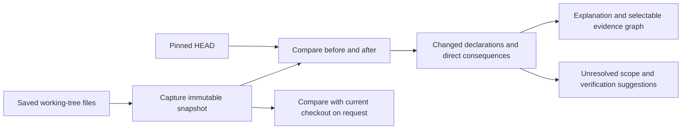

# Working-tree analysis and change consequences

Status: Deliveries 1–3 implemented and fixture-qualified in `feature/working-tree-impact`; retained explanation follows.
Prepared: 2026-09-06.
Source baseline: `b666129b750b0db3225a090d3570fd528897c983`.

## Product outcome

An agent can answer: "What do my current uncommitted changes affect, why, and
what should I verify?" The result contains a bounded before/after explanation,
a selectable graph, exact source evidence, and explicit gaps in coverage.
The developer can keep editing after capture; the result continues to describe
its immutable input and reports when that input differs from the live checkout.

The first independently useful delivery is narrower: public read-only context
and navigation can inspect current saved working-tree files without a commit.
The complete first release adds change comparison and bounded consequences for
one Kotlin/JVM Gradle repository. Start with one main compilation; include test
compilations only when explicitly selected. Rust is the following dogfood
contour, with syntax authority preserved. Other languages and cross-repository
impact follow qualification of this slice.

## Existing building blocks and gaps

These findings come from maintainer source inspection, not a new runtime test.
All references below describe the pinned baseline above.

| Building block | Existing behavior | Work required |
| --- | --- | --- |
| `repository_snapshot.rs`, `capture_with_hook`, `materialize` | Captures Git index blobs and working-tree entries into CAS; checks repeated file reads and Git views; materializes a private sealed tree. | Scope and budget capture for public analysis; bind base revision; integrate the captured content with public session authority. |
| `session.rs`, `SessionAuthority::open` | Binds HEAD and a local target ref; Python captures selected committed blobs, other languages create a detached source worktree at the base revision. | Introduce explicit source selection and analysis-only authority; all downstream reads must use the selected snapshot. |
| `operations.rs`, `main.rs` | `--committed` allows analysis in a dirty checkout while excluding local edits. | Add working-tree source admission without changing existing defaults or mutation requirements. |
| `thread_impact.rs`, `thread_change_set.rs` | Bounded Kotlin impact and before/after observations for declared provider/consumer pairs and callable families. | Reuse suitable fact/comparison primitives; add single-repository change subjects without fabricating a pair. |
| `explanation_freshness.rs`, `explanation_render.rs` | Retained explanation rendering and claim freshness with unresolved outcomes. | Connect new change evidence; distinguish live-checkout freshness from explanation validity and coverage. |

Source files: [snapshot](https://github.com/codeclew/codeclew/blob/b666129b750b0db3225a090d3570fd528897c983/crates/clew/src/repository_snapshot.rs),
[session](https://github.com/codeclew/codeclew/blob/b666129b750b0db3225a090d3570fd528897c983/crates/clew/src/session.rs),
[impact](https://github.com/codeclew/codeclew/blob/b666129b750b0db3225a090d3570fd528897c983/crates/clew/src/thread_impact.rs),
[comparison](https://github.com/codeclew/codeclew/blob/b666129b750b0db3225a090d3570fd528897c983/crates/clew/src/thread_change_set.rs),
[explanation freshness](https://github.com/codeclew/codeclew/blob/b666129b750b0db3225a090d3570fd528897c983/crates/clew/src/explanation_freshness.rs).

## Proposed user flow



This diagram is the proposed product architecture, not an observed execution
trace. The graph returned by the product will distinguish compiler relations,
syntax observations and agent interpretations on individual edges.

CLI shape (working-tree read admission implemented; change inspect follows in Delivery 2):

```sh
clew nav query --repo <repo> --target-ref <branch> \
  --language kotlin --profile <admitted-profile> --compilation <main> \
  --working-tree --term <identifier>

clew change inspect --repo <repo> --target-ref <branch> \
  --language kotlin --profile <admitted-profile> --compilation <main> \
  --working-tree --base HEAD
```

`--working-tree` also belongs on `context open`. Keep `--committed` as
the existing committed-source spelling and reject conflicting selections.
`change inspect` is a thin read-only facade over retained snapshot/comparison
services. The agent writes the narrative from its result; Codeclew does not
need an embedded LLM or a new edit/publication workflow.

## Source contract

- The comparison base is HEAD, resolved once to an exact commit. Arbitrary
  comparison refs and index-only analysis are later additions.
- Working-tree mode uses the current saved file content: staged and unstaged
  changes are not applied as two patches. Preserve the captured index as
  provenance, including when its bytes differ from the working-tree file.
- Include tracked inputs and non-ignored untracked source/build inputs inside
  the admitted scope. Declare the included roots and excluded input categories
  in the result. Changes outside that scope remain visible as out of scope;
  they must not disappear into an apparent whole-repository verdict.
- Deleted files remain explicit entries. Treat uncertain rename correspondence
  as deletion/addition or unresolved matching, with its basis recorded.
- Unsaved editor buffers are outside this filesystem-based source mode.
- Apply limits to file count, individual bytes, total bytes and traversal.
  Reject unsupported conflicts, path/link cases and input-budget overflow
  with a typed result; do not silently substitute committed HEAD.
- Check HEAD, index, path inventory and captured content for observed drift.
  Abort an unstable capture with a retryable diagnostic. Existing repeated
  reads are useful but do not establish an atomic filesystem transaction;
  specify the bounded consistency guarantee and test edits after an earlier
  file has been read. Never advertise stronger atomicity than implemented.
- Bind source mode, base commit, content snapshot, scope, runtime/profile and
  analysis-only operation into session/evidence authority. Version affected
  schemas and preserve verification of old committed-session digests.
- Original source files, HEAD, Git refs and index bytes remain unchanged.
  No stash/reset or user-repository commit is part of capture. Existing
  private materialization can retain its internal synthetic Git metadata.
- A working-tree analysis session cannot enter mutation prepare or publish,
  including through lower-level public commands.

## Delivery sequence

| Delivery | Implementation slice | Accepted user result |
| --- | --- | --- |
| 1. Analyze current edits | Source contract, scoped capture, session/admission binding, Kotlin source materialization, `nav query` and `context open` source selection, lifecycle/GC integration. | A dirty Kotlin fixture returns the edited declaration and a new untracked declaration from the sealed snapshot. Further edits do not alter that retained answer. |
| 2. Explain what changed | Retain base and working-tree analyses; file/hunk changes mapped to before/after declarations; explicit correspondence and build-model comparability. | `change inspect` lists additions, deletions, body changes and supported declaration-shape changes with exact before/after evidence. |
| 3. Find bounded consequences | Single-repository direct relation queries rooted in changed declarations; before/after relation union; selected tests and entrypoint evidence. | The report identifies direct consumers or affected steps, gives the reason for each finding and names what remains unproven. |
| 4. Render an explanation | Agent skill, machine-readable claims, before/after flow, source inspector, retained render and freshness integration. | One readable report explains the change, shows affected and unaffected steps, and opens the code supporting each claim. |
| 5. Qualify daily use | End-to-end fixtures, real Kotlin dogfood, Rust syntax dogfood, CI and published example. | A repeatable daily workflow with measured latency, coverage and cleanup behavior; release claims match tested contours. |

Deliver each row as a bounded implementation slice. Delivery 1 is the next
implementation task and must finish before adding the consequence graph.

### Comparison and consequence rules

- A body change is a change even if the callable signature is unchanged.
  Distinguish textual change from compiler-projected semantic change; comments
  and formatting must not automatically become behavioral-change claims.
- Match declarations using supported stable identity and explicit
  correspondence. Name similarity alone cannot prove rename continuity.
- Analyze both sides with compatible scope/profile/runtime authority. If build
  files or dependencies change, rebuild the relevant model and record whether
  the two results remain comparable. Never reuse an index for different inputs.
- A failure to analyze the after snapshot still permits an exact textual diff
  and usable before evidence, marked with the failed/unavailable after scope.
  It cannot produce "no impact" from an empty after graph.
- Begin with direct relations in the admitted compilation. Include edges from
  both snapshots so a removed call is still explainable. Bounded traversal can
  be added later; limits and omitted scope must stay visible.
- Resolved direct callers can be reported as affected candidates, not as proven
  runtime failures. Preserve overload, dispatch, reflection and framework
  boundaries. Known entrypoints are affected only through supported paths.
- Test references are evidence of a relationship, not proof of sufficient
  coverage. When test compilation was not analyzed, say so. A suggested test
  is separate from an executed test result; inspect does not run tests.
- Findings distinguish exact source delta, compiler relation, agent inference
  and unresolved obligation. An unchanged projected shape is not a universal
  proof of unchanged behavior.

### Explanation, retention and freshness

Every claim and graph edge retains before/after anchors as applicable, snapshot
identities, evidence references and authority. New uncommitted text opens from
retained local evidence; do not fabricate a GitHub commit link for those bytes.
Existing source-bound rendering should be reused where its contracts fit.

The initial public UI is a local report with an overview, selected-step text,
before/after code and verification suggestions. Publication is a separate user
action. A repeat render reads retained evidence without rebuilding the project.

Keep three questions separate: whether retained evidence is valid; whether it
still describes the live checkout; and whether the selected scope is complete.
Continued editing makes the live view out of date, not the old evidence corrupt.
Refreshing creates new immutable inputs and a new result. There is no background
watcher in the first release. Retain the new snapshot roots in normal reachability
and GC rules, and remove derived materialization when its session is collected.

## Acceptance cases

1. One file has staged version A and unstaged version B: working-tree analysis
   shows B, preserves index A, and compares against pinned HEAD.
2. An added source file, a deletion and a rename all appear; ignored generated
   files are excluded by policy and unmatched changes remain explicit.
3. An edit during capture produces a typed unstable-input outcome when detected;
   an edit after capture cannot change retained code or comparison evidence.
4. Changing a function body while preserving its signature is reported. A
   comment-only edit preserves the supported behavior claims or records the
   limits of proving that preservation.
5. Removing a call preserves its before edge and invalidates the corresponding
   explanation claim. An unchanged neighboring step retains its evidence.
6. Changing a signature identifies a supported direct consumer; ambiguity,
   unresolved dispatch and truncated coverage never become a green verdict.
7. Broken Kotlin or changed build inputs produce an explicit incomplete result
   while preserving available before/after source evidence.
8. Test scope omitted, test scope analyzed and tests actually executed remain
   distinct states. The report never invents a test relationship or run.
9. Original file bytes/modes, index bytes and refs are unchanged after success,
   failure and cleanup. Working-tree sessions reject prepare/publish through
   every supported command surface; committed-source behavior remains intact.
10. Repeat rendering starts no compiler/build process; repeat identical capture
    preserves content identity. Cleanup respects retained evidence roots.

Use focused tests for changed snapshot/admission/comparison behavior, then the
repository's normal CI and a small Linux/macOS end-to-end qualification. Do not
repeat broad independent verification without a material change or the final
release gate.

Record time to first useful answer, cold capture/model/analysis time, unchanged
repeat time, bytes retained, changed declarations found, missed direct
consequences and unsupported claims. Set numeric performance gates from the
first representative measurements, not guessed budgets for an unknown project.

## First implementation task

Implement Delivery 1 for one Kotlin/JVM Gradle main compilation, using the
existing snapshot store and private workspace machinery. Include a fixture
with staged-plus-unstaged content, an untracked source file and a subsequent
edit after capture. Add the source-mode contract to CLI help and the agent
skill. The acceptance artifact is one CLI transcript proving that navigation
returns the captured edited bytes while the user's checkout and index retain
their original state. No impact facade or new graph engine is needed for this
first result.

## Delivery 1 evidence (2026-09-06)

- `python3 scripts/qualification/working-tree.py --output <local-directory>`
  passes through the public source launcher with the Kotlin/Gradle baseline
  profile and `:/main`: navigation reads `fun savedPrice(): Int = 300` while
  the index retains `stagedPrice = 200`; context expansion finds untracked
  `extraPrice` and still reads `savedPrice` after the live checkout is changed
  to `laterPrice`. Index bytes and refs are unchanged through session GC.
- The first successful qualified run measured 27.958 seconds for navigation,
  19.309 seconds for expansion, 5.048/5.298 seconds for freshness checks and
  5.552 seconds for GC. These are small-fixture measurements, not release
  performance guarantees. Its development capsule build plus discovery took
  59.299 seconds and is separate from analysis latency.
- The Rust managed CLI test covers capture, later edits, retained reads,
  freshness and GC. Unit cases cover stable identity, earlier-file drift,
  byte/count/path limits, explicit deletion/addition, ignored outputs,
  unsupported links, old session digests and the actual prepare/publish guards.
- Kotlin expansion exposed a pre-existing camel-case validation mismatch:
  query membership now uses the same normalization as the query index while
  exact source declaration spelling remains required.
- Working-tree source is currently admitted only for Kotlin/Gradle and Rust
  with non-cacheable model authority. It never publishes shared incremental
  heads. The synthetic Git repository remains private; the source binding
  retains the original base commit and input snapshot.

## Delivery 2 evidence (2026-09-06)

`change inspect --working-tree --base HEAD` retains one bounded comparison
against the pinned commit. `change show --comparison <id>` reads that evidence;
`change forget --comparison <id>` releases its retention root. The result binds
both model manifests and separates exact source changes from projected shapes.

- `scripts/qualification/working-tree-change.py` passes for Kotlin bodies,
  signature changes, comments, added/deleted/renamed files, broken after-source
  and changed Gradle inputs. Index bytes and refs remain unchanged; temporary
  sessions are collected. Broken after-source returns `INCOMPLETE` with exact
  text and available before evidence.
- The initial inspect including development capsule startup took 68.286 s;
  retained reads took 5.104/5.328 s. Broken-source and changed-build inspections
  took 13.190/15.489 s on this small fixture. These are observations, not a
  general repository latency promise.
- A managed Rust CLI regression proves retained comparison reads survive both
  session GC and storage GC, plus later user edits. Direct consequences are
  outside Delivery 2; syntax evidence does not claim compiler-resolved callers.
- Diff allocation and retained row/preview budgets are explicit. Large line
  diffs fall back to exact coarse replacement ranges, with full CAS anchors.

## Delivery 3 evidence (2026-09-06)

`change graph --comparison <id>` returns a bounded one-hop union of before and
after Kotlin compiler relations. Exact callable identity and source containment
are required; unresolved family targets remain boundaries. Candidate impact is
a static inference, separate from the relation and any runtime/test outcome.

- Public Kotlin qualification passes direct consumers, a removed before-call,
  JVM main evidence and an actual `PriceTest.kt` consumer when `:/test` is
  explicitly selected. Main-only reports unanalysed test scope.
- Main comparison took 36.982 s; main plus tests took 22.292 s; retained graphs
  took 5.095/5.063 s. Broken after-source remained incomplete with before
  evidence. No test execution or universal no-impact claim is made.
- Source-composed Kotlin test analysis now excludes only missing local declared
  main friend outputs and the selected project's conventional main resource
  output from its classpath, recording a coverage boundary. Missing external
  dependencies remain errors. Focused worker tests pass; all three trusted
  Kotlin distributions were rebuilt from the shared worker change.
- Graph budgets, overload abstention, stale removed-edge claims and failed-after
  unresolved claims have focused regression coverage. The public qualification
  verifies unchanged index/refs and comparison cleanup.
