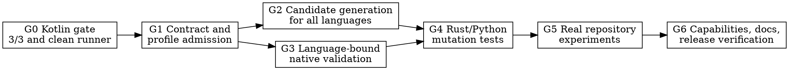

# General Kotlin, Rust, and Python Mutation Plan

## Outcome

Codeclew uses one immutable change protocol for the three supported language
contours. Kotlin 2.4.10 keeps compiler-backed evidence. Rust and Python keep
their existing bounded syntax evidence and may publish only through the
conditional path after explicit acknowledgement of unresolved semantic
obligations and successful native validation.

"General" means that the protocol is not tied to a fixture or to Codeclew's
own repository. It does not mean that every Kotlin version, build system,
Python environment manager, Rust macro expansion, or dynamic Python behavior
is silently claimed as supported.

## Entry gate

The Kotlin 2.4.10 write pilot passed three independent changes in RELEASE mode.
Every case completed context creation, isolated preparation, publication, and
the native post-publication test. The two warm cases completed in about 31
seconds, with context creation in 5.3--5.4 seconds and publication in about
0.55 seconds. This establishes that managed writes are useful enough to justify
generalizing the protocol.

The pilot runner defect discovered by this gate is part of the change: sealed
runtime directories are made removable only inside the pilot-owned disposable
workspace, and the runner emits its sole result after cleanup succeeds.

## Product contract

| Language/profile | Read authority | Write authority | Required validation | Publish result |
|---|---|---|---|---|
| Kotlin 2.4.10 Gradle single compilation | compiler-backed K2 | strict or conditional, according to evidence | Gradle | `PUBLISHED` or acknowledged conditional |
| Kotlin preview profiles | existing compiler-backed preview | none until a profile-specific write gate | none | refused |
| Rust Cargo target | bounded Rust syntax | conditional only | at least one Cargo step | acknowledged conditional |
| Python source scope | tree-sitter Python syntax | conditional only | at least one Python module step | acknowledged conditional |

All writes retain the existing invariants: immutable base revision, CAS-bound
source bytes, one operation per file, detached candidate worktree, exact changed
path set, native validation, candidate commit, candidate re-analysis,
compare-and-swap publication, recoverable ledger, and no automatic rollback
after a candidate commit exists.

Rust and Python validation does not turn syntax evidence into compiler-backed
semantic proof. It satisfies the execution part of the gate; the explicit
syntax obligations remain in the prepared authority and must be acknowledged
to publish.

## Dependency graph

## Steps and definitions of done

### G0 — Preserve the Kotlin usefulness gate

Work:

- keep the three-case RELEASE pilot as the write-value gate;
- fix cleanup of pilot-owned sealed capsules;
- emit exactly one public result after cleanup.

Definition of done:

- pilot unit tests include a sealed read-only runtime directory;
- the full pilot exits zero, emits one JSON line, reports `3/3`, and leaves no
  disposable workspace;
- no persistent capsule permissions are changed.

### G1 — Replace the language switch with profile admission

Work:

- admit mutation by the session's qualified language/profile, not by a Kotlin
  equality check duplicated in the CLI and transaction layer;
- keep Kotlin preview profiles read-only;
- bind every plan's validation launchers to the session language;
- reject a plan with no validator for its language.

Definition of done:

- Kotlin 2.4.10, `rust-syntax`, and `python-syntax` reach plan/run admission;
- Kotlin 2.4.0 and Kotlin 2.3.0 remain refused for mutation;
- cross-language validators fail before a candidate worktree is created;
- CLI and transaction code use the same admission function and error code.

### G2 — Re-analyze the candidate with the same language authority

Work:

- route candidate generation to Kotlin, Rust, or Python generation code;
- capture Python candidates with the same selected source-scope limits as the
  base session;
- extract the Cargo model from the detached candidate and prove that model
  extraction did not mutate its tracked snapshot;
- store and verify the candidate generation before publication;
- publish language generation heads only after Git publication succeeds.

Definition of done:

- changed Rust/Python candidates produce a verified ready-generation set bound
  to the candidate commit;
- out-of-scope Python files cannot become authorized by candidate generation;
- Rust cfg/macro and Python dynamic/import boundaries remain `UNSURE` with
  explicit obligations;
- tampered candidate generation or moved base/target authority fails closed.

### G3 — Add fail-closed native validation

Work:

- retain Gradle and Maven launchers for qualified Kotlin profiles;
- require Cargo for Rust;
- add a Python launcher that executes only `python3 -m <module> ...`, rejecting
  `-c`, absolute arguments, traversal, and empty module names;
- keep controller descriptors and `CODECLEW_*` variables out of child builds;
- retain bounded hashed output evidence without exposing output publicly.

Definition of done:

- a successful validator produces hashed evidence and a failed validator gives
  typed `TEST_FAILED`;
- Rust plans without Cargo and Python plans without Python fail admission;
- Python cannot select shell or inline-code execution through the plan schema;
- Kotlin pilot behavior is unchanged.

### G4 — Qualify Rust and Python mutation behavior

Work:

- add generic minimal Rust and Python repositories to the test corpus;
- exercise replace and create operations through context, immutable plan,
  detached prepare, conditional approval, publish, and native post-test;
- cover stale source bytes, wrong validator, failed native test, cancellation,
  and candidate-generation tampering.

Definition of done:

- both language pilots publish a behavior change and a test from clean committed
  repositories;
- neither can publish without acknowledging every prepared obligation;
- failures leave the source ref unchanged and have a deterministic recovery or
  cleanup path;
- focused Rust tests and Python harness tests pass.

### G5 — Prove usefulness outside purpose-built fixtures

Work:

- run a bounded Rust analysis/write experiment against a clean clone of
  Codeclew;
- run a bounded Python analysis/write experiment against a clean clone of a
  local Python project;
- choose small reversible tasks, measure context, prepare, and publish time, and
  compare the facts/obligations with ordinary source search.

Definition of done:

- both projects reach at least `READY_TO_PUBLISH_CONDITIONAL` after native
  validation, or yield a typed product boundary with no repository mutation;
- successful cases are post-tested and disposable publications are removed with
  their temporary repositories;
- the report states what Codeclew found, what remained uncertain, and whether
  the managed path was more useful than source search.

### G6 — Expose only proven support

Work:

- switch `mutation` to true only for Rust/Python profiles that passed G4;
- update human capabilities, README, runbook, and the Codeclew skill;
- run focused tests first, then the repository verification slice once;
- commit the implementation and evidence-facing documentation.

Definition of done:

- machine and human capability output agree with tested behavior;
- documentation gives one end-to-end command sequence per language and labels
  evidence strength accurately;
- privacy and repository checks pass;
- the worktree is clean after the final commit.

## Deliberate non-goals

- Kotlin mutation outside the already qualified 2.4.10 Gradle profile;
- semantic Rust macro expansion, borrow/type inference, or IDE-grade resolution;
- Python runtime import resolution, decorator/metaclass execution, or static
  typing claims;
- Poetry, uv, tox, nox, or arbitrary shell launchers in the first mutation
  slice;
- coordinated multi-repository publication;
- automatic acknowledgement of `UNSURE` obligations.

These extensions remain valuable, but none is required to establish a useful,
honest, general three-language write protocol.
