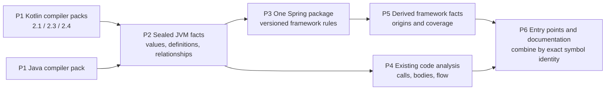

# Modular language and framework support

Date: 2026-09-08. Status: agent-authored architectural proposal, not implemented.
Prepared after the preceding Kotlin documentation/release task completed.

## Decision

Keep compiler-version adapters, introduce a small shared JVM fact contract, and
implement Spring interpretation once in a Rust framework package. Start with
built-in packages and an explicit registry. Reuse the existing worker transport,
language adapter interface, immutable evidence storage and consumer pipelines.

The important boundary is between **compiler observations** and **framework
interpretation**. Moving the current Spring reader into a shared Kotlin source
directory would reduce copies but still couple Spring semantics to FIR APIs.
Exporting only annotation names would lose essential analytical information.

This diagram is the proposed dependency structure; arrows are proposed data
dependencies, not compiler-proven calls in the current implementation.

Text alternative: Kotlin and Java export sealed compiler facts. Spring derives
framework facts from those inputs. Existing code analysis continues alongside
Spring; consumers join both by retained symbol identity. Missing inputs remain
explicit boundaries. See the [rendered diagram](modular-language-framework-analysis.svg)
and [editable diagram source](modular-language-framework-analysis.mmd).

## What the current source establishes

| Claim | Observation | Retained evidence |
|---|---|---|
| E1 | All three Kotlin Spring readers mix compiler access with framework selection. The returned windows repeat nearest-family inheritance selection, controller detection and Feign exclusion. The 24 reader additionally exposes the full alias/value/hierarchy machinery. This is source-level duplication, not a measured equivalence claim. | `03-kotlin-open.json`, `05-kotlin-reader.json`; [24 reader](../../workers/kotlin/src/main/kotlin/dev/semanticthread/worker/SpringAnnotationFacts24.kt), lines 51–349; [21 reader](../../workers/kotlin21/src/main/kotlin/dev/semanticthread/worker/SpringAnnotationFacts21.kt), lines 50–74 and 191–224; [23 reader](../../workers/kotlin23/src/main/kotlin/dev/semanticthread/worker/SpringAnnotationFacts23.kt), lines 51–73. |
| E2 | Rust already owns a Spring metadata type, validation and trigger projection. Metadata has annotation chains, raw attributes, runtime-conditional registration, optional target symbol and bean class. | `02-rust-open.json`; [spring_entrypoints.rs](../../crates/clew/src/spring_entrypoints.rs), lines 27–90 and 160–238. |
| E3 | The Rust Java declaration contract has `annotations: Vec<String>` plus separate optional `spring` and `documentation` payloads. A plain annotation-name array cannot carry the input needed to replace the existing Spring payload. This is Rust syntax evidence, not inspection of javac execution. | `06-java-contract.json`; [java_adapter_v2.rs](../../crates/clew/src/java_adapter_v2.rs), lines 34–128. |
| E4 | `LanguageAdapter` already exposes handshake, generation, cancellation and shutdown. The handshake includes adapter identity/digest, languages, capabilities and toolchains. The registry distinguishes build-model providers and language adapters. | `08-adapter-contract.json`; [adapter_v2.rs](../../crates/clew/src/adapter_v2.rs), lines 162–203 and 285–327. |
| E5 | Kotlin already uses one Rust adapter type parameterized by a semantic engine and generation driver. An existing fake-driver test describes a common streaming contract for 21/23/24; the test was read, not executed here. | `12-kotlin-adapter.json`; [kotlin_adapter_v2.rs](../../crates/clew/src/kotlin_adapter_v2.rs), lines 42–82 and 1408–1454. |
| E6 | Documentation `project` consumes language facts, preserves flow events, reads `fact.spring`, selects expected authority by service language, and builds entrypoint observations. IDs include target and ordinal; missing implementation bodies produce a boundary. | `11-docs-project.json`; [documentation/analysis.rs](../../crates/clew/src/documentation/analysis.rs), lines 447–641. |
| E7 | An existing derived **input** manifest binds repository snapshot, provider models and sealed inputs. It is a reusable storage pattern, not evidence that a framework-result cache already exists. | `10-derived.json`; [derived_manifest.rs](../../crates/clew/src/derived_manifest.rs), lines 9–33. |
| E8 | Build configuration shares worker sources and excludes version-specific FIR/Spring files; worker manifests already bind distributions by file digests and tree hashes. The workspace currently declares one Rust crate. The protobuf envelope carries versioned messages with canonical JSON response payloads and blob references. | Native configuration observations in `15-config-observations.json`; [Kotlin build](../../workers/kotlin/build.gradle.kts), [21 build](../../workers/kotlin21/build.gradle.kts), [23 build](../../workers/kotlin23/build.gradle.kts), [worker manifests](../../workers/manifests), [Cargo workspace](../../Cargo.toml), [worker protocol](../../schemas/worker.proto). |

E1–E7 came from the installed Codeclew release. E8 is explicitly separate native
configuration inspection. Codeclew's Rust references are syntax observations,
not resolved call edges. The proposed arrows P1→P2 and P2→P3 address E1/E3;
P2→P4 preserves E4/E5; P3→P5 extends E2/E7; P5→P6 and P4→P6 adapt E6.
Every P node and arrow is a design recommendation, not an observed execution path.

## Minimal package boundaries

| Unit | Owns | Boundary |
|---|---|---|
| Build-model provider | Source roots, classpath, compiler options/plugins, compilation dependencies and library identities | Preserve the existing provider role. Frameworks must not independently rediscover the live build. |
| Language pack | Parsing/compiler integration, declaration identities, source ranges, annotation extraction, types, overrides, inherited callable bindings, calls and body facts | Version-specific FIR/javac details remain here. No Spring root names, alias merging, controller classification or placeholder interpretation. |
| JVM fact contract | Small portable records shared by Kotlin and Java | It is a JVM interoperability slice, not a universal AST or replacement for richer language-specific facts. |
| Framework package | Spring annotation traversal, aliases, trigger rules, registration candidates and framework boundaries | Reads sealed facts; cannot access live FIR/javac objects or silently inspect the live checkout. |
| Core and consumers | Scheduling, validation, storage, provenance, query/catalogue integration and documentation | Understand generic derived facts and capability coverage; join to existing code graphs without changing compiler identity. |

Implement the shared types in a small `clew-facts` crate and the pure interpreter
in `clew-framework-spring`. These are proposed new crates. Keep the current
`clew` orchestration and versioned JVM worker processes. A lightweight
`FrameworkAnalyzer` interface needs identity/capabilities plus an analysis method
over a read-only sealed fact view, bounded result sink and cancellation token.
Avoid inheritance from `LanguageAdapter`: a framework consumes completed facts
and does not own compiler generation or toolchains.

For the first release, register Spring in a static list. Package identity,
version, implementation digest, accepted fact-schema versions, required/optional
capabilities and output schemas are sufficient metadata. Validate required
inputs before execution. Unknown or absent required capabilities produce a
typed unsupported/partial result, never a successful empty catalogue.

Source modularity and separately installable packages are different milestones.
Start with built-in Rust crates and the existing trusted worker distributions.
If independent installation becomes a product requirement, add a versioned
out-of-process entrypoint and digest-pinned package lock using the same fact
contract. Do not start with native dynamic-library ABI, arbitrary classloaders,
a package marketplace, an annotation-rule DSL or a general fixed-point engine.
Their lifecycle, compatibility and trust costs do not help remove this duplication.

## The fact contract must preserve enough information

Introduce a versioned `jvm-annotation-facts/1` capability alongside existing
language facts. Names below describe proposed records, not existing APIs.

| Record | Required information | Why it matters |
|---|---|---|
| Declaration | Exact existing symbol identity, owner, kind, modifiers, JVM signature, source or binary origin | Joins to code/body evidence and avoids matching overloads by name. |
| Annotation use | Target symbol and use-site target, resolved annotation type identity, occurrence/ordering, explicit arguments, provenance | Distinguishes field/getter/parameter/type annotations, repeatable uses and defaults. |
| Annotation definition | Members and types, defaults, member/getter annotations, metaannotation uses, retention/target/repeatable metadata | Custom composed annotations and `AliasFor` require definitions, including dependency JAR definitions. |
| Typed value | Scalar with type, enum type plus entry, class literal identity, ordered array, nested annotation, or unresolved value with reason/source | Do not flatten enums/classes to ambiguous strings or conflate missing, defaulted, unknown and empty. |
| Type/method relationships | Direct supertypes with substitutions, direct overrides, effective inherited callable to declared implementation binding | A Spring package cannot safely reconstruct Kotlin overrides or inherited handler identities from names alone. |
| Coverage | Per compilation/capability status, omitted scopes, unavailable binary definitions, traversal/value limits and diagnostics | Absence of an annotation is meaningful only within a completed extraction scope. |

Compiler packs resolve constants and identities. They preserve strings containing
`${...}` or `#{...}` exactly; Spring interprets their framework meaning and
marks runtime-dependent values. The language extractor preserves `AliasFor`
as an ordinary annotation and its member arguments; only Spring interprets it.
Likewise, export generic repeatable/container information without hard-coding
Kafka or scheduling annotations in each FIR bridge.

Collect source annotation uses and the reachable closure of their definitions,
member annotations, defaults and relevant supertypes. Include binary dependency
origins and content digests. Memoize definitions per compilation and shared
artifact; preserve occurrence order separately from canonical object ordering.
Use explicit node/depth/value/output budgets with typed boundaries. Do not scan
every dependency class, and do not retain a live compiler callback in the
framework package. Framework reruns must work from the captured closure; if it
is insufficient, request a new language generation with a stated capability.

Keep rich Kotlin/Java calls, flow, contracts and language-specific facts intact.
The common layer is additive. Framework rules must not reinterpret a lexical
call as compiler resolution, turn declared OpenAPI into an implemented endpoint,
or create a cross-service call solely from matching routes/topics.

## What moves into Spring, and what stays with the compiler

The observed 24 reader makes the split concrete:

- `read` at lines 56–115 combines direct and inherited bindings by annotation
  family, chooses type mappings, detects controllers/Feign, creates HTTP/Kafka/
  scheduled entries, and emits runtime/abstract-owner boundaries. These rules
  belong to Spring; compiler-derived owners and method modality are inputs.
- `readInherited`, `classHierarchy` and `inheritedAnnotations` at lines 117–198
  combine compiler hierarchy lookup with Spring registration selection. Export
  the compiler relationships and effective callable identities; move Spring's
  family precedence and per-bean registration to the shared interpreter.
- `expand` and `aliasDestination` at lines 203–279 mix FIR annotation lookup
  with framework roots, repeatable containers, composed aliases and legacy
  overrides. Move the latter rules; retain generic definition/value lookup in
  the language pack. Preserve cycle and resource boundaries.
- `arguments`, `elements`, `asAnnotation` and `value` at lines 292–347 expose
  version-sensitive FIR representation, constructor-to-annotation conversion,
  constant/enum evaluation and unresolved values. Those compiler operations
  stay in the language pack. Framework-expression detection moves to Spring.

Rust's current `describe_trigger` can be the starting point for the shared
package. It preserves raw evidence while deriving HTTP paths/methods/conditions,
scheduled configuration and other trigger configuration. Its HTTP path product
is bounded at 4096; unresolved combinations retain a resolution boundary.
Method conditions can override type conditions, while params/headers are
combined. Scheduled disablement remains unknown when runtime values occur.
These existing distinctions must survive, not be replaced by a flattened route.

One implementation does not imply one policy for every Spring version. Declare
the supported Spring component/version ranges using captured dependency data,
independently of Kotlin compiler compatibility. Retain version differences as
small policy branches in the same package, qualified by fixtures. Explicit and
transitive aliases have framework semantics beyond merely reading an annotation.
See the [Spring AliasFor contract](https://docs.spring.io/spring/docs/6.2.4/javadoc-api/org/springframework/core/annotation/AliasFor.html).
The current multiple-mapping handling and legacy override rule need targeted
qualification; [Spring's mapping reference](https://docs.spring.io/spring-framework/reference/web/webmvc/mvc-controller/ann-requestmapping.html)
specifies first-mapping behavior. These are review obligations, not defects
proven by this analysis.

## Provenance, integration and cache boundaries

A framework result should contain: package identity/digest and policy version;
input manifest/fact references; compilation and dependency scope; exact target
and bean-owner identities; trigger attributes; an ordered derivation chain;
source/binary origins; and coverage/boundaries. Keep compiler authority and
framework derivation authority separate. Compiler-resolved annotations do not
prove that a live Spring bean or schedule is active. Registration remains
`RUNTIME_CONDITIONAL` unless a separate evidence source establishes activation.

Preserve annotation-use identity, implementation identity and bean-registration
identity separately. Two concrete beans can inherit the same implementation;
they must not collapse just because the target method is equal. E6's
target/ordinal-based projection deserves a focused collision test before reuse.
Entry identity should ultimately bind compilation, concrete owner, target,
trigger kind and annotation occurrence. Document any intentional ID migration
and invalidate old downstream references consistently.

The existing Java enum and other shown contracts reject unknown fields. Adding
fields blindly is therefore not a safe compatibility strategy. Introduce a
negotiated capability/schema version and a compatibility projection. During
migration, compute the new Spring result from generic facts and project it to
the old `spring-entrypoints/0.1` consumer shape at one boundary. Do not claim
old compiler authority for new framework-derived facts: retain both the input
authority and derivation metadata, and update validators/readers together.

Then update the catalogue and documentation consumers to read framework facts
directly. Keep their existing code/body observations, source binding and
`IMPLEMENTATION_BODY_UNAVAILABLE` behavior. The exact graph/catalogue sealing
integration was not exhaustively traced in this run; identifying its call sites
and enforcing result/source binding is a first implementation obligation.

Use two cache boundaries:

1. Language generation key: existing source/model/toolchain/plugin inputs plus
   the fact capability/schema and extractor implementation digest.
2. Framework generation key: digest of the relevant sealed fact inputs and
   coverage, package implementation/schema, selected Spring policy/dependency
   versions, rule configuration and traversal limits.

A Spring-rule change should rerun derivation and downstream consumers, with no
compiler rerun if the required facts are retained. Annotation definition/default,
override, dependency or source changes invalidate affected derivations. Start
with per-compilation invalidation and a coarse framework input manifest; add
fine-grained reverse-dependency invalidation only after measurement. Record
missing dependencies too, so later availability invalidates earlier unknowns.
Core runtime admission identity remains separate from reusable fact identity;
otherwise unrelated runtime packaging changes can accidentally defeat reuse.
Do not promise selective reuse until current cache-key integration is verified.

## Migration with reviewable gates

| Step | Deliverable | Acceptance gate |
|---|---|---|
| 1 | Freeze current Spring results and define the annotation/hierarchy contract from real fixtures | Cover current positive cases, boundaries and negative cases; identify semantic uncertainties separately. |
| 2 | Add generic extraction to Kotlin 24 and a pure Spring interpreter; run old/new outputs in comparison mode | Same observable triggers, owners, sources, boundaries and completeness; reviewed intentional changes only. |
| 3 | Implement the same fact capability for Java and Kotlin 21/23 with small compiler bridges | Equivalent language fixtures normalize to the same portable facts and framework outputs; compiler identity and authority remain precise. |
| 4 | Switch catalogue/documentation to the derived result through one compatibility boundary | Existing flows, source links, IDs or explicit ID migration, freshness and failure reporting remain correct. |
| 5 | Remove old Spring readers after coverage gates pass; publish package metadata with built-in registration | No production Spring rule copies remain in version-specific workers; update all qualified workers and schema validators together. |
| 6 | Consider independent package distribution | Only if there is a concrete installation/versioning need; use the already-tested portable contract. |

Comparison should ignore envelope hashes that intentionally change and compare
semantic payloads, provenance and boundaries. Do not normalize away ordering,
bean identity, unresolved values or completeness. Test code already inspected
provides useful starting fixtures, but its presence is not evidence of passing
tests in this run. A full qualification matrix belongs to implementation.

Required cases include custom/metaannotations from source and JARs; explicit,
default, conflicting and transitive aliases; repeatable/nested annotations;
literal/constant/enum/class values; unresolved values and runtime expressions;
Kotlin use-site targets; generic overrides and inherited handlers; two beans
sharing an inherited implementation; controller and outbound Feign separation;
class Kafka listeners with handlers; scheduling disablement; multiple mappings;
partial generations, cycles and limits; source offsets and missing bodies.
Keep Spring-rule tests independent of the compiler matrix, add per-pack
extraction conformance, and retain representative end-to-end combinations.
Use actual Spring behavior as an oracle for disputed framework rules; this
checks semantic correctness beyond old/new Codeclew equivalence.

Measure exported fact bytes, extraction latency/RSS, repeated derivation cost
and end-to-end query latency on fixed fixtures before claiming a performance
benefit. This analysis observed 23.076 seconds for Rust opening and 95.477 seconds
for three Kotlin compilations; those isolated runs are not comparable benchmarks.

## Evidence scope and remaining limits

Both managed sessions passed installed-release admission with
`codeclew-agent-contract/1.0`, `sourceFallbackAllowed=false`, and `WORKING_TREE`.
They captured base `a15a104268f4155c10165bd4cc758a9322ecf325` and input snapshot
`sha256:63473ad9fff11d4fb8dad37ec0ead86a4a013b98a66a20477d79da5bbf3268ca`.
Rust scope was the `clew` library compilation; Kotlin scope was the three worker
main compilations. These are selected architectural slices, not whole-repository
semantic coverage. Kotlin project/analyzer versions were 2.4.10/2.4.10,
2.1.21/2.4.10 and 2.3.0/2.3.0. Kotlin generation remains partial; Rust does not
prove name resolution, cfg or macro expansion. Java saved-working-tree compiler
analysis is unsupported, so Java extraction internals remain an obligation.

The [evidence index](modular-language-framework-evidence.json) records command
artifacts, context/evidence digests, retained window ranges and source digests.
Raw artifacts remain in the private caller-owned `modular-20260908` directory.
The [issue journal](modular-analysis-codeclew-issues.md) retains every observed
failure/limitation and distinguishes hypotheses from confirmed design debt.
No product code was changed and no previous test/benchmark results were
reclassified as verification of this proposal.

Final session freshness checks returned `LIVE_CHANGED` with retained evidence
valid and unchanged HEAD after this task began writing its report. A bounded
native comparison confirmed all 36 returned source windows still match their
live line ranges. This does not certify the complete live input snapshot;
the captured snapshot remains the authority for this document.

Document verification completed: local Markdown targets resolve; the evidence
JSON and SVG parse; the SVG was rendered and visually inspected; repository
English-content and whitespace checks passed. Runtime tests were not rerun for
this analysis-only change. The follow-up automation was paused on completion.
