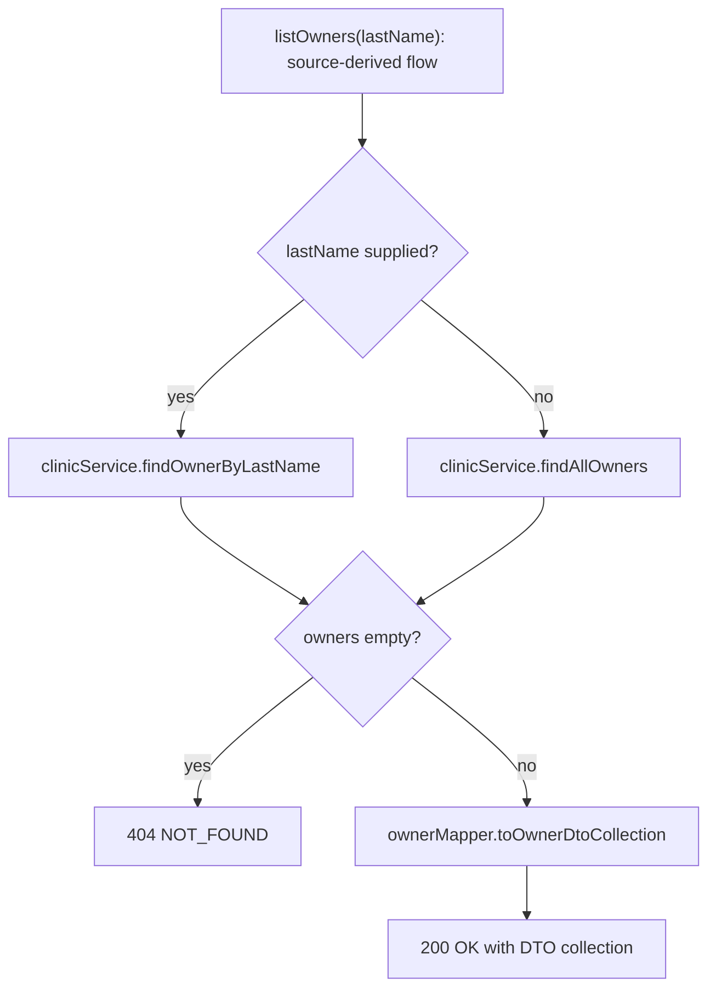

# Java 17 Maven documentation from the compiler index

Validation date: 2026-09-07. This is a source-development check, not installed-release qualification or a claim about the unavailable private repository from the feedback.

## Selected project and result

[Spring Petclinic REST v3.2.1](https://github.com/spring-petclinic/spring-petclinic-rest/tree/dc06a75075a6a0d493897f8982df7e474afcd7cf), commit `dc06a75075a6a0d493897f8982df7e474afcd7cf`, compilation `:/main`, was built and indexed with the Java Maven read-only profile and `maven.compiler.release=17`. The observed compiler was Temurin JDK 21; this run does not establish execution on a JDK 17 installation.

The project uses generated API/DTO and mapper types. Native Maven compilation made those classes available to javac, and the index returned the original `OwnerRestController` declaration with `COMPILER_EXACT` authority. `nav expand --source` delivered its exact retained source, lines 47–183. No raw controller-file read was used to write the documentation below.

The catalogue inspected 397 class/method declaration records and returned 36 annotation-declared HTTP entries over two pages (31 + 5). Generation remains `PARTIAL/UNSURE`, with `LIMIT_DOCUMENTATION_TO_INDEXED_SOURCE_OBJECTS`. Its reported boundaries are `JAVA_GENERATED_DECLARATIONS_NOT_INDEXED` and `INHERITED_HANDLER_SOURCE_UNAVAILABLE`; it is not a complete generated API inventory. Runtime registration, security configuration and bean activation remain unproven.

## OwnerRestController

The controller implements `OwnersApi`, declares the `/api` base path, and receives `ClinicService`, `OwnerMapper`, `PetMapper` and `VisitMapper` through its constructor. All eight implemented handlers below declare `@PreAuthorize("hasRole(@roles.OWNER_ADMIN)")`. Routes come from resolved Spring annotation metadata; behavior is an agent interpretation of the exact source returned by navigation, not an executed HTTP test.

| Method | Declared route | Source behavior | Source |
| --- | --- | --- | --- |
| `listOwners` | `GET /api/owners` | Find owners by last name when supplied, otherwise find all; return 404 for an empty collection or mapped DTOs with 200. | [L70](https://github.com/spring-petclinic/spring-petclinic-rest/blob/dc06a75075a6a0d493897f8982df7e474afcd7cf/src/main/java/org/springframework/samples/petclinic/rest/controller/OwnerRestController.java#L70) |
| `getOwner` | `GET /api/owners/{ownerId}` | Find by ID; return 404 when absent, otherwise map the owner and return 200. | [L85](https://github.com/spring-petclinic/spring-petclinic-rest/blob/dc06a75075a6a0d493897f8982df7e474afcd7cf/src/main/java/org/springframework/samples/petclinic/rest/controller/OwnerRestController.java#L85) |
| `addOwner` | `POST /api/owners` | Map the request, save the owner, and return its DTO with 201 and a Location header. | [L95](https://github.com/spring-petclinic/spring-petclinic-rest/blob/dc06a75075a6a0d493897f8982df7e474afcd7cf/src/main/java/org/springframework/samples/petclinic/rest/controller/OwnerRestController.java#L95) |
| `updateOwner` | `PUT /api/owners/{ownerId}` | Return 404 when absent; copy address, city, first/last name and telephone, save, then construct a response with 204. | [L107](https://github.com/spring-petclinic/spring-petclinic-rest/blob/dc06a75075a6a0d493897f8982df7e474afcd7cf/src/main/java/org/springframework/samples/petclinic/rest/controller/OwnerRestController.java#L107) |
| `deleteOwner` | `DELETE /api/owners/{ownerId}` | Return 404 when absent; otherwise delete and return 204. The method declares a transaction. | [L123](https://github.com/spring-petclinic/spring-petclinic-rest/blob/dc06a75075a6a0d493897f8982df7e474afcd7cf/src/main/java/org/springframework/samples/petclinic/rest/controller/OwnerRestController.java#L123) |
| `addPetToOwner` | `POST /api/owners/{ownerId}/pets` | Map the pet, attach the supplied owner ID, resolve its pet type, save, and return 201 with a Location header. | [L135](https://github.com/spring-petclinic/spring-petclinic-rest/blob/dc06a75075a6a0d493897f8982df7e474afcd7cf/src/main/java/org/springframework/samples/petclinic/rest/controller/OwnerRestController.java#L135) |
| `addVisitToOwner` | `POST /api/owners/{ownerId}/pets/{petId}/visits` | Map the visit, attach the supplied pet ID, save, and return 201 with a Location header. The shown body does not use ownerId. | [L152](https://github.com/spring-petclinic/spring-petclinic-rest/blob/dc06a75075a6a0d493897f8982df7e474afcd7cf/src/main/java/org/springframework/samples/petclinic/rest/controller/OwnerRestController.java#L152) |
| `getOwnersPet` | `GET /api/owners/{ownerId}/pets/{petId}` | Load owner and pet; return 404 if either is missing, 400 if the pet belongs to another owner, otherwise a mapped DTO with 200. | [L168](https://github.com/spring-petclinic/spring-petclinic-rest/blob/dc06a75075a6a0d493897f8982df7e474afcd7cf/src/main/java/org/springframework/samples/petclinic/rest/controller/OwnerRestController.java#L168) |

The compiled interface also declares an inherited `updateOwnersPet` route. The catalogue reports its source as unavailable; this document does not infer its implementation.



The diagram interprets the retained method body. It makes no claim about database behavior, framework interception, or exceptions inside the called service/mapper implementations.

## Reproduction and retained bindings

Use an external private `settings.xml` and a caller-local configuration:

```yaml
version: 1
maven:
  settings: ../settings.xml
```

No configuration commit is required. Run the source launcher with an available JDK 17+ and the public project checked out at the selected tag:

```sh
./clew nav query --repo <petclinic-repo> --target-ref v3.2.1 \
  --language java --profile java-17plus-maven-read-only \
  --compilation :/main --term OwnerRestController \
  --decision-identifier OwnerRestController --source
./clew nav expand --session <returned-session> --from <returned-context> \
  --candidate <returned-OwnerRestController-class-card> --source
./clew entrypoints --session <returned-session> --limit 100
# Follow every returned nextCursor with --cursor until it is null.
```

The initial broad name query correctly abstained because its candidate list was truncated. Selecting the returned exact class card then delivered its retained source; the query was not relabeled as complete.

Retained public bindings:

- Catalogue digest: `sha256:d2576cb3ecd23efe72d0ea1fdd755b173bbf134180faad56fa81b5b27e35cc93`.
- Generation digest: `sha256:6c9d2e40edc9ac2322fbf53a504d0e54951d80f7576b9e90995cea4270c8fae6`.
- Class fact digest: `sha256:e6b02471dda5787d113d262d726c0cc51bd201b1a11f337a14217851488a5398`.
- Source content digest: `sha256:0188bf937b08ecbd18eed652780b708d4c0f52166b9a6b002d5e64e188155f04`.
- Navigation evidence digest: `sha256:043d6749442c7d059ac8103aeab9717b09a4746e8617d3a4057b37e2b6a819b8`.

## Regression coverage

The managed CLI regression uses a mode-0644 sh wrapper, modified tracked `codeclew.yaml`, external settings, a generated Java 17 record, and Unicode before the indexed declaration. It checks exact source delivery, the Spring entrypoint and scope obligation, preserved Git status and wrapper mode, and absence of build output in the caller checkout. Separate configuration tests cover untracked, staged-new, modified-tracked and staged-modified local configuration. A native two-module Maven probe resolved its sibling output through the reactor without `install`.
