# Stabilization-first execution policy

Status: independently reviewed, `PASS`.

Codeclew must eventually change its Kotlin worker through the public managed
Codeclew flow. That self-host contour is disabled until `G1 STABLE_CLEW`.
Before `G0 FOUNDATION_ENTRY`, full edit/publish end-to-end checks and real
cold/multi-compilation performance gates are forbidden.

The authoritative dependency graph, check commands, input closures, budgets,
and qualification rules live in `stabilization-plan.json`. The development
controller stores receipts outside the repository. Plan, controller, and
independent-verifier bytes are part of every authority; changing any of them
invalidates all downstream receipts.

## Verification levels

- `L0`, up to 60 seconds: static and privacy checks.
- `L1`, up to 3 minutes: impacted unit and property checks.
- `L2`, up to 8 minutes: component contracts.
- `L3`, up to 12 minutes: clean checkpoint checks without real E2E.
- `L4`, up to 20 minutes: one representative provider integration.
- `L5`, up to 45 minutes: cold and multi-compilation release gates.
- `L6`, up to 90 minutes: one bounded external product E2E or final release evidence.
- `L7`, up to 45 minutes: shadow and mandatory self-hosting.

Budgets are valid only on a qualifying host. `UNQUALIFIED_HOST` and
`BUDGET_EXCEEDED` are typed non-pass results. The controller refuses blind
retries of a functional failure with the same evidence key.

## Milestones

```dot
digraph stabilization_first {
  rankdir=LR;
  S0 -> S1 -> S2 -> S3 -> S4 -> S5 -> S6 -> S7 -> S8 -> S9 -> S10 -> S11;
  S11 -> G0 [label="FOUNDATION_ENTRY"];
  G0 -> Q1 -> Q2 -> Q3 -> G1 [label="STABLE_CLEW"];
  G1 -> H1 -> H2 -> G2 [label="SELF_HOST_CUTOVER"];
  G2 -> R1 -> R2 -> R3 -> R4 -> R5;
}
```

`S0` is a recoverable privacy/history baseline. `S1-S2` establish this policy
and its controller. `S3-S11` stabilize trusted runtime, component capsules,
model extraction, immutable generations, bounded context, transactions, and
security cleanup. `Q1-Q3` are the only pre-self-host expensive qualification
chain. `H1-H2` prove final N-to-N+1 self-hosting before cutover. `R1-R5` finish
mandatory self-hosting, hardening, BTA24, paired comparison, push, and CI.

### S5 component CAS boundary

S5 qualifies a generic immutable runtime-component store before production
bootstrap uses it. Component identity is a closed digest of mode, component
kind/id, relevant input rows, toolchain authority, and build contract. The
component API contains no Kotlin variant enum: a synthetic `language:zeta`
adapter must publish, verify, quarantine, and materialize without core changes.

S5 DoD is exact relevant-input keying, RELEASE/DEVELOPMENT domain separation,
one publication under concurrent processes, fail-closed corruption quarantine,
and deterministic executable-bit-preserving materialization. S5 does not alter
the launcher build route. S6 is the separate cutover that assembles a complete
runtime capsule only from verified component objects and proves warm reuse.

S6 DoD is a closed data-driven component registry, selective Cargo/Gradle
execution for component misses, a capsule manifest bound to every component
key, and a real RELEASE integration proof. That proof changes only bootstrap
authority in an isolated committed clone, reuses the S3 component store, and
must report all component hits, zero misses, zero build stages, and identical
core/worker artifacts under a different runtime key.

### S7 OpenProjectSet bridge boundary

S7 establishes one typed, content-digested authority for the exact ordered
compilation set before any compilation lane starts. It owns the single shared
repository materialization and derived mounts, rejects empty, unsorted,
duplicate, widened, or repeated compilation requests, and retains each live
worker for its matching compiler lane and cancellation contour.

The pre-G1 bridge is deliberately honest about its temporary implementation:
the Kotlin worker protocol still exposes only legacy `OpenProject`, so the
private bridge serializes and counts one legacy call per opened compilation.
No caller outside that bridge may issue the call, and qualification must not
describe this contour as shared model extraction. After `G1 STABLE_CLEW`, H1
changes the worker through managed N-to-N+1 self-hosting to implement one real
set extraction; H2 proves it and removes the private legacy implementation
without changing the generation-service set authority.

S7 DoD is one set request/digest in private evidence, exact compilation-set
admission, one materialization/mount set, per-compilation response and
cancellation ownership, explicit legacy-call accounting bounded by the set,
and targeted component tests only. A cold or multi-compilation performance
claim remains forbidden until Q2.

### S8 persistent generation boundary

S8 qualifies the existing immutable generation contour rather than adding an
ambient model shortcut. Compiler-store keys survive unrelated runtime rebuilds
but change with worker, adapter, compilation, classpath, plugins, or canonical
options. An exact sealed incremental receipt may yield `UNCHANGED_HIT`, reusing
the immutable generation and query index while still retaining the live
project-model authority required by the session policy. Configuration changes,
UNSURE parents, unknown invalidation, or corrupt heads force a full plan.

Repository query indexes are content-addressed by the sealed generation and
deterministic across rebuilds; expansion refuses a parent bound to another
index. PROJECT_NATIVE model reuse remains `NON_CACHEABLE` unless a canonical,
HEAD-bound tracked manifest is selected, while EXTERNAL requires sealed RELEASE
authority. S8 does not weaken those model-policy boundaries to improve warm
numbers.

S8 DoD is stable compiler-store identity, exact unchanged planning, immutable
generation/query-index reuse, corruption and cross-index tamper refusal,
model-policy fail-closed tests, and no Gradle/Maven or product E2E execution.

### S9 bounded context boundary

S9 stores the complete evidence as an immutable CAS object and emits only a
canonical projection. The projection target is 54 KiB so the public context
envelope remains at or below 64 KiB. Oversized fact payloads become bounded
opaque references; compilation provenance, completeness, publication-blocking
obligations, and content references remain explicit.

One authorized source row exists per `fileId`. A row may contain up to four
ordered, non-overlapping source windows with an aggregate 32-KiB text budget.
Exact compiler identity/range facts win over earlier textual import matches;
multiple disjoint callers or declarations in the same file no longer collapse
to the first range. The row retains one immutable full-file `contentRef`, so
plan/task-run edit authority remains unambiguous. Window order, aggregate text,
bounds, duplicate files, and complete-file claims are validated fail-closed.

Expansion remains bound to the parent context and immutable session generation;
cross-index expansion is refused and only requested term buckets are read. S9
DoD is bounded deterministic stdout, multi-window source coverage, immutable
full evidence, cheap parent expansion semantics, exact provenance, and tamper
refusal under component tests without a product E2E.

### S10 transaction recovery boundary

S10 qualifies the detached Rust task-run supervisor and append-only run ledger.
`task-run start` derives deterministic run and transaction identities from the
session/context/plan authority and persists `CREATED` before spawning a new
process group. Repeating start returns the same run. Status reads only durable
state; resume either safely discards a proven pre-commit derived candidate,
returns the run to `CREATED`, or classifies a committed candidate as
`WORKTREE_RECOVERY_REQUIRED`.

Preparation, publication, and recovery are separate operations. Candidate
checkpoint, commit, snapshot, validation evidence, and semantic generation are
mutually bound. Once a candidate commit exists it is never automatically
discarded. Publication is fast-forward/CAS only, hooks-disabled and
noninteractive; a moved target or dirty checked-out worktree fails closed. If
the ref moved to the candidate but index/worktree synchronization did not
finish, recovery resumes forward and never uses `reset --hard`.

Cancellation is permitted only for `CREATED/PREPARING`, verifies PID start
identity, terminates the owned process group, and leaves a durable terminal
ledger event. Ledger projections are reconstructible; stale writers, invalid
transitions, tampering, replaced state roots, extra candidate commits, and
unknown worktree inventory all fail closed.

S10 DoD is deterministic idempotent admission, durable detached execution,
verified process-tree cancellation, recoverable preparation/publication,
append-only ledger CAS, no rollback after candidate OID, and component tests
only. Real publication remains deferred to Q3.

### S11 security and cleanup boundary

S11 qualifies all new mutable state as descriptor-bound, owner-controlled data
under private `CODECLEW_HOME`. Repository keys contain no personal path;
absolute repository/build-state paths exist only in private locator records.
Managed directories and files enforce `0700/0600`, refuse symlink ancestors or
targets, and continue using their pinned descriptors if an attacker replaces a
path after open.

Repository capture ignores root and nested `.semantic-thread` without reading
their contents. Materialization is private and read-only and refuses escaping
symlinks. Session GC inventories source/candidate worktrees, HEAD, index,
ignored and untracked paths before deletion. It removes only proven managed
derived worktrees/state, refuses replaced roots and unknown candidate content,
and leaves all legacy state inert and untouched.

S11 DoD is path-free public authority, private locator/state permissions,
descriptor and symlink race refusal, sealed snapshot materialization, legacy
subtree inertness, exhaustive managed-worktree cleanup checks, and privacy
regression coverage. The unreachable legacy Kotlin edit implementation is not
re-enabled or modified before G1; R2 removes it after mandatory self-hosting.

### G0 FOUNDATION_ENTRY

G0 is a zero-E2E checkpoint over S0-S11. It requires the exact controller plan
to report every foundation step complete, a clean single-worktree repository,
no active capsule/task-run/foundation qualification process, and every
foundation gate to be a regular executable file. It records only booleans,
digests, step identifiers, and the source revision in private evidence.

Passing G0 permits the bounded Q1 provider integration and Q2 cold/multicore
gates. It does not itself claim product readiness, enable self-hosting, or run
Gradle/Maven/Cargo builds.

### Q1 provider-model qualification

Q1 is the single pre-self-host provider integration. It resolves and verifies
the private trusted RELEASE seed locator before invoking any public `./clew` command,
performs a readiness audit followed by an exact warm audit, and then exercises
fresh committed Gradle and Maven product repositories materialized from tracked
fixtures. Each repository first passes its ordinary native compile and then
opens one `:/main` session and creates one bounded semantic context.

Q1 does not validate a plan, edit source, start a task run, publish a ref, or
claim cold/multicore performance. `COMPLETE_TASK` and an honestly explained
`CONDITIONAL_TASK` are both valid provider results at this boundary. The gate
requires exact compilation and RELEASE runtime authority, compiler version,
immutable generation and query-index objects, a 64-KiB-bounded context result,
`NON_CACHEABLE` native model policy, zero runtime capsule/toolchain build, and
successful session close plus managed GC. Evidence contains only digests,
bounded timings, versions, statuses, and path-free authority.

Q1 DoD is one successful native Gradle compile and one successful native Maven
compile, one model/generation context for each provider through `./clew`, one
shared trusted runtime key, exact warm counters with no subprocess or input
rehash, no leaked managed session/worktree, and no edit or publication E2E.

## Stop rules

Stop the current step and every dependent step on the first functional
failure, digest mismatch, dirty release authority, unexplained fallback,
publication-blocking obligation, leaked process/worktree, duplicate model
extraction, or unqualified performance host. A retry is allowed only after a
causal input changes, or once for an independently classified infrastructure
failure. Unchanged upstream receipts remain reusable.
