# Stabilization-first execution policy

Status: independently reviewed, `PASS`.

Codeclew must eventually change its Kotlin worker through the public managed
Codeclew flow. That self-host contour is disabled until `G1 STABLE_CLEW`.
Before `G0 FOUNDATION_ENTRY`, full edit/publish end-to-end checks and real
cold/multi-compilation performance gates are forbidden.

The authoritative dependency graph, check commands, input closures, budgets,
and qualification rules live in `stabilization-plan.json`. The development
controller stores receipts outside the repository. Plan, controller, and
independent-verifier bytes are part of every authority; changing any of them
invalidates all downstream receipts.

## Verification levels

- `L0`, up to 60 seconds: static and privacy checks.
- `L1`, up to 3 minutes: impacted unit and property checks.
- `L2`, up to 8 minutes: component contracts.
- `L3`, up to 12 minutes: clean checkpoint checks without real E2E.
- `L4`, up to 20 minutes: one representative provider integration.
- `L5`, up to 45 minutes: cold and multi-compilation release gates.
- `L6`, up to 90 minutes: one bounded external product E2E or final release evidence.
- `L7`, up to 45 minutes: shadow and mandatory self-hosting.

Budgets are valid only on a qualifying host. `UNQUALIFIED_HOST` and
`BUDGET_EXCEEDED` are typed non-pass results. The controller refuses blind
retries of a functional failure with the same evidence key.

## Milestones

```dot
digraph stabilization_first {
  rankdir=LR;
  S0 -> S1 -> S2 -> S3 -> S4 -> S5 -> S6 -> S7 -> S8 -> S9 -> S10 -> S11;
  S11 -> G0 [label="FOUNDATION_ENTRY"];
  G0 -> Q1 -> Q2 -> Q3 -> G1 [label="STABLE_CLEW"];
  G1 -> H1 -> H2 -> G2 [label="SELF_HOST_CUTOVER"];
  G2 -> R1 -> R2 -> R3 -> R4 -> R5;
}
```

`S0` is a recoverable privacy/history baseline. `S1-S2` establish this policy
and its controller. `S3-S11` stabilize trusted runtime, component capsules,
model extraction, immutable generations, bounded context, transactions, and
security cleanup. `Q1-Q3` are the only pre-self-host expensive qualification
chain. `H1-H2` prove final N-to-N+1 self-hosting before cutover. `R1-R5` finish
mandatory self-hosting, hardening, BTA24, paired comparison, push, and CI.

## Stop rules

Stop the current step and every dependent step on the first functional
failure, digest mismatch, dirty release authority, unexplained fallback,
publication-blocking obligation, leaked process/worktree, duplicate model
extraction, or unqualified performance host. A retry is allowed only after a
causal input changes, or once for an independently classified infrastructure
failure. Unchanged upstream receipts remain reusable.
