# Stabilization-first execution policy

Status: independently reviewed, `PASS`.

Codeclew must eventually change its Kotlin worker through the public managed
Codeclew flow. That self-host contour is disabled until `G1 STABLE_CLEW`.
Before `G0 FOUNDATION_ENTRY`, full edit/publish end-to-end checks and real
cold/multi-compilation performance gates are forbidden.

The authoritative dependency graph, check commands, input closures, budgets,
and qualification rules live in `stabilization-plan.json`. The development
controller stores receipts outside the repository. Plan, controller, and
independent-verifier bytes are part of every authority; changing any of them
invalidates all downstream receipts.

## Verification levels

- `L0`, up to 60 seconds: static and privacy checks.
- `L1`, up to 3 minutes: impacted unit and property checks.
- `L2`, up to 8 minutes: component contracts.
- `L3`, up to 12 minutes: clean checkpoint checks without real E2E.
- `L4`, up to 20 minutes: one representative provider integration.
- `L5`, up to 45 minutes: cold and multi-compilation release gates.
- `L6`, up to 90 minutes: one bounded external product E2E or final release evidence.
- `L7`, up to 45 minutes: shadow and mandatory self-hosting.

Budgets are valid only on a qualifying host. `UNQUALIFIED_HOST` and
`BUDGET_EXCEEDED` are typed non-pass results. The controller refuses blind
retries of a functional failure with the same evidence key.

## Milestones

```dot
digraph stabilization_first {
  rankdir=LR;
  S0 -> S1 -> S2 -> S3 -> S4 -> S5 -> S6 -> S7 -> S8 -> S9 -> S10 -> S11;
  S11 -> G0 [label="FOUNDATION_ENTRY"];
  G0 -> Q1 -> Q2 -> Q3 -> G1 [label="STABLE_CLEW"];
  G1 -> H1 -> H2 -> G2 [label="SELF_HOST_CUTOVER"];
  G2 -> R1 -> R2 -> R3 -> R4 -> R5;
}
```

`S0` is a recoverable privacy/history baseline. `S1-S2` establish this policy
and its controller. `S3-S11` stabilize trusted runtime, component capsules,
model extraction, immutable generations, bounded context, transactions, and
security cleanup. `Q1-Q3` are the only pre-self-host expensive qualification
chain. `H1-H2` prove final N-to-N+1 self-hosting before cutover. `R1-R5` finish
mandatory self-hosting, hardening, BTA24, paired comparison, push, and CI.

### S5 component CAS boundary

S5 qualifies a generic immutable runtime-component store before production
bootstrap uses it. Component identity is a closed digest of mode, component
kind/id, relevant input rows, toolchain authority, and build contract. The
component API contains no Kotlin variant enum: a synthetic `language:zeta`
adapter must publish, verify, quarantine, and materialize without core changes.

S5 DoD is exact relevant-input keying, RELEASE/DEVELOPMENT domain separation,
one publication under concurrent processes, fail-closed corruption quarantine,
and deterministic executable-bit-preserving materialization. S5 does not alter
the launcher build route. S6 is the separate cutover that assembles a complete
runtime capsule only from verified component objects and proves warm reuse.

S6 DoD is a closed data-driven component registry, selective Cargo/Gradle
execution for component misses, a capsule manifest bound to every component
key, and a real RELEASE integration proof. That proof changes only bootstrap
authority in an isolated committed clone, reuses the S3 component store, and
must report all component hits, zero misses, zero build stages, and identical
core/worker artifacts under a different runtime key.

## Stop rules

Stop the current step and every dependent step on the first functional
failure, digest mismatch, dirty release authority, unexplained fallback,
publication-blocking obligation, leaked process/worktree, duplicate model
extraction, or unqualified performance host. A retry is allowed only after a
causal input changes, or once for an independently classified infrastructure
failure. Unchanged upstream receipts remain reusable.
