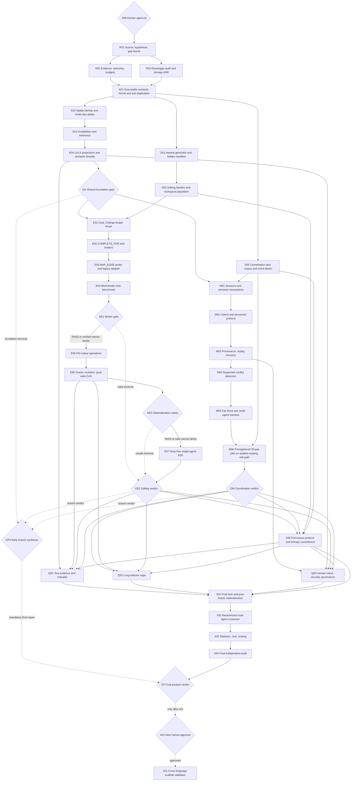

# Codeclew — кумулятивный доказательный план

## Метаданные

- **Режим:** extended `quick-plan`, planning/design-only.
- **Тип:** orchestration meta-plan; exact per-node run manifests создаются и
  проверяются до запуска соответствующего node.
- **Статус:** `PROPOSED_AWAITING_HUMAN_APPROVAL`.
- **Дата:** 8 августа 2026 года.
- **Code baseline:** `7fc3e0d6c6e784a130245ef0e344535a146324c7`.
- **Корневой gate:** `A00 HUMAN_APPROVAL`; до него запрещены implementation и
  benchmark runs.
- **Оркестратор:** исполняет только узлы, достижимые по принятой ветке DAG.
- **Worker:** свежая сессия без истории предыдущих узлов.
- **Verifier:** отдельная свежая сессия, не являющаяся автором или worker-ом
  проверяемого узла.
- **Предыдущий план:**
  [`2026-08-02-codeclew-corpus-first-plan.md`](2026-08-02-codeclew-corpus-first-plan.md)
  немедленно переведён текущей пользовательской инструкцией в
  `HISTORICAL_EVIDENCE_ONLY`: его nodes нельзя исполнять отдельно. После
  человеческого одобрения этот документ становится единственной точкой
  оркестрации.

Документ не утверждает, что описанные возможности уже реализованы или что
Codeclew уже выигрывает у baseline. Он определяет последовательность, в которой
эти утверждения должны стать доказанными, опровергнутыми или честно
неопределёнными.

## Source manifest

| ID | Роль | Путь | SHA-256 |
| --- | --- | --- | --- |
| `S0` | Исходное техническое задание | [`project.md`](../../../project.md) | `de216ab739fa58c267ba2891653102d81c7f87f3639419760b472face69b7d2d` |
| `S1` | Deep Research: semantic editing | [`deep-research-codeclew-semantic-editing-results.md`](../../experiments/deep-research-codeclew-semantic-editing-results.md) | `4354c3e7434bfce071f5a037351958a01aabe89f822ee8ff14fe878f47a51742` |
| `S2` | Проверенный план semantic editing | [`2026-08-02-codeclew-corpus-first-plan.md`](2026-08-02-codeclew-corpus-first-plan.md) | `c87f436db2a548c60f9106976afc8e0406de04eb07418d28d2a3a3631e9dc202` |
| `S3` | Верификация покрытия S1 планом S2 | [`codeclew-research-plan-coverage-verification-2026-08-02.md`](../../experiments/codeclew-research-plan-coverage-verification-2026-08-02.md) | `3a8742b36e911b7581441a4d2be2958b47c97b46bdc24776fa2b8b83b7d84e02` |
| `S4` | Постановка Deep Research coordination | `/workspace/user/Downloads/codeclew_dr2.txt` | `3e2263c15cf64dd58c3af9d4d128399105569034a739492e5bd5acde3cb029bf` |
| `S5` | Результаты Deep Research coordination | `/workspace/user/Downloads/codeclew_dr3.md` | `bf011d2dcfdfbb54cb703c34f657f35631ff8dadd72cf6b02385c4e7fa512f44` |

`R01` обязан архивировать или привязать digest внешних S4/S5 к
репозиторному evidence manifest до начала разработки. Изменение любого source
digest инвалидирует coverage verdict и создаёт новую версию DAG.

## Целевой результат

Нужно доказать или опровергнуть, что Codeclew может стать общей семантической
средой, в которой несколько агентов:

1. работают с кодом на L0–L5 уровнях абстракции;
2. локализуют затронутую поверхность без model-directed grep workflow;
3. формулируют компактные goals и obligations вместо textual patches;
4. материализуют изменения PSI-native операциями и fail-closed отказами;
5. публикуют intents, assumptions, claims и semantic transactions;
6. обнаруживают поддерживаемые смысловые конфликты раньше Git/build;
7. интегрируют изменения корректнее, быстрее и с меньшим суммарным расходом
   токенов, чем равносильные multi-agent default и AST-index workflows.

Ценность измеряется accepted integrated outcomes и стоимостью их достижения,
а не красотой графа, количеством semantic nodes или качеством пересказа кода.

## Нормативные ограничения

1. Git/source/build artifacts остаются authority исполняемого поведения.
2. Semantic model — disposable, rebuildable, lossy projection; не вторая
   программа.
3. Thread — bounded query-specific projection, не полное поведение.
4. Static graph не объявляется полным без `coverageBoundary` и `Unknown`.
5. Неполный detector возвращает
   `NO_CONFLICT_FOUND_WITHIN(boundary, evidence)`, но не `PROVEN_SAFE`.
6. Compilation, один test/demo, LLM judgment, красивый graph и отсутствие
   textual merge conflict не являются достаточным доказательством.
7. Repository-specific recipes и task vocabulary запрещены в general worker.
8. Неизвестный behavioral oracle остаётся model/human/external obligation или
   приводит к отказу.
9. Runtime и human evidence не смешиваются с static evidence как равносильные.
10. Новый production transform запрещён до `GE1`; полный product claim — до
    `GF`.

Практический anti-duplication test:

> Если удалить исходный код, сможет ли Codeclew самостоятельно воспроизвести
> все externally observable transitions компонента?

Ответ «да» для большей части системы означает, что проект строит вторую
реализацию и должен остановиться или сузить semantic model.

## Как согласованы предыдущие вердикты

| Область | Текущий research verdict | Кумулятивное решение |
| --- | --- | --- |
| Универсальный semantic editing | `GO_BUILD_CORPUS_FIRST`, confidence 0,88 | Старый G1 сохраняется; corpus и binder proof предшествуют PSI materialization. |
| Semantic coordination | `GO_BUILD_SEMANTIC_COORDINATION_MVP`, confidence 0,72 | Разрешён только экспериментальный MVP после executable consistency kernel и `GK`. |
| Универсальный digital twin | Не разрешён | Вне scope; semantic model обязана быть lossy и non-authoritative. |
| Cross-language migration | Specification scaffold hypothesis | Bounded untested scaffold входит в research deliverables; только empirical validation — post-GO `Z01`, не часть текущего GO. |

Эти вердикты не противоречат друг другу: первый относится к универсальности
semantic edit compiler, второй — к durable coordination state и раннему
обнаружению конфликтов. Сильный результат одной ветки не закрывает провал
другой.

## Термины итогового доказательства

```text
Accepted Integrated Outcome =
  all requested behavior implemented
  AND hidden tests pass
  AND no declared invariant violated
  AND no lost update
  AND no silent semantic retargeting
```

`Substantial advantage` означает одновременное выполнение correctness gate,
time/token thresholds и независимого статистического audit. Быстрый rejected
run не является победой.

`Grep-free Codeclew workflow` означает:

- агент Codeclew-arm не вызывает `rg`, `grep`, `find`, broad directory scans или
  broad source reads для локализации;
- агент может видеть только bounded semantic projection, exact anchored source
  fragment, build/test diagnostics и transaction receipt;
- compiler/parser/index internals могут читать source — это не model-directed
  grep workflow;
- любой fallback search фиксируется как `FALLBACK_SEARCH`, сохраняется в
  результатах и не считается grep-free успехом;
- невозможность построить полную поверхность приводит к structured refusal, а
  не к скрытому grep fallback.

Grep-free означает workflow-free, а не притворство, что compiler никогда не
сравнивает tokens. Исполняемый allowlist model-visible navigation:

```text
OPEN_PROJECT(exact compilation/module)
BOOTSTRAP_TASK(taskTextDigest, originalTaskText)  # ровно один вызов
EXPAND_HANDLE(handle, declaredEdgeKinds, boundedDepth)  # <=2 follow-ups
READ_ANCHOR(anchorId)                             # exact fragment only
SUBMIT_TYPED_GOAL(goal)
PREVIEW_VALIDATE_COMMIT(transactionId)
```

Правила:

- только `BOOTSTRAP_TASK` может использовать task-text lexical tokens внутри
  service; он deterministic, versioned и логирует все lexical predicates,
  candidates и rejected decoys;
- binder/agent не может переписывать query, делать substring/regex/FQN/path
  search, перечислять files или просить «ещё похожие» candidates;
- `EXPAND_HANDLE` идёт только от уже выданного semantic handle по разрешённым
  typed edges; unanchored expansion запрещён;
- на task суммарно: один bootstrap, не более двух expansions, `<=32 KiB`
  model-visible context, `<=12 KiB` exact anchored source и `<=512` semantic
  records. `R02` может только ужесточить эти default caps до freeze;
- series of anchors, widening, extra bootstrap, hidden broad read, превышение
  calls/bytes/records или task-derived lexical predicate вне bootstrap получает
  `FALLBACK_SEARCH` и проваливает `H04`;
- rename/decoy/10× padding tests должны показать, что разрешённый lexical seed
  лишь находит initial semantic candidates, а obligation closure/binding не
  зависит от surface vocabulary.

`M05` enforce-ит allowlist по capability manifest и полному tool-event trace;
агентская декларация «я не использовал grep» доказательством не является.

## Реестр гипотез

| ID | Гипотеза | PASS | CONDITIONAL | STOP/FALSIFIER |
| --- | --- | --- | --- | --- |
| `H01` | Semantic model остаётся полезной lossy projection. | 100% product-derived fact types имеют used query/constraint/decision, rebuild source и boundary; full derived store rebuild даёт эквивалентные registered query results; anti-duplication test пройден. | Ограниченная executable specification только для явно owned critical scope. | Модель воспроизводит большую часть externally observable behavior без source, содержит orphan fact types или требует ручного дублирования transition logic. |
| `H02` | Stable identity и invalidation безопасны в supported contour. | Zero silent retargeting; `SAME/RENAMED/MOVED/SPLIT/MERGED/DELETED/AMBIGUOUS` корректны; ambiguity блокирует publication. | Неоднозначность явно приводит к refuse/reslice. | Silent retargeting или stale fact используется как fresh. |
| `H03` | Multi-level L0–L5 projections сокращают model context. | Context `16–32 KiB`, typical goal `<=1 KiB`, обязательная closure не усечена; 10× padding не выводит context за budget. | `PARTIAL_BUDGET` с корректным отказом. | Context растёт с repository LOC либо upper-level claim не имеет provenance. |
| `H04` | Semantic binding позволяет отказаться от grep workflow. | 100% Codeclew runs соблюдают frozen query allowlist/cumulative caps: semantic resolution или explicit refusal без fallback; independently weighted applicability `>=60%`; correct binding `>=90%`; false complete `0`; must-refuse `100%`. | Applicability `40–59,99%`: одна preregistered binder-only итерация. | Applicability `<40%`, task-derived lexical query вне one-shot bootstrap, widening/over-budget, decoy-sensitive binding или fallback search. |
| `H05` | Grep-free semantic editing существенно дешевле single-agent default/AST. | Accepted correctness non-inferior к лучшему baseline по `δ=5` п.п.; accepted win rate `>=70%`; median E2E `-30%`, noncached tokens `-30%`, raw tokens `-40%` против каждого baseline; 95% CI исключает отсутствие cost выигрыша. | Correctness NI, но одна cost-метрика/CI не достигнута: `NARROW/INCONCLUSIVE`. | Correctness не проходит NI, safety violation или model пишет low-level source plan в большинстве applicable tasks. |
| `H06` | PSI-native materialization безопасна. | False commit `0`; must-refuse до candidate `100%`; no textual edit path chosen family; goal-wide CAS/recovery green. | Unsupported query/framework boundary — explicit refusal. | Text/source-shape recipe обязателен для generalization или incorrect commit. |
| `H07` | Semantic MVCC раньше обнаруживает supported conflicts. | Detection uplift `>=20` п.п. против MA-AST; FN `0`; FP `<10%` для preregistered text/symbol/signature/project-model/declared-assumption/explicit-resource classes. | FP `10–15%`: одна detector iteration, новый withheld set. | Uplift `<20` п.п., FP `>15%` или любой FN supported class. |
| `H08` | Coordination не мешает независимой работе. | Independent-task coordination overhead `<20%`, paired 95% CI upper bound `<20%`; disjoint work не сериализуется; correctness non-inferior. | Point estimate ровно/ниже `20%`, но CI пересекает `20%`: inconclusive, новый preregistered run. | Point estimate `>20%` или lost parallelism/correctness. |
| `H09` | Multi-agent Codeclew существенно выигрывает на conflict-heavy tasks. | Accepted integration time `-25%`; human interventions `-30%`; noncached tokens `-30%`; raw tokens `-40%` против MA-default и MA-AST; accepted outcome NI по `δ=5` п.п.; paired 95% CI primary ratios ниже `1.0`. | Human reduction `[20%,30%)`, integration `[20%,25%)`, positive token direction below target или CI пересекает no-benefit: `NARROW`/confirmatory series. | Human или integration improvement `<20%`, token advantage `<=0`, correctness не проходит NI или safety violation. |
| `H10` | Structured protocol заменяет большую часть свободного dialogue. | `<=20%` resolved episodes требуют only-free-text; каждый dialogue result materialized typed decision/obligation. | `>20%` и `<=30%` — narrow/iterate. | `>30%` resolved episodes не получают useful semantic artifact. |
| `H11` | Инкрементальная модель практически выполнима. | Small change p95 update `<5 s`; stale-assumption notification `<5 s`; no duplicate publication; sampled active stale facts `0` in supported boundary. | `PARTIALLY_FRESH` не блокирует unrelated partitions и явно показан, при этом latency всё ещё `<5 s`. | Любой latency p95 `>=5 s`, `>10%` sampled facts stale или service ухудшает Git workflow. |
| `H12` | Test-evidence/criticality улучшает выбор проверок и refactoring decomposition. | На frozen mutant set supported routing recall `100%`, median selected test time `<=70%` run-all, omission/wrong-order mutant kill `100%`, accepted correctness non-inferior; ranking не называется probability. | Экономии нет, но evidence links/mutation gate безопасны: `NARROW_TO_EVIDENCE`. | Любой supported routing miss, self-confirming oracle или uncalibrated score выдан за failure probability. |
| `H13` | Hybrid storage нужен только при измеримой пользе. | Representative workload укладывается в `H11` и `R02` resource budgets на existing SQLite; либо proposed extension даёт preregistered `>=25%` p95 query/update improvement без correctness loss и с `<=20%` operations/state overhead. | Module-level materialization и rebuild fallback достаточны для MVP. | Добавлены graph/OWL/hypergraph services без достигнутого threshold либо state/operations cost dominates. |
| `H14` | Cross-language model полезна как specification scaffold. | После primary GO bounded equivalence доказана только по declared observables/tested domain/platform assumptions. | `Z01` возвращает `INCONCLUSIVE`, не влияет на MVP verdict. | Модель используется как universal transpiler или заявляет arbitrary behavioral equivalence. |

Confidence из research является provenance, но не gate. Любое изменение
threshold после открытия результатов создаёт новую experiment version; старые
runs не объединяются с ней.

Для `H12` decision ownership frozen отдельно: `X00` задаёт protocol,
`Q01` строит только candidate evidence/routing machinery на dev fixtures,
`X01` после final-system lock материализует hidden mutant/routing set, `X02`
измеряет, `X03` только пересчитывает, и лишь independent `X04` записывает
`hypothesisDecision.H12`. Ни один pre-freeze result не может подтвердить или
опровергнуть H12 product claim.

## Разрешение серых зон

| Метрика | PASS | CONDITIONAL/NARROW | STOP |
| --- | ---: | ---: | ---: |
| Supported-conflict FP | `<10%` | `10–15%`, одна итерация | `>15%` |
| Human intervention reduction | `>=30%` | `>=20%` и `<30%` | `<20%` |
| Integration-time reduction | `>=25%` | `>=20%` и `<25%` | `<20%` на conflict-heavy sample |
| Independent overhead | point `<20%` и 95% CI upper `<20%` | point `<=20%`, но CI пересекает `20%` | point `>20%` или lost parallelism |
| Applicability | `>=60%` | `40–59,99%`, одна итерация | `<40%` |
| Free-text-only resolution | `<=20%` | `>20%` и `<=30%` | `>30%` |

## Statistical and missing-data conventions

- Accepted-outcome non-inferiority margin `δ=5` percentage points; paired
  bootstrap 95% lower bound `Codeclew - comparator >= -0.05`. Это не ослабляет
  safety gates: lost/silent/false commit/must-refuse violations должны быть `0`.
- Primary cost ratios use all preregistered instances with timeout/failure
  penalties from `R02`; нельзя считать только accepted fast runs. Accepted-only
  view публикуется secondary.
- `accepted win rate` denominator — все preregistered
  `task × comparator` pairs. Win: Codeclew accepted, comparator not; либо оба
  accepted и Codeclew total E2E ниже comparator более чем на frozen 2% tie
  band. Comparator-only acceptance = loss; both unaccepted or time difference
  within tie band = tie. Ties остаются в denominator и не считаются wins;
  expected correct refusal определяется hidden judge как accepted outcome.
- Human intervention = discrete external human decision/rework action после
  `TASK_VISIBLE`; denominator — все conflict-heavy instances. Free-text ratio
  denominator — все resolved coordination episodes; unresolved episodes
  публикуются отдельно и не исчезают из correctness/integration denominator.
- Missing primary correctness, event-clock, human, time or native-token value
  makes the corresponding hypothesis `INCONCLUSIVE/UNAVAILABLE`, never PASS.
- Exactly `5.000 s` fails strict `<5 s`; exactly 20%/25%/30% belongs to the
  interval shown in the table. `R02` freezes rounding precision and bootstrap
  method before any outcome.

## Два ортогональных уровня графа

Program abstraction:

```text
L5 capability/outcome
  -> L4 architecture/ownership
  -> L3 journey/thread
  -> L2 component/contract/effect
  -> L1 symbol/type/call/CFG/def-use/anchor
  -> L0 authoritative source/build/schema
```

Evidence aggregation:

```text
E0 raw artifact/event/token record
  -> E1 observed/derived/declared fact
  -> E2 obligation/proof/refusal/delta
  -> E3 task or integrated outcome
  -> E4 paired/cohort result
  -> E5 product/architecture verdict
```

Каждый E(n+1) claim обязан ссылаться на verified receipts E(n). Переход от
green build напрямую к E5 запрещён.

## Execution-time контракт узла

Карточки в этом документе — logical `NodeSpec`, а не готовые shell instructions:
это orchestration meta-plan. До старта **каждого** node оркестратор обязан
материализовать schema-valid `run-manifest.json` со всеми следующими полями;
independent verifier делает preflight manifest до выдачи worker-у. Отсутствие
точного path, verification command, budget, retry или predicate означает
`BLOCKED_MANIFEST`, а не право worker-а додумать их.

```text
NodeContract {
  id
  status
  kind
  goal
  hypothesisIds[]
  hardPredecessors[]
  readFirst[]
  boundedWork
  nonGoals[]
  expectedEvidenceDelta
  outputArtifacts[]
  genericOutcomeArtifacts[]
  verificationCommands[]
  independentVerifierChecks[]
  modelContextBudget
  tokenAndTurnBudgetRef
  retryPolicy
  retryableGenericBranchCodes[]
  passPredicate
  allowedOutcomes
  branchCodeRegistryRef
  conditionalEdge
  failOrStopEdge
}
```

`R02` создаёт и тестирует schema/validator, но не может ослабить hypotheses или
thresholds этого документа. Для compound node каждый bullet bounded work/
independent pass превращается в именованный conjunctive `subPredicate`; PASS
требует все mandatory subPredicates. Независимые subchecks могут исполняться
параллельно, но join packet не получает partial PASS. Exact commands/paths и
per-node budgets фиксируются до начала node, потому что до соответствующего
implementation revision они ещё не существуют.

Canonical execution layout:

```text
evidence/graphs/<plan-digest>/
  manifests/<node>/<attempt>/run-manifest.json
  packets/<node>/<attempt>/{packet.json,summary.md}
  receipts/<node>/<attempt>/{receipt.json,verification.md}
  objects/sha256/<digest>
  decisions/<gate>/decision.json
```

Implementation node manifest также фиксирует exact base/tree, owned paths,
non-goals и mandatory non-regression command. Эти directories создаются только
после `A00`; здесь зафиксирована topology, не пустые placeholder files.

### Bootstrap `NodeContract-v0`

Чтобы `R02` не требовал собственный ещё не созданный validator, `A00` одобряет
вместе с этим документом immutable bootstrap contracts:

- [`2026-08-08-codeclew-node-contract-v0.schema.json`](2026-08-08-codeclew-node-contract-v0.schema.json);
- [`2026-08-08-codeclew-bootstrap-manifests-v0.json`](2026-08-08-codeclew-bootstrap-manifests-v0.json);
- [`2026-08-08-codeclew-evidence-packet-v0.schema.json`](2026-08-08-codeclew-evidence-packet-v0.schema.json);
- [`2026-08-08-codeclew-verification-receipt-v0.schema.json`](2026-08-08-codeclew-verification-receipt-v0.schema.json);
- [`2026-08-08-codeclew-bootstrap-contract-fixtures-v0.json`](2026-08-08-codeclew-bootstrap-contract-fixtures-v0.json);
- [`2026-08-08-codeclew-terminal-synthesis-v0.json`](2026-08-08-codeclew-terminal-synthesis-v0.json);
- [`2026-08-08-codeclew-approval-bundle-v0.schema.json`](2026-08-08-codeclew-approval-bundle-v0.schema.json);
- [`2026-08-08-codeclew-bootstrap-controller-v0.rb`](2026-08-08-codeclew-bootstrap-controller-v0.rb).

`NodeContract-v0` содержит полные read-first/output path templates, commands,
predicates, branch codes и **team** budgets для `R01/R02/R03`, а также
терминальный bootstrap-profile `GK`. Последний активируется только при наличии
accepted exhausted generic outcome от bootstrap-source до появления normal
foundation continuation; он ждёт quiescence reachable wave, принимает полный
отсортированный parent set и может выпустить только
`SUCCESS + INCONCLUSIVE_FOUNDATION` в `GF0`. Он не имеет implementation edge.
`EvidencePacket-v0` и `VerificationReceipt-v0` тем самым делают исполнимым и
положительный, и отрицательный bootstrap proof loop до появления v1.

Standard JSON Schema validator и fresh verifier проверяют их без artifacts
`R02`; равенство receipt `producerSessionId` packet producer-у и неравенство
producer/verifier session ID, которые JSON Schema не выражает, проверяет
controller. `A00` является единственным special predecessor: его
`HUMAN_APPROVED` представлен `approval-bundle.json` с exact `USER` messages,
thread/turn/message IDs и SHA-256 текста, прочитанными из текущей Codex-сессии.
Это local workflow gate, а не third-party identity proof: наличие явного
одобрения проверяет orchestrator через read-only session view, controller
проверяет целостность записи и bundle digests. Отсутствие явного сообщения
оставляет `A00` закрытым; RSA/PKI не является целью исследования. Для `R01`
controller требует этот bundle вместо
predecessor receipt; для всех остальных predecessor исключений нет. `R03`
безопасно параллелен `R02`. `R02` выпускает и негативно
тестирует полный v1 contract set; normal profile `GK` и все nodes начиная с
`K01` блокируются без accepted v1 preflight receipt. Если bootstrap уже
терминализирован v0-profile `GK`, v1 не может открыть implementation задним
числом.

Bootstrap receipt digest считается по RFC 8785 canonical JSON без самого поля
`receiptDigest`, что явно фиксируется `digestScope`; content-addressed object
store дополнительно проверяет digest полного сохранённого файла. Это устраняет
self-hash ambiguity.

Fixture bundle — это immutable self-test specification, а не набор
самообъявленных «valid» JSON. Исполняемый controller в disposable object store
сам материализует placeholders, создаёт полный accepted chain
`A00 -> R01 -> R02`, два exhausted attempts `R02/R03` и terminal-only `GK` с
точным simultaneous parent set. Сначала он обязан принять positive success и
failure-closure chains, затем отклонить либо fail-closed нормализовать
mutations: `ACCEPT` с mandatory `FAIL`, missing/wrong mandatory check,
unavailable native tokens с claim domain `TOKEN`, duplicate manifest IDs,
dangling/mismatched refs, same producer/verifier session, wrong/missing retry
ancestry, wrong GK parent set/branch, forged producer edge, success без полного
success-output set, generic outcome без diagnostic и over-budget team total.
Последний не открывает continuation: controller обязан сразу спроецировать его
в exhausted `NO_PROGRESS + BUDGET_EXCEEDED`. Compile schema без успешного
`bootstrap-controller-v0.rb --self-test` не считается bootstrap verification.

Plan-time/bootstrap validation command:

```bash
npx --yes ajv-cli@5 validate --spec=draft2020 \
  -s docs/superpowers/plans/2026-08-08-codeclew-node-contract-v0.schema.json \
  -d docs/superpowers/plans/2026-08-08-codeclew-bootstrap-manifests-v0.json
npx --yes ajv-cli@5 compile --spec=draft2020 \
  -s docs/superpowers/plans/2026-08-08-codeclew-evidence-packet-v0.schema.json
npx --yes ajv-cli@5 compile --spec=draft2020 \
  -s docs/superpowers/plans/2026-08-08-codeclew-verification-receipt-v0.schema.json
ruby docs/superpowers/plans/2026-08-08-codeclew-bootstrap-controller-v0.rb \
  --self-test
jq -e '
  ([.outcomeSynthesisGroups[].sources[]] | length) ==
    ([.outcomeSynthesisGroups[].sources[]] | unique | length) and
  (.gf0.pairCount ==
    ((.gf0.editingDomain | length) * (.gf0.coordinationDomain | length))) and
  (.gf0.exhaustivePairs | length) == .gf0.pairCount and
  ([.gf0.exhaustivePairs[] | [.editing, .coordination]] | unique | length) ==
    .gf0.pairCount and
  ([.gf0.editingDomain[] as $e |
      .gf0.coordinationDomain[] as $c | [$e, $c]] | sort) ==
    ([.gf0.exhaustivePairs[] | [.editing, .coordination]] | sort) and
  ([.gf0.exhaustivePairs[] | select(.route == "FULL_PATH")] | length) ==
    .gf0.expectedFullPathPairs and
  ([.gf0.exhaustivePairs[] | select(.route == "FULL_PATH" and .target != "X00")] | length) == 0 and
  ([.gf0.exhaustivePairs[] | select(.route == "GF0")] | length) ==
    (.gf0.pairCount - .gf0.expectedFullPathPairs)
' docs/superpowers/plans/2026-08-08-codeclew-terminal-synthesis-v0.json
```

Adversarial fixture validation выполняется в disposable `mktemp -d` самим
controller: он материализует полный positive object graph, AJV сначала
принимает его, затем schema-invalid mutations обязаны вернуть non-zero, а controller-only
mutations — exact fail-closed projection/rejection. Exact invocation
записывается в planning verification report; положительный exit schema-invalid
mutation либо неверная controller projection — planning failure. Отдельный
DOT/sidecar validator обязан дополнительно доказать
полный Cartesian product `editingDomain × coordinationDomain`, ровно одну
строку на пару, согласованность всех `OUTCOME_SYNTHESIS` source/sink sets,
retry branch vocabularies и принадлежность каждого normalization target
terminal vocabulary соответствующего totalizer-а.

`A00` фиксируется отдельным `approval-bundle.json`, который содержит SHA-256
этого plan, authoritative DOT, всех восьми bootstrap sidecars, финального
planning-verification report и S0–S5, а также current-session approval record.
Approval относится к точному plan scope и зафиксированному session decision.
Изменение product scope, hypotheses или terminal criteria возвращает статус
`PROPOSED_AWAITING_HUMAN_APPROVAL`; уже явно разрешённая planning-only
фиксация session provenance не требует повторного approval. Digest не
встраивается в собственный файл, поэтому circular hash отсутствует.

Bootstrap team budgets включают producer, independent verifier и допустимый
retry, но не evaluation-controller:

| Node | Noncached token ceiling | Output ceiling | Tool calls | Wall ceiling | Per-turn visible context |
| --- | ---: | ---: | ---: | ---: | ---: |
| `R01` | `180,000` | `30,000` | `60` | `90 min` | `64 KiB` |
| `R02` | `100,000` | `20,000` | `50` | `60 min` | `64 KiB` |
| `R03` | `120,000` | `25,000` | `80` | `120 min` | `64 KiB` |
| terminal-only `GK` v0 | `30,000` | `8,000` | `20` | `20 min` | `64 KiB` |

Receipt содержит producer-telemetry digest, verifier telemetry, ссылки на все
prior attempts, canonical budget digest и recomputed team totals. Tokens и
tool calls суммируются по producer + verifier + prior attempts; wall — elapsed
от самого раннего attempt start до `verifiedAt`, а context ceiling проверяется
по максимуму любого turn. Controller независимо пересчитывает формулы и
сравнивает их с manifest.

Ceiling исчерпан независимо от содержимого packet — immutable raw result
сохраняется, но controller выставляет effective
`NO_PROGRESS + BUDGET_EXCEEDED`; continuation и retry закрываются, разрешён
только exhausted scope synthesis. Поскольку team budget кумулятивен, повтор
после его превышения математически не может вернуться под тот же ceiling.
Если provider не отдаёт native tokens, bootstrap всё равно проверяет
context/tool/wall caps, ставит `TOKEN_TELEMETRY_UNAVAILABLE` в cost receipt и
`R02` не может открыть token claims; bytes не объявляются tokens. Превышение
любого доступного non-token ceiling имеет приоритет и остаётся
`BUDGET_EXCEEDED`.

Node может получить `VERIFIED_PASS` только если он добавил хотя бы один
подтверждённый research delta:

- закрыл gap ID;
- подтвердил, опроверг или сузил hypothesis;
- создал проверенный prerequisite artifact, реально потребляемый successor;
- получил новый accepted/refused/failure outcome, меняющий агрегированное
  evidence.

Code и green tests без нового evidence delta дают `NO_PROGRESS`, а не PASS.

## Evidence packet

Каждый node сохраняет canonical `packet.json`, человекочитаемый `summary.md` и
content-addressed raw artifacts:

```text
EvidencePacket {
  nodeId, attempt, startedAt, producerCompletedAt
  outcome: SUCCESS | FAILURE | REFUSED | BLOCKED | NO_PROGRESS | INFRA_ERROR
  branchCode, limitations[]
  hypothesisIds
  producerAgent, modelVersion, toolVersions
  approvalBundleDigest, runManifestDigest, artifactSetDigest
  metricEligibility { nativeTokens: AVAILABLE | UNAVAILABLE }
  sourceDigests[exact S0..S5 {role,ref,sha256}], parentReceiptDigests[]
  gitTree, buildModelHash, analyzerVersions
  programLevels[], evidenceLevel, coverageBoundary, unknowns[]
  preregistrationRef, commandsOrRunManifest
  claims[] { label, domains[], soundnessClass, evidenceRefs[]{ref,sha256}, falsifiers }
  dischargedObligations[], unresolvedObligations[]
  taskVisibleAt, firstEditAt, acceptedIntegrationAt
  environmentReleasedAt, preprocessingStartAt, repositoryReadyAt
  coldSetup, maintenance, amortizedSetup, analysis, coordination, inference,
  buildTest, integrationRework durations
  input, cachedInput, output, raw, noncached tokens
  context, goal, proof, diagnostic bytes
  messages, navigationCalls, toolCalls, modelTurns
  CPU, memory, storage, updateLatency
  evidenceDelta { kind, statement, domains[], artifactRefs[]{ref,sha256} }
  artifacts[] { path, sha256, sensitivity }
  humanReadableConclusion
  proposedNextEdges[]  # non-authoritative hint
}
```

`artifactSetDigest` хеширует exact sorted actual artifact paths в packet, а не
ожидаемый success set. `proposedNextEdges` никогда не авторизует переход:
controller вычисляет отдельный exact `effectiveEligibleNextEdges` только из
frozen DOT, effective outcome/branch и current digests. При native token
telemetry producer-а `UNAVAILABLE` packet schema и controller запрещают domain
`TOKEN` в claims и evidence delta этого packet; человекочитаемая проза не
является metric verdict. Это packet-local eligibility. Отдельный receipt
вычисляет team-wide availability по current producer + verifier + prior
attempts: если хотя бы один участник не имеет native telemetry, downstream
team-token verdict остаётся `UNAVAILABLE`, даже если producer packet локально
мог содержать token evidence.

Отдельный `VerificationReceipt` содержит checks с typed
`evidenceRef {ref,sha256}` и `costAccounting`. Любая claim/delta/check ссылка
обязана byte-for-byte разрешаться либо в artifact текущего immutable packet,
либо в явно разрешённый content-addressed predecessor/object-store object.
Неизвестный path, повтор path с разными hashes или hash mismatch запрещает
`CONTROL_ACCEPT`.

Evidence labels нормализуются к:
`CODE | TEST | LITERATURE | EXISTING_SYSTEM | EXISTING_STANDARD |
EXISTING_BENCHMARK | OBSERVATION | INFERENCE | HYPOTHESIS |
DESIGN_DECISION | HUMAN_DECISION`.

## Independent verifier contract

1. Producer и verifier — разные fresh sessions; verifier не получает reasoning
   transcript producer-а и не может править его artifacts.
2. Verifier читает preregistration, immutable packet и raw evidence, повторяет
   ключевые проверки и возвращает отдельный receipt.
3. Hidden correctness judge отделён от experiment-integrity verifier.
4. Correctness оценивается до открытия mode labels и cost ranking.
5. Verdict: `ACCEPT | ACCEPT_EXPLORATORY_ONLY | REJECT_RETRYABLE |
   REJECT_FATAL | BLOCKED_EXTERNAL`.
6. Refused/failed outcome может иметь `ACCEPT` receipt и обязан остаться в
   агрегатах.
7. Verifier не чинит node. Любая правка создаёт immutable retry attempt.
8. Accepted receipt подтверждает честность packet, но не его успех. Outgoing
   edge eligible только по конъюнкции:

```text
receipt.verdict == ACCEPT
AND controller.verdict == CONTROL_ACCEPT
AND controller.effectiveOutcome IN edge.acceptedOutcomes
AND (
  controller.effectiveBranchCode IN edge.acceptedBranchCodes
  OR edge.branchMatch == ANY_SOURCE_REGISTERED_CODE
)
AND all referenced digests are current
AND selected gate branch permits the successor
```

`ANY_SOURCE_REGISTERED_CODE` имеет одно frozen значение из
`genericBranchPolicy` sidecar: только когда effective outcome входит в generic
terminal set, controller проверяет effective branch membership в полном source
`NodeSpec.branchCodes`,
включая default `NONE`. Это **не** wildcard по произвольной строке и не ссылка
на `terminalBranchCodes`, которые описывают только успешно вычисленные domain
terminal decisions.

`BUDGET_EXCEEDED` — обязательный global diagnostic code каждого v0/v1
NodeSpec. Его создаёт только controller effective projection; producer может
зафиксировать его raw лишь если ceiling уже был доказанно превышен до
verification. Он никогда не входит в continuation/terminal-success vocabulary.

Подтверждённый `FAILURE/REFUSED/NO_PROGRESS` остаётся evidence. Эти generic
outcomes зарезервированы для невозможности завершить/проверить node
(включая budget exhaustion), а **не** для успешно измеренного опровержения
гипотезы. Если retry ещё разрешён, generic outcome создаёт immutable
`RETRY_OF`; после исчерпания ровно один `OUTCOME_SYNTHESIS` edge передаёт
полный wave-quiescent set read-only scope totalizer-у (`GK`, `GE2`, `GM` или
`GF`). Generic failure никогда не идёт по implementation continuation и
нормализуется только в `INCONCLUSIVE_*`.

Успешно проверенный falsifier имеет `outcome=SUCCESS` и exact
`terminalBranchCode`; он идёт по отдельному `TERMINAL_SYNTHESIS` mapping и
может честно дать `STOP/NARROW`. Frozen mappings включают как минимум
`K01.STOP_SECOND_IMPLEMENTATION`, `K02.STOP_SILENT_IDENTITY_RETARGETING`,
`K03.STOP_STALE_FACT_AS_FRESH`, `K04.STOP_ABSTRACTION_CLAIM`,
`E01.STOP_UNSAFE_GOAL_PROOF`, `E02.STOP_FALSE_COMPLETENESS`,
`E03.STOP_MAP_EDGE_GENERALIZATION`, `E05.STOP_RECIPE_DEPENDENCY`,
`E06.STOP_UNSAFE_COMMIT`, `M01.STOP_UNSAFE_SEMANTIC_TRANSACTION`,
`M02.STOP_LOCK_EMULATION`, `M03.STOP_STALE_COORDINATION_STATE`,
`M04.STOP_SUPPORTED_CONFLICT_FALSE_NEGATIVE` и post-freeze
`X04.STOP_H12_TEST_ROUTING_SAFETY`. Поэтому доказанное опровержение не laundering-ится
в infrastructure inconclusive, а незавершённая работа не может притвориться
product falsifier.

Именованные карточками значения — не новые outcome, а нормативные
`branchCode`. Diagnostic `REWORK/BLOCK/BUDGET_EXCEEDED` сопровождает generic
outcome и сам не может превратить его в success. Напротив, подтверждённый
`STOP/NARROW` falsifier сопровождает только `SUCCESS` и исполним лишь при exact
successful continuation/terminal edge. `SUCCESS` с limitation тоже проходит
только edge, явно включивший этот code в `acceptedBranchCodes`.

Успешно вычисленный gate всегда имеет generic `outcome=SUCCESS`, даже если его
domain decision — `STOP`, `NARROW`, `REWORK` или `INCONCLUSIVE`; смысл решения
находится только в `branchCode`. Зарегистрированный `retryBranchCode` создаёт
новый attempt только при положительном remaining budget. При нуле
`SUCCESS + retryBranchCode` запрещён, но не создаёт тупик: **до финализации
packet** deterministic rule sidecar либо выпускает `SUCCESS +` direct terminal
normalizer в самом totalizer (`GK/GM`), либо выпускает verified
`NO_PROGRESS + diagnostic retryBranchCode`, который идёт по уже существующему
`OUTCOME_SYNTHESIS` в `GE2/GF`. Ошибка выполнения самого gate имеет generic
negative outcome и попадает только в outcome synthesis. Это отделяет
достоверность вычисления решения от желательности результата.

### Fail-closed acceptance controller

Receipt не является self-authorizing. Перед любым edge детерминированный
controller создаёт `CONTROL_ACCEPT` только при одновременном выполнении всех
проверок:

1. manifest, packet и receipt schema-valid; node ID существует ровно один раз;
2. approval-bundle, run-manifest, source и **полный** hard-predecessor receipt
   set совпадают с текущими digest. Packet и independently observed runtime содержат ровно
   шесть canonical source tuples `{role,ref,sha256}` для `S0..S5`, полностью
   равных `approvalSubject.sources`; подмена, перестановка role, duplicate,
   missing или extra source запрещены и для current, и для prior attempt.
   Лишний или пропущенный parent запрещён.
   Единственное исключение — `A00`, представленный exact current-session
   `USER` approval record и approval-bundle digest вместо receipt;
3. для raw `SUCCESS` packet artifact paths/digests равны интерполированному
   manifest `outputArtifacts` success-set, исключая self-referential
   `packet.json/summary.md`; для generic outcome обязателен интерполированный
   `failure.json` из `genericOutcomeArtifacts`, разрешён hashed subset уже
   созданных success artifacts и запрещён любой undeclared path. Благодаря
   этому честный ранний отказ не обязан выдумывать ещё не созданные success
   outputs. `artifactSetDigest` равен SHA-256 от canonical sorted exact actual
   artifact paths; packet/summary controller отдельно разрешает по exact
   manifest paths в immutable object store и сверяет hashes (packet — по
   canonical packet digest scope, summary — по сохранённым bytes);
4. receipt `packetDigest`, node, outcome, branch, approval и manifest digest
   byte-for-byte совпадают с packet/controller inputs;
5. `receipt.producerSessionId == packet.producer.sessionId`, а
   `receipt.verifier.sessionId != packet.producer.sessionId`; receipt содержит
   ровно `requiredCheckIds` manifest, и при
   `ACCEPT/ACCEPT_EXPLORATORY_ONLY` каждый mandatory check имеет `PASS`;
6. `packet.hypothesisIds` — exact set manifest, а каждая
   claim/evidence-delta/check digest-ref разрешается в единственный immutable
   artifact либо authorized content-addressed predecessor object с тем же
   SHA-256; dangling или conflicting ref запрещён;
7. producer native-token availability согласована с nullable token fields,
   packet `metricEligibility` и typed claim domains; `TOKEN` domain при
   producer-unavailable telemetry запрещён. Receipt отдельно вычисляет
   team-wide availability; любой unavailable verifier/prior блокирует
   downstream token-win. Для `R02 SUCCESS` producer availability биективно связана с `NONE` либо
   `TOKEN_TELEMETRY_UNAVAILABLE`;
8. controller проверяет monotonic
   `earliest startedAt <= producerCompletedAt <= receipt.verifiedAt`,
   пересчитывает producer + verifier + все prior-attempt costs, wall elapsed,
   canonical budget/telemetry digests и exact team totals; mismatch даёт
   `CONTROL_REJECT`, а превышение даёт effective
   `NO_PROGRESS+BUDGET_EXCEEDED` независимо от raw packet;
9. branch code зарегистрирован для node, edge-role subsets валидны, все digests
   current и receipt canonical digest воспроизводится;
10. receipt attempt совпадает с packet; attempt 1 имеет пустую ancestry,
   attempt 2 содержит ровно controller-authorized accepted retryable-generic
   attempt-1 packet+receipt refs того же node, а prior branch обязан входить в
   frozen `NodeSpec.retryableGenericBranchCodes`; prior `SUCCESS`, `EXCEEDED`,
   `NONE`, `BUDGET_EXCEEDED`, любой иной non-retryable branch или непустая
   attempt-1 ancestry запрещены. Controller
   повторяет полную prior identity/schema/check/session/digest validation,
   загружает refs byte-for-byte, проверяет attempt/timestamps и считает
   current+prior producer/verifier cost. Retry budget согласован с
   terminal-synthesis entry: zero-budget
   `SUCCESS+retry` отклоняется, а pre-finalized direct-terminal либо generic
   `NO_PROGRESS` packet точно соответствует `exhaustionAction` и sink.

Controller не интерпретирует исследовательский вывод и не заменяет verifier;
он проверяет только замкнутость ссылок, budget projection и невозможность
ложного unlock. При `WITHIN` effective outcome/branch копируют packet; при
token-unavailable запрещается любой token-domain claim; при `EXCEEDED`
применяется projection выше и retry не разрешён. Producer edge hints
игнорируются; controller публикует authoritative
`effectiveEligibleNextEdges`. Любой integrity/formula mismatch даёт
`CONTROL_REJECT` и закрывает все outgoing edges. `R02` обязан
перенести этот контракт в v1 без ослабления и тестировать positive плюс
adversarial fixtures.

## Token economy и no-progress policy

- Admission до запуска требует: один открытый gap/hypothesis/falsifier, один
  заранее названный evidence delta, хотя бы одного exact consumer-а или
  terminal decision и отсутствие уже accepted эквивалентного artifact. Иначе
  node не запускается; planning log записывает reason
  `duplicate-or-no-information-gain` (это не packet outcome/branchCode) без
  расхода solving budget.
- Successor получает node card, verified summaries direct predecessors и
  artifact refs, но не общий transcript.
- Model-visible semantic context: `<=32 KiB`; typical goal: `<=1 KiB`;
  human-readable evidence summary: `<=16 KiB`.
- Raw logs не вставляются в prompt; verifier открывает их адресно.
- Перед node `R02` фиксирует равные per-arm token/time/tool budgets и provider
  telemetry contract. Bytes не заменяют tokens.
- В benchmark считается сумма orchestrator + parent + all children + retries +
  operational verifiers. Evaluation-controller cost публикуется отдельно.
- Author attempts: максимум два до freeze. Logical wrong answer после freeze —
  outcome, не infrastructure retry.
- Preregistered infrastructure failure: максимум один rerun, обе записи
  сохраняются.
- Повтор одинакового `failureFingerprint` без accepted evidence delta во второй
  раз создаёт `NO_PROGRESS` и через scope totalizer ведёт к читаемому
  `INCONCLUSIVE/NARROW/STOP`, а не к оборванному графу.
- После каждого node публикуются cumulative team tokens и отношение
  `accepted evidence deltas / 100k noncached tokens` как descriptive research
  efficiency; эта величина не заменяет correctness/cost gates и не допускает
  дробления одного логического результата на фиктивные deltas.
- Отсутствие native token telemetry делает token verdict `UNAVAILABLE`; оно не
  превращается в token win по bytes.

## Edge semantics

| Edge | Значение |
| --- | --- |
| `REQUIRES_VERIFIED` | Successor закрыт до accepted receipt **и** совпадения packet outcome с predicate edge для всех hard predecessors. |
| `FORK` | Параллельные nodes разрешены только при доказанно disjoint resources. |
| `JOIN_ALL` | Ожидает все cells либо verified preregistered exclusion. |
| `PAIRED_WITH` | Одинаковые task/base/model/topology/budget для сравнения. |
| `VERIFIED_BY` | Связь packet с независимым receipt. |
| `INVALIDATES` | Новый source/threshold/corpus digest помечает descendants stale. |
| `RETRY_OF` | Новый immutable attempt; старый остаётся в evidence. |
| `BRANCH_ON` | Mutually exclusive PASS/CONDITIONAL/NARROW/STOP. |
| `BLOCKS` | Требует human decision или внешнего evidence. |
| `OUTCOME_SYNTHESIS` | Только исчерпанный generic negative; ведёт к единственному read-only scope totalizer и никогда к implementation. |

Machine edge roles проверяются по двум независимым словарям. `CONTINUATION`
принимает только generic `SUCCESS` и source `continuationBranchCodes`;
`TERMINAL_SYNTHESIS` — только `SUCCESS` и `terminalBranchCodes`;
`BRANCH_SYNTHESIS` — `SUCCESS` и явно перечисленное объединение для `GF0`.
`OUTCOME_SYNTHESIS`, напротив, обязан принимать **ровно весь** generic terminal
effective-outcome set, `branchMatch=ANY_SOURCE_REGISTERED_CODE` и
`retryState=EXHAUSTED`. Политика означает membership в source
`NodeSpec.branchCodes` (включая `NONE`), а не произвольный code. Поэтому ни
незавершённый retry, ни failed gate не может выдать себе `GO`.

DOT custom attributes `acceptedOutcomes`, `continuationOutcomes`,
`terminalOutcomes`, `acceptedBranchCodes`, `continuationBranchCodes` и
`terminalBranchCodes`, а также `retryBranchCodes`, `branchMatch` и `retryState`
нормативны, а не комментарии. `R02` обязан дать validator, который отклоняет
edge без этих semantics. Retry создаёт новый immutable attempt-node в execution
expansion; invalidation закрывает outgoing edges всех stale descendants.
Поэтому master DAG остаётся ацикличным, но динамические
`RETRY_OF/INVALIDATES/BLOCKS` всё равно машинно проверяются.

## Total terminal synthesis contract

Authoritative machine-readable function:
[`2026-08-08-codeclew-terminal-synthesis-v0.json`](2026-08-08-codeclew-terminal-synthesis-v0.json).
Она закрывает четыре непересекающихся набора exhausted negative sources:

| Scope | Sources | Единственный totalizer | Нормализованный исход |
| --- | --- | --- | --- |
| Shared foundation | `R01–R03`, `K01–K04` | `GK` | `INCONCLUSIVE_FOUNDATION` |
| Editing | `D01`, `D02`, `E01–E07`, `GE1`, `GES` | `GE2` | `INCONCLUSIVE_EDITING` |
| Coordination | `D03`, `M01–M06` | `GM` | `INCONCLUSIVE_COORDINATION` |
| Full evaluation | `X00`, `Q01–Q03`, `X01–X04` | `GF` | `INCONCLUSIVE_FULL_EVALUATION` |

Каждый scope-totalizer сначала ждёт quiescence текущей reachable wave, затем
атомарно выбирает **все** accepted exhausted generic inputs своего source set,
проверяет отсутствие ещё достижимой continuation в этой wave и фиксирует exact
sorted packet+receipt parent set. First-arrival запрещён: два параллельных
исхода `R02/R03` дают один GK packet с обоими parents и всеми primary/secondary
causes. Та же reducer-функция действует для `GE2`, `GM` и `GF`; отсутствие,
дублирование или лишний parent даёт controller reject.

Totalizer выполняет только read-only normalization, имеет собственный packet и
independent recomputation receipt и завершает работу с generic `SUCCESS` плюс
domain verdict. Generic negative имеет приоритет над diagnostic branch code:
пока retry budget положителен — `RETRY_OF`; после исчерпания — только scope
`INCONCLUSIVE_*`. Substantive `STOP/NARROW` возможен лишь из успешно
проверенного falsifier/gate/audited result с exact successful-terminal mapping,
а не из падения worker-а.

Successful retry branches frozen отдельно: `GK.REWORK_FOUNDATION`,
`GE1.CONDITIONAL_BINDER_ITERATION_REQUIRED`, `GES.REWORK_MATERIALIZATION`,
`GM.CONDITIONAL_ONE_ITERATION_REQUIRED`, `Q02.REWORK_CHECKPOINTS` и
`X04.REOPEN_EARLIEST_INVALID_NODE` допускают ровно один дополнительный attempt.
При исчерпанном budget success-retry packet не создаётся. Sidecar заранее
задаёт executable `exhaustionAction`: `GK/GM` финализируют direct
`SUCCESS + INCONCLUSIVE_*`; `GE1/GES/Q02/X04` финализируют verified generic
`NO_PROGRESS`, после чего их единственный dotted edge приводит в `GE2/GF` и
выдаёт `exhaustedNormalizer`. Validator проверяет наличие этого exact edge,
sink и terminal vocabulary; дополнительный retry невозможен.

После получения total `GE2` и `GM` применяется исчерпывающая функция. Domains
имеют соответственно 7 и 5 значений; sidecar явно перечисляет все `35` пар:
ровно `6` full-eligible пар ведут к `X00`, остальные `29` — ровно к одному
`GF0` verdict, после чего exact identity mapping всегда передаёт его в
universal reporting gate `GF`. Человекочитаемый приоритет правил:

1. оба full-eligible → full path;
2. оба explicit STOP → `STOP_USE_EXISTING_TOOLS`;
3. token telemetry, external oracle, coordination inconclusive, editing
   inconclusive и corpus-first сохраняются в таком порядке;
4. editing доказан, coordination STOP → `NARROW_EDITING_ONLY`;
5. coordination доказан, editing STOP →
   `NARROW_COORDINATION_NOT_GREP_FREE`;
6. отсутствие ровно одного matching rule — validator failure.

Foundation codes и full-stage terminal codes имеют отдельные exact mappings в
том же sidecar. `Q03.BLOCK_SECURITY` нормализуется в
`STOP_USE_EXISTING_TOOLS`; любой exhausted full-stage infrastructure/work
outcome — в `INCONCLUSIVE_FULL_EVALUATION`; normal `X04` может только копировать
его independently audited `auditDecision` через typed
`COPY_VALIDATED_FIELD`: sidecar перечисляет exact `allowedOutputs`, а copy
разрешён только при совпадении decision enum, predicate digest и evidence-set
digest.
Подтверждённый `X04.STOP_H12_TEST_ROUTING_SAFETY` нормализуется отдельно в
`NARROW_WITHOUT_AUTOMATED_TEST_ROUTING`; это successful post-freeze falsifier,
не generic падение Q01. Все десять `GF0` outputs имеют explicit one-to-one
mapping в `GF`, поэтому ранняя остановка не обходит 32-answer/22-deliverable
final-report contract.

Перед reduction оркестратор ждёт quiescence текущей reachable wave и собирает
все verified terminal inputs. Machine
`terminalSetReduction.scopeOutcomeReduction` сначала задаёт exact all-input
reducers для `GK/GE2/GM/GF`, после чего правила `GF0/GF` задают порядок:

1. для `GF0` любой foundation input доминирует над параллельно успевшими
   branch inputs и использует exact GK mapping; без него требуется ровно один
   total `GE2` и `GM`, после чего применяется 35-row table;
2. для `GF` `Q03.BLOCK_SECURITY` имеет safety priority и даёт
   `STOP_USE_EXISTING_TOOLS`; `GF0` и H12 имеют только exact frozen mappings;
   любой generic full input и exact `X01` leakage / Q03 governance / X04 audit
   inconclusive mapping даёт `INCONCLUSIVE_FULL_EVALUATION`; только normal
   `X04.NONE` без других terminal causes разрешает typed audit-decision copy;
3. no match либо два rules одного priority дают
   `INCONCLUSIVE_FINALIZATION`, а не выбранный агентом verdict.

Domain verdict выбирается **только** этой exact function. Для отчёта все raw
причины выводятся в frozen presentation order
`foundation -> editing -> coordination -> X00 -> Q01 -> ... -> X04`. Этот порядок не
переопределяет truth table и не удаляет secondary causes.

Finite trust boundary неизбежен: physical failure самих `GK/GE2/GM/GF0/GF`
или deterministic controller не рекурсирует в ещё один agent node. Он создаёт
`INCONCLUSIVE_FINALIZATION`, не product verdict, сохраняет все входные receipts
и требует human/external recovery. Это единственный разрешённый путь без
independent terminalizer receipt.

## Master DAG

Authoritative machine-readable graph:
[`2026-08-08-codeclew-cumulative-evidence-graph.dot`](2026-08-08-codeclew-cumulative-evidence-graph.dot).

В master graph каждый прямоугольник обозначает не просто работу, а пару
`producer work -> independent verifier receipt`. Ромб может открыть исходящие
рёбра только по accepted receipts. Поэтому отдельные verifier nodes не
размножены на схеме, но являются обязательной частью каждого прямоугольника.



Для читаемости Mermaid не рисует десятки dotted
`OUTCOME_SYNTHESIS` edges; authoritative DOT рисует каждый source-to-totalizer
edge явно и validator сверяет его с четырьмя scope sets sidecar.

`GF0` имеет conditional join: foundation-terminal **или** оба branch verdicts,
если хотя бы один не разрешает full proof. Поэтому он не конкурирует с
`X00–GF`, когда обе ветки full-eligible. Каждый exhausted generic
`REFUSED/FAILURE/BLOCKED/NO_PROGRESS/INFRA_ERROR` использует только dotted
outcome-synthesis edge; успешно вычисленный `STOP` является domain branch code,
а не failure исполнения gate.

`M01–M05` могут выполняться параллельно `E01–E07` после `GK`, потому что их
resources и primary hypotheses различны; `E01` дополнительно ждёт только
`D02`, а `M01` — только `D03`. `M06` использует уже аудированный в
`R03` безопасный transaction/EditIR path и проверяет только coordination value;
он не получает право заявлять grep-free editing. `X00` заранее фиксирует
sampling/generator contract без identities; `Q01–Q03` работают только по нему;
`X01` затем сначала фиксирует system lock и лишь потом материализует exact
withheld instances. Поэтому общий product claim возможен только после
независимого успеха обеих веток без protocol/task-identity tuning.

## Алгоритм оркестратора

Steady-state оркестратор не перечитывает весь этот human-readable документ на
каждом шаге. После `R02` он загружает authoritative DOT, один schema-valid
NodeContract текущего узла, direct predecessor summaries/receipts и exact
artifact refs. Полный plan/S0–S5 читают только bootstrap coverage work и
финальный audit; это различие обязательно отражается в token telemetry.

Для каждого достижимого node оркестратор выполняет одинаковый протокол:

1. Проверяет human approval, branch verdicts, accepted receipts hard
   predecessors и их digests.
2. Создаёт immutable `run-manifest.json`: hypothesis, seed/task population,
   budgets, model/topology, commands, exclusions, pass/stop rules.
3. Передаёт worker-у только node card, predecessor summaries и адресные
   artifact references.
4. Worker создаёт expected artifacts и `packet.json`; затем прекращает работу.
5. Свежий independent verifier повторяет проверки и создаёт `receipt.json` и
   понятный человеку `verification.md`.
6. Оркестратор выполняет fail-closed acceptance-controller checklist выше,
   создаёт `CONTROL_ACCEPT/CONTROL_REJECT`, но не переоценивает смысловой
   verdict verifier-а.
7. Только при `ACCEPT + CONTROL_ACCEPT` сопоставляет outcome и exact branch
   predicate либо проверенный `ANY_SOURCE_REGISTERED_CODE`; обновляет reachability
   только при полном eligibility predicate. Разрешённый retry создаёт новый
   attempt. Exhausted generic negative следует по единственному
   `OUTCOME_SYNTHESIS`; successful gate — только по exact domain
   continuation/terminal branch code.
8. После каждого gate публикует короткое резюме: что теперь известно, на каких
   данных, какие hypotheses изменили статус, что остаётся неизвестным и какой
   следующий node разрешён.

Никакой node не может сам создать себе accepted receipt. Изменение artifact
после проверки инвалидирует receipt по digest.

## Топологические волны

| Волна | Nodes | Разрешённый параллелизм | Человеческий checkpoint |
| --- | --- | --- | --- |
| `W0` | `A00` | Нет | Явное одобрение этого документа. |
| `W1` | `R01` | Нет | Зафиксированы sources, hypotheses и gap IDs. |
| `W2` | `R02`, `R03` | Да | Приняты telemetry/budgets и reuse boundary. |
| `W3` | `K01`; затем параллельно `D01`, `D03`, `K02`; `D01 -> D02` | Частично | Consistency kernel — первый executable artifact; branch corpora не раскрывают hidden oracle worker-ам и не блокируют друг друга. |
| `W4` | `K02–K04`; затем shared `GK`; параллельно завершаются `D02/D03` | Частично | Формальная consistency model исполнима и lossy независимо от готовности конкретного corpus. |
| `W5E` | после `GK + D02`: `E01–E04`; затем `GE1` | Параллельно `W5M` | Binder либо заслужил materialization, либо ветка сужена/остановлена. |
| `W5M` | после `GK + D03`: `M01–M05` | Параллельно `W5E` | Coordination corpus предшествует своей branch implementation, но не зависит от editing corpus. |
| `W6E` | `E05–E06`; `GES`; затем `E07/GE2` | Частично с `Q03` | Safety доказана до comparative single-agent editing verdict. |
| `W6M` | `M06`; затем `GM` | После `M05`, параллельно `W6E` | Есть ранний pilot coordination verdict без присвоения editing win. |
| `W6T` | `GF0`; затем universal `GF` | Только foundation terminal либо оба branch verdicts с хотя бы одним non-full | Ранний честный verdict всё равно получает обязательный полный reporting packet. |
| `W7a` | `X00` | Нет | Population/generator/H12 protocol и entropy commitment фиксируются; exact instances не существуют. |
| `W7b` | `Q01–Q03` | Да, без sealed access | Cross-cutting implementation/evidence закрыты только по preregistered protocol. |
| `W7c` | `X01` | Lock, затем independent reveal | Exact system заморожена раньше exact corpus materialization. |
| `W8` | `X02–X04`; затем `GF` | Controlled paired runs | Итоговый продуктовый verdict и audit без pre-freeze task leakage. |
| `W9` | `A01`; при новом approval — `Z01` | Только после primary GO | Отдельное решение и post-MVP hypothesis. |

## Fair multi-agent comparison

### Основные arms

| Arm | Разрешённая навигация и изменение | Запрещённое преимущество |
| --- | --- | --- |
| `MA-DEFAULT` | Обычные filesystem search/read/edit, Git/worktrees, build/tests. | Предзагруженные semantic answers, скрытые recipes. |
| `MA-AST` | Всё из `MA-DEFAULT` плюс AST-index queries; обычный `rg`/filesystem fallback разрешён и учитывается, exact source reads/edits, Git/worktrees, build/tests. | Codeclew graphs, claims, semantic transactions. |
| `MA-CODECLEW` | Bounded L0–L5 projections, goals/obligations, exact anchored fragments, semantic transaction/protocol. | Model-directed grep/broad reads; repository recipes; доступ к hidden manifest. |

`MA-CODECLEW` не является tool-starved: его service может использовать текущий
syntax index, PSI/K2 и exact source internally; ограничен model-visible
exploration workflow. Primary estimand сравнивает три законченных способа
работы.

Обязательные preregistered ablations:

| Ablation | Capability | Роль в решении |
| --- | --- | --- |
| `MA-BOARD` | `MA-DEFAULT` + общий textual task/intent/status board. | Проверяет, не решается ли coordination дешёвой явной дисциплиной. |
| `MA-LOCKS` | `MA-DEFAULT` + file/symbol claims/leases без semantic dependency model. | Проверяет coarse pessimistic coordination. |
| `MA-AST+CODECLEW` | Direct AST queries + Codeclew sessions/transactions. | Отделяет coordination value от строгого grep-free interface; это product ablation, не non-Codeclew baseline. |

На pilot каждая ablation проходит минимум 12 frozen pairs: 4 independent и не
менее одного случая каждого supported conflict class (strata могут
пересекаться). На full stage — минимум 20 pairs во всех repositories; самая
сильная или статистически неотличимая non-Codeclew alternative расширяется на
полный pair corpus. Итоговый broad claim строится относительно сильнейшей
non-Codeclew alternative на общей population; если shared sample недостаточен,
вердикт сужается, а не экстраполируется.

Если `MA-AST+CODECLEW` выигрывает, а pure grep-free arm нет, допустим
`NARROW_COORDINATION_NOT_GREP_FREE`, но не H04/H05 PASS.

Для всех arms и ablations одинаковы:

- task text, base revision, hidden acceptance и machine resources;
- модель/version/reasoning effort, parent/child topology и максимальный
  параллелизм;
- token/time/tool budgets и число допустимых repair attempts;
- build/test access и knowledge cutoff;
- task assignment policy; seed и run order рандомизируются;
- по три повторения на instance; cold/warm strata публикуются отдельно.

По ранее зафиксированному пользовательскому выбору preregistration default для
solving parent/children — `gpt-5.6-terra`; `R02` фиксирует exact model build и
reasoning effort одинаково для всех arms. Недоступность Terra не разрешает
тихую замену: требуется новая human-approved experiment version либо
`BLOCKED_EXTERNAL`, а результаты разных model versions не pooling-уются.

Pilot team topology фиксируется как один parent-orchestrator и три child agents.
В pair instance два child являются task owners, третий — одинаково заданный во
всех arms integration/review worker; в triple instance все три являются task
owners, а parent выполняет orchestration/integration. Hidden judge и integrity
verifier не входят в solving team и не передают ей информацию. `R02` может
выбрать иную точную topology только до freeze и только одинаковую для arms.

Сравнивается вся команда, а не один «удачный» child. В arm cost входят
оркестратор, workers, межагентные сообщения, retries и operational verifiers.
Hidden judge/evaluation-controller публикуется отдельно, потому что это
стоимость эксперимента, одинаковая для arms, а не product workflow.

### Общие часы событий

Все arms пишут монотонные timestamps единого event collector:

```text
ENVIRONMENT_RELEASED
ARM_PREPROCESS_START
REPOSITORY_READY
TASK_VISIBLE
INTENT_OR_CLAIM_PUBLISHED
FIRST_CONTEXT_READY
FIRST_CORRECT_EDIT
CONFLICT_EARLIEST_DETECTABLE_GROUND_TRUTH
CONFLICT_DETECTED
CANDIDATE_READY
BUILD_OR_TEST_FAILURE
GIT_CONFLICT
HUMAN_INTERVENTION
ACCEPTED_INTEGRATION
```

`early detection uplift` считается относительно независимой ground-truth
разметки earliest detectable event, а не относительно wall-clock момента,
когда конкретный агент случайно заметил конфликт.

Cold E2E начинается с `ENVIRONMENT_RELEASED`, до любого arm-specific project
inspection/index/model build, и заканчивается `ACCEPTED_INTEGRATION`. Warm E2E
публикует task latency от `TASK_VISIBLE`, но добавляет отдельно и в amortized
total всю index/model maintenance после предыдущего change, storage/service
cost и долю cold setup по horizon, замороженному `R02`. Никакая preprocessing
работа не становится бесплатной из-за того, что она выполнена до task text;
cold, warm и amortized claims не смешиваются.

### Популяции задач

1. **Editing corpus (`D01/D02` specification, `E04` instantiation)**: минимум
   36 withheld задач, минимум шесть
   structural families; в каждой positive, ambiguous и must-refuse; randomized
   naming/layout/modules/decoys; Gradle и Maven; ecology weights из независимой
   выборки публичных Kotlin/JVM tasks.
2. **Coordination pilot (`D03` specification, `M06` instantiation)**: один
   medium Kotlin/Spring/JPA repository,
   30 пар: 10 independent, 5 shared-symbol, 5 signature, 4 project-model,
   3 assumption, 3 migration/resource. Text/anchor conflicts входят как
   preregistered control fixtures и как labels пересекающихся пар, не меняя
   исходный 30-pair mix. Это feasibility verdict, не claim о масштабируемости.
3. **Full coordination corpus (`X00` specification/commitment, `X01`
   post-freeze instantiation, `X02` execution)**: 3–5 repositories, не менее 60
   single-agent tasks, 40 pairs и 10 triples; минимум 50% instances взяты из
   реальных histories; hidden tests и human conflict ground truth.

Corpus generator и worker не могут разделять implementation или task-specific
vocabulary. `D02/D03/X00` фиксируют generator version, strata,
manifest/oracle rules и sealed entropy-derivation commitment, но не создают и
не открывают exact final evaluation instances implementer-у. Независимый
corpus runner материализует final withheld seeds/tasks только после atomic
freeze binder/detector/Codeclew/prompts/harness в `X01`; все
failures/refusals/exclusions сохраняются.

## Gate predicates

### `GK — FOUNDATION`

PASS, только если:

- `R01–R03`, `K01–K04` имеют accepted receipts; `D02/D03` проверяются только
  соответствующими branch prerequisites;
- consistency model исполнима, semantic records имеют provenance/freshness и
  поддерживают composite snapshot;
- anti-duplication test не обнаружил второй реализации;
- supported Kotlin contour имеет stable identity и fail-closed ambiguity;
- storage ADR показывает reuse существующего ядра либо измеримый повод для
  изменения;
- L0–L5 projections не скрывают Unknown/coverage boundary.

Иначе: `GO_FORMALIZE_MODEL_FIRST`, one-attempt `REWORK_FOUNDATION`,
`NARROW_SUPPORTED_CONTOUR`, `STOP_SECOND_IMPLEMENTATION` либо
`INCONCLUSIVE_FOUNDATION` для полного wave-quiescent exhausted generic set.
`K01.STOP_SECOND_IMPLEMENTATION` и `K04.STOP_ABSTRACTION_CLAIM` поступают как
successful verified falsifiers, а не generic failures. Bootstrap v0 profile
принимает только exhausted `R01–R03`, всегда выдаёт
`INCONCLUSIVE_FOUNDATION` и открывает только `GF0`. Ни editing, ни coordination
implementation не обходит `GK`.

### `GE1 — BINDER`

PASS: `false COMPLETE=0`, must-refuse `100%`, correct binding `>=90%` на
applicable tasks, applicability `>=60%`, median goal `<=1 KiB`, clarification
turns `<=1`, repository vocabulary absent. `40–59,99%` разрешает ровно одну
preregistered binder iteration; `<40%` останавливает универсальную editing
линию. Conditional branch создаёт ровно одну новую immutable series; при
исчерпании retry он нормализуется в `INCONCLUSIVE_EDITING`. PSI materialization
открывает только финальный PASS либо явно accepted narrow family outcome.

### `GES — MATERIALIZATION SAFETY`

PASS, только если `E05/E06` accepted и на всём frozen supported materialization
corpus одновременно: false commit `0`; must-refuse publishable candidate `0`
(`100%` refusal); selected family не имеет textual/exact/regex production path;
omission/wrong-placement/order mutants пойманы; baseline/full suite green;
goal-wide multi-root replay, moved-HEAD CAS, crash/rollback/recovery и index
publication matrix green. Это read-only safety gate и прямой наследник старого
`G2`; он предшествует любому comparative `E07`.

Любой incorrect commit или silent stale commit даёт `STOP_UNSAFE_COMMIT`.
Unsupported, но корректно отказанный contour может дать
`NARROW_SAFE_FAMILY_ACCEPTED`; repair меняет implementation version и требует
ровно один новый frozen safety run, после чего unresolved repair становится
`INCONCLUSIVE_EDITING`.

### `GE2 — EDITING`

Normal path from `E07`: PASS, если hidden correctness проходит NI (`δ=5` п.п.) против лучшего single-agent
baseline без safety violations; grep-free runs без fallback; accepted win
`>=70%`; median E2E `-30%`, noncached tokens `-30%`,
raw tokens `-40%` против default и AST; paired 95% CI исключает отсутствие
выигрыша; false commit `0`; goal-wide replay/CAS/recovery green.

Недостигнутый cost threshold при сохранённой correctness даёт
`NARROW_EDITING`/`INCONCLUSIVE`, а не выдуманный win. Низкая correctness,
неустранимый low-level plan или repository-specific source recipes дают
`STOP_UNIVERSAL_EDITING`.

Early exclusive path from `GE1/GES` или exhausted editing work не вычисляет H05 cost: `GE2` только
нормализует verified `GO_BUILD_CORPUS_FIRST/STOP_UNIVERSAL_EDITING/
INCONCLUSIVE_*` в editing-branch verdict для `GF0`. Ровно один из normal/early
predecessor paths может быть active.

### `GM — COORDINATION`

`GO_FULL_COORDINATION_CORPUS` требует на pilot все H07–H11:

- `H07`: supported FN `0`, FP `<10%`, detection uplift `>=20` п.п. против
  MA-AST, zero lost/silent/must-refuse publication;
- `H08`: correctness NI (`δ=5` п.п.), overhead point и 95% CI upper `<20%`,
  disjoint tasks не сериализованы;
- `H09`: integration `-25%`, human `-30%`, noncached tokens `-30%`, raw tokens
  `-40%` против MA-default и MA-AST, CI/correctness rule выполнены;
- `H10`: free-text-only `<=20%`, каждый resolved dialogue материализован;
- `H11`: оба p95 `<5 s`, no duplicate publication, active stale facts `0`.

Любой gray interval из таблицы (`FP 10–15%`, H08 CI, H09 conditional ranges,
H10 `(20%,30%]`) разрешает ровно одну preregistered conditional series на
новом withheld set; это не PASS, а exhausted retry становится
`INCONCLUSIVE_COORDINATION`. FP `>15%`, любой supported FN, uplift `<20`
п.п., H08 point `>20%`, H09 human/integration `<20%` или token advantage `<=0`,
H10 `>30%`, H11 latency `>=5 s`, missing primary metric или safety violation
ведут к `STOP_OR_NARROW_COORDINATION`.

### `GF — FINAL PRODUCT VERDICT`

`GO_MULTI_AGENT_CODECLEW`, только если на полном corpus одновременно:

- correctness accepted integrated outcome проходит NI (`δ=5` п.п.) против
  MA-default, MA-AST и сильнейшей preregistered non-Codeclew alternative;
- conflict-heavy accepted integration time `-25%`, human interventions `-30%`,
  noncached tokens `-30%`, raw tokens `-40%` против MA-default, MA-AST и
  сильнейшей alternative на общей достаточной population;
- independent overhead point и 95% CI upper `<20%`;
- supported conflict FN `0`, FP `<10%`, detection uplift `>=20` п.п.;
- Codeclew-arm остаётся grep-free и typed protocol materializes each dialogue;
- H12 имеет independent `PASS`, либо safe `NARROW_TO_EVIDENCE_LINKS` при
  удалённых claims об automated test selection/failure probability; unsafe H12
  branch не совместима с GO;
- CI/robustness analysis подтверждает, что результат не объясняется одним
  repository, family, cache state или outlier run.

Если Codeclew побеждает default/AST, но не board/locks на достаточной общей
population, broad GO запрещён: выдаётся narrow или `STOP_USE_EXISTING_TOOLS`.

Другие честные terminal verdicts, нормализуемые ранним `GF0` или full-stage
inputs и всегда выпускаемые universal `GF`:

- `NARROW_EDITING_ONLY`;
- `NARROW_COORDINATION_ONLY`;
- `NARROW_COORDINATION_NOT_GREP_FREE`;
- `NARROW_WITHOUT_AUTOMATED_TEST_ROUTING`;
- `GO_FORMALIZE_MODEL_FIRST`;
- `GO_BUILD_CORPUS_FIRST`;
- `STOP_USE_EXISTING_TOOLS`;
- `INCONCLUSIVE_FOUNDATION`;
- `INCONCLUSIVE_EDITING`;
- `INCONCLUSIVE_TOKEN_TELEMETRY`;
- `INCONCLUSIVE_EXTERNAL_ORACLE`;
- `INCONCLUSIVE_COORDINATION`;
- `INCONCLUSIVE_FULL_EVALUATION`.

Branch verdict не уничтожает отрицательные данные. Финальная формулировка
всегда перечисляет population, supported boundary и unresolved hypotheses.

## Node registry: governance, corpus, foundation

У всех nodes ниже начальный status `PROPOSED`; `A00` —
`BLOCKED_ON_HUMAN_APPROVAL`. Указанная проверка дополняет, но не заменяет общий
Independent Verifier Contract.

Во всех карточках `Fail edge/Branches` задаёт code из NodeSpec, но outcome
зависит от природы результата. Невозможность завершить или достоверно проверить
работу даёт generic `FAILURE/REFUSED/BLOCKED/NO_PROGRESS`; после bounded retry
current implementation edges закрываются, а единственный scope
outcome-synthesis edge открывается. Успешно измеренный falsifier даёт
`SUCCESS + terminalBranchCode` и требует exact DOT/sidecar mapping; code без
такого mapping не исполним. Recovery/retry создаёт новую attempt/graph version.

### `A00 — Human approval`

- **Goal:** человек принимает scope, DAG, hypotheses, thresholds, budgets-to-be-
  frozen и terminal verdicts.
- **Evidence delta:** `HUMAN_DECISION` и `approval-bundle.json` с точными
  digest plan, DOT, восьми bootstrap sidecars, final planning-verification
  report и S0–S5.
- **Pass:** явное одобрение пользователя; silence или просьба продолжить
  редактирование не является approval. Любое последующее изменение bundle
  инвалидирует approval и снова закрывает `R01`.
- **Independent pass:** orchestrator читает текущую Codex-сессию и подтверждает
  наличие exact `USER` approval; mechanical controller пересчитывает message
  и bundle digests. Это не криптографическая аутентификация и не отдельный
  исследовательский проект. Отсутствие явного approval оставляет gate blocked.
- **Fail edge:** возврат к planning; никакой implementation node недостижим.

### `R01 — Source, hypothesis and gap freeze`

- **Hypotheses:** все; **predecessor:** `A00`.
- **Bounded work:** архивировать S0–S5/digests; превратить claims S1/S4/S5 и
  obligations старого плана в versioned hypothesis/gap register; отделить
  measured facts от literature, inference и design decision; зафиксировать
  supported Kotlin contour (Kotlin `2.1.21` remains a mandatory compatibility
  stratum for both Gradle and Maven) и forbidden claims. Все непрозрачные research
  citations (`turn...`) разрешить в title, primary URL/DOI, publication date,
  retrieval date и content digest; недоступные пометить `UNVERIFIED`.
- **Artifacts:** `source-manifest.json`, `hypotheses.yaml`, `gap-register.yaml`,
  `coverage-boundary.md`, `bibliography-lock.json`, source-to-claim trace table;
  bounded `cross-language-specification-scaffold.md` (observables, platform
  assumptions, provable/unprovable properties, differential-test obligations,
  explicit no-transpiler boundary) and a synthetic-data clickable offline
  `evidence-view-prototype/index.html`. Эти два source-level artifacts не
  подтверждают H14/product value; `Q03` later validates/refines the view, while
  `Z01` optionally validates the scaffold after GO.
- **Evidence delta:** каждое research assertion имеет owner hypothesis,
  falsifier и destination node; потерянные/дублированные claims выявлены.
- **Independent pass:** verifier пересчитывает digests, выбирает случайную
  выборку и все mandatory claims/32 DR2 questions, проверяет двунаправленную
  трассировку и primary-source metadata; отдельно проверяет scaffold boundary
  и кликабельные provenance/Unknown/freshness переходы synthetic prototype;
  `UNVERIFIED` literature не может быть
  parent evidence gate/product claim. Unresolved mandatory mapping блокирует
  PASS.
- **Fail edge:** `REVISE_PLAN_SOURCE_COVERAGE`.

### `R02 — Evidence, telemetry, budgets and preregistration`

- **Hypotheses:** `H03–H12`; **predecessor:** `R01`.
- **Bounded work:** versioned schemas NodeContract/EvidencePacket/receipt;
  provider-native token capture; event clock; compute/storage/time fields;
  common arm topology; run/exclusion/retry/no-progress policy; exact statistical
  estimand, confidence method, sample sizes, hardware and budget ceilings;
  corpus commitment/final-system-lock, sole-X04 H12 decision and exact GF
  answers-01-32/deliverable-01-22 schemas.
- **Artifacts:** JSON schemas, event taxonomy, `benchmark-protocol.md`, power or
  precision analysis, budget table, redaction policy and validation fixtures.
- **Evidence delta:** последующие cost/correctness claims становятся
  воспроизводимыми и не могут менять threshold после outcomes.
- **Independent pass:** schema round-trip and bad-packet tests; synthetic run
  доказывает суммирование producer/verifier/parent/children/retries, exact
  budget projection и rejection dangling digest refs; cached/raw/noncached
  tokens не смешиваются; отсутствующая telemetry остаётся `UNAVAILABLE`.
  Negative fixtures отвергают reveal-before-lock, post-lock digest drift,
  H12 decision outside X04, missing/duplicate final answer/deliverable IDs and
  dangling final-report refs.
- **Branch:** если все governance schemas годны, но native tokens недоступны,
  packet имеет `outcome=SUCCESS`,
  `branchCode=TOKEN_TELEMETRY_UNAVAILABLE`; только semantic-design edge
  `R02 -> K01` принимает его, а все token verdicts обязаны стать
  `UNAVAILABLE`. Любой другой contract failure:
  `outcome=BLOCKED`, `branchCode=BLOCK_MEASUREMENT_CONTRACT`.

### `R03 — Current-code reuse/gap audit and storage ADR`

- **Hypotheses:** `H01`, `H02`, `H11`, `H13`; **predecessor:** `R01`.
- **Bounded work:** проверить текущие Rust/Kotlin workers, SQLite index, Thread
  IR, transaction/CAS/recovery и skill against required records/queries;
  построить reuse/extend/replace map; измерить representative read/update
  workloads до выбора нового storage.
- **Artifacts:** architecture map, code-linked capability/gap matrix, workload
  traces, ADR `reuse SQLite / measured extension / replacement`, removal plan
  для duplicate layers.
- **Evidence delta:** каждое proposed component либо потребляет существующую
  capability, либо связано с measured gap; снимается ложное предположение, что
  прототип отсутствует.
- **Independent pass:** verifier воспроизводит representative queries, ищет
  parallel stores/identity models и проверяет ADR against measurements.
- **Measured branch:** accepted narrower reuse contour даёт
  `SUCCESS+NARROW_BASELINE_CONTOUR` и явно переносится в `K01`; invalid or
  unmeasured architecture остаётся `REWORK_ARCHITECTURE/BLOCK_BASELINE_REGRESSION`
  generic outcome. Graph/OWL/hypergraph service без evidence запрещён.

### `K01 — Executable semantic kernel and anti-duplication`

- **Hypotheses:** `H01`, `H13`; **predecessors:** `R02`, `R03`.
- **Bounded work:** это первый новый executable product-semantic artifact. Формализовать
  `ObservedFact`, `DerivedFact`, `DeclaredFact`, `Assumption`, `Hypothesis`,
  `Invariant`, `Obligation`, `Claim`, `Evidence`, `Unknown`, `Conflict`;
  provenance, validity interval, soundness, coverage boundary, composite
  snapshot и state transitions. В этот же минимальный kernel входят executable
  dependency relation, conservative invalidation transition и commit
  preconditions (`current snapshot`, discharged obligations, no unresolved
  conflict, accepted validation evidence). Это model semantics, не incremental
  engine: operational event ingestion/recompute остаётся в `K03`. Реализовать
  только schema/conformance kernel и property examples, не feature transform.
- **Artifacts:** semantic-record schemas, state machine, dependency/invalidation
  and commit-precondition rules, executable conformance/property tests,
  anti-duplication inventory, compatibility adapter к текущему index.
- **Evidence delta:** consistency rules можно исполнить и опровергнуть; ни один
  upper-level fact не существует без provenance/freshness; model остаётся
  lossy/disposable.
- **Independent pass:** mutation tests должны ловить missing provenance,
  invalid snapshot, missing dependent invalidation, commit через stale snapshot
  или undischarged obligation, erased Unknown и cyclic derivation;
  source-removal test подтверждает невозможность воспроизвести приложение.
- **Measured branches:** supported lossy subset даёт
  `SUCCESS+NARROW_RECORD_TYPES` и продолжает narrow foundation; подтверждённая
  вторая реализация/невыразимость kernel-а даёт
  `SUCCESS+STOP_SECOND_IMPLEMENTATION` и exact terminal mapping в `GK`.
  Незавершённая проверка остаётся generic inconclusive.

### `D01 — Neutral corpus generator and hidden manifest`

- **Hypotheses:** infrastructure for `H02–H12`; **predecessor:** `K01`.
- **Bounded work:** реализовать generator после freeze semantic-record schema;
  separate public task package from hidden obligations/oracle; randomized
  names/packages/layout/modules/decoys; immutable generator version, public
  sample seed and leakage scan; positive/ambiguous/refuse variants.
- **Artifacts:** generator, manifest schema, hidden runner, fixture provenance,
  contamination/leakage tests and sample packets.
- **Evidence delta:** появляется нейтральный независимый способ измерять
  completeness/refusal/generalization, не повторяя known repository answer.
- **Independent pass:** verifier генерирует unseen seeds, меняет vocabulary и
  layout, подтверждает deterministic replay and hidden separation; worker
  prompt не содержит oracle fields.
- **Fail edge:** `REBUILD_CORPUS_INFRA`; experimental outcomes закрыты.

### `D02 — Editing families and ecological population`

- **Hypotheses:** `H03–H06`, `H12`; **predecessor:** `D01`.
- **Bounded work:** минимум 36 tasks/6 families: producer-transform-consumer,
  type/signature propagation, DTO/event/API evolution, persistence/nullability,
  config/lifecycle, error/retry/resource, плюс test strengthening; собрать
  независимую stratified public Kotlin/JVM population и weights; заранее
  зафиксировать generator/strata/seed-derivation protocol, не раскрывая будущие
  evaluation instances.
- **Artifacts:** frozen generator/family/variant specification, manifest schema,
  sealed seed commitment, public-sample selection log, double-annotation and
  hidden acceptance/oracle construction rules. Immutable task manifests
  materialизуются независимым runner-ом в `E04` после binder freeze.
- **Evidence delta:** applicability получает denominator «типичные задачи», а
  не hand-picked transform set; family completeness becomes testable.
- **Independent pass:** verifier checks planned counts, reproducible
  seed-after-freeze protocol, inter-rater agreement, decoys/must-refuse
  coverage and absence of task vocabulary/shared implementation between
  worker and generator.
- **Measured branch:** воспроизводимая, но более узкая population даёт
  `SUCCESS+NARROW_POPULATION` и переносит ограничение в editing branch;
  недостоверная sample требует `REBUILD_SAMPLE`. Universal claim запрещён.

### `D03 — Coordination pilot corpus and event ground truth`

- **Hypotheses:** `H07–H11`; **predecessor:** `K01`.
- **Bounded work:** зафиксировать medium Kotlin/Spring/JPA repo и 30-pair mix,
  а также отдельные text/anchor control fixtures;
  определить rules, по которым для каждого будущего instance строятся semantic
  resources, intended independence/conflict, earliest-detectable event,
  acceptable resolution, must-refuse и hidden integrated outcome. Exact pilot
  instances создаёт independent runner в `M06` после detector/harness freeze.
- **Artifacts:** generator/version and sealed seed commitment, base revisions,
  event-ground-truth schema/rules, human adjudication protocol, three-agent
  assignment/topology templates и public control fixtures.
- **Evidence delta:** early/late conflict и independent overhead получают
  объективную точку сравнения.
- **Independent pass:** blinded second annotator validates construction rules,
  public controls and disjoint-resource predicate; после `M06` instantiation он
  проверяет every generated conflict label и разрешает ambiguity до раскрытия
  arm results.
- **Fail edge:** `REANNOTATE_OR_REPLACE_PILOT`; pilot не запускается.

### `K02 — Stable identity and Kotlin fact deltas`

- **Hypotheses:** `H02`; **predecessor:** `K01`.
- **Bounded work:** добавить/проверить identity lifecycle
  `SAME/RENAMED/MOVED/SPLIT/MERGED/DELETED/AMBIGUOUS`, K2/PSI/build-model fact
  deltas и conservative match confidence; ambiguity fail-closed.
- **Artifacts:** identity decision records, rename/move/split/merge/decoy
  fixtures, delta extractor and provenance links to source snapshots.
- **Evidence delta:** assumptions/claims могут переживать безопасный refactor
  либо становиться stale/ambiguous без silent retargeting.
- **Independent pass:** hidden transformations, adversarial same-name decoys,
  rebuild equivalence and zero-silent-retarget invariant.
- **Measured branch:** conservative supported subset даёт
  `SUCCESS+NARROW_IDENTITY_CONTOUR`; affected successors inherit boundary and
  invalidate on change. Любой silent retargeting внутри frozen supported
  contour даёт `SUCCESS+STOP_SILENT_IDENTITY_RETARGETING` и exact mapping через
  `GK` в `GO_FORMALIZE_MODEL_FIRST`. Неисполняемый extractor даёт generic
  outcome.

### `K03 — Incremental invalidation and freshness`

- **Hypotheses:** `H02`, `H11`, `H13`; **predecessor:** `K02`.
- **Bounded work:** dependency/invalidation rules across source, build model,
  classpath, compiler version and derived views, refining without changing the
  minimal K01 semantics; operational event ingestion, incremental recompute,
  at-least-once idempotence, rebuild/replay,
  `FRESH/PARTIALLY_FRESH/STALE/UNKNOWN` states.
- **Artifacts:** invalidation graph/rules, event log, checkpoint/replay tests,
  stale-notification benchmark, duplicate/out-of-order/crash fixtures.
- **Evidence delta:** every active record has defensible freshness; service
  survives missed/duplicate events without duplicate publication.
- **Independent pass:** fault injection, full-rebuild equivalence, p95 update
  and notification measurements, sampled stale fact audit.
- **Measured branch:** доказанный rebuild-only contour даёт
  `SUCCESS+NARROW_TO_REBUILD_MODE`; непроверенная freshness требует
  `REWORK_INCREMENTAL_MODEL` generic retry/inconclusive. Подтверждённое
  использование active stale fact как fresh даёт
  `SUCCESS+STOP_STALE_FACT_AS_FRESH` и exact mapping через `GK` в
  `GO_FORMALIZE_MODEL_FIRST`; latency/rebuild limitation этим falsifier не
  подменяется.

### `K04 — L0–L5 projections, threads and evidence links`

- **Hypotheses:** `H03`, foundation for `H04`, `H07`, `H12`;
  **predecessor:** `K03`.
- **Bounded work:** define horizontal levels L0–L5 and bounded vertical threads:
  control, data, journey, state, effect, failure, config, test-evidence, change;
  each projection has query, provenance, budget, Unknown/boundary and expansion
  handle; no repository recipe.
- **Artifacts:** projection/thread schemas and APIs, L5-to-L0 evidence path,
  padding/decoy fixtures, context budget measurements.
- **Evidence delta:** different abstraction levels become queryable without
  copying repository source into model context; truncation becomes explicit.
- **Independent pass:** random L5 claims trace to L0; 10× irrelevant repository
  padding stays within budget; unsupported boundary yields partial/refusal;
  upper-level summary mutations are detected.
- **Measured branches:** доказанный ограниченный projection set даёт
  `SUCCESS+NARROW_PROJECTIONS`; подтверждённая невозможность traceable bounded
  abstraction даёт `SUCCESS+STOP_ABSTRACTION_CLAIM` и exact mapping через `GK`
  в `GO_FORMALIZE_MODEL_FIRST`. Execution failure остаётся generic.

### `GK — Foundation decision`

- **Predecessor/join:** normal path `K04=SUCCESS` (транзитивно
  `R01–R03/K01–K03`) **либо** полный wave-quiescent set exhausted-negative
  inputs от shared-foundation sources из terminal-synthesis sidecar, либо exact
  successful falsifier mapping. До v1 exhausted bootstrap subset `R01–R03`
  обслуживает terminal-only v0 profile этого же gate. Editing-specific
  `D02` и coordination-specific `D03` намеренно не входят в shared gate.
- **Work:** read-only synthesis of accepted packets; no repair and no code.
- **Artifact:** decision record with per-hypothesis status, supported boundary,
  stale descendants and exact open/closed edges.
- **Evidence delta:** фиксирует, исполнима ли shared semantic foundation и какой
  exact contour разрешён обеим независимым веткам; negative input превращается
  только в проверенное ограничение/неопределённость.
- **Independent pass:** fresh verifier recomputes gate predicate from raw
  receipts, exact sorted parent/cause set and validates DAG reachability/no
  implementation unlock for terminal-only bootstrap profile.
- **Branches:** `PASS`, `NARROW_SUPPORTED_CONTOUR`; один динамический retry
  `REWORK_FOUNDATION`; terminal `GO_FORMALIZE_MODEL_FIRST`,
  `STOP_SECOND_IMPLEMENTATION`, `INCONCLUSIVE_FOUNDATION`. Исчерпанный retry
  обязан нормализоваться в `INCONCLUSIVE_FOUNDATION`.

## Node registry: grep-free semantic editing

### `E01 — Typed Goal, Change Graph and Proof`

- **Hypotheses:** `H03–H06`; **predecessors:** `D02` и `GK=PASS` or its explicitly
  accepted narrow contour. Поэтому editing corpus не блокирует coordination,
  но всё ещё предшествует editing binder implementation.
- **Bounded work:** versioned typed constraint language; first-class
  `ChangeObligation` graph; `BOUND/AMBIGUOUS/REFUSED` proof object; model owns
  only irreducible business choices/names/oracle, never graph IDs or source
  substitutions. No source mutation in this node.
- **Artifacts:** goal/change/proof schemas, primitive obligations
  (`BindUnique`, `TypeAssignable`, `IntroduceOnce`, `MapEdge`,
  `PreserveOrder/Cardinality/Laziness/Effects/Nullability/ABI`,
  `RequireOracle`, `MustRefuseOnBoundary`), property fixtures and migration from
  existing goal schema.
- **Evidence delta:** separates intent/binding/proof from materialization and
  makes missing obligations observable.
- **Independent pass:** schema/property mutation tests; every goal field has a
  semantic consumer; unrestricted textual/graph-delta escape hatch absent;
  ambiguity cannot produce edit plan.
- **Measured branch:** ambiguity, породившая edit plan, либо unrestricted
  textual/graph-delta escape hatch даёт `SUCCESS+STOP_UNSAFE_GOAL_PROOF` и
  exact mapping в `GE2.STOP_UNIVERSAL_EDITING`. Неспособность закончить schema/
  property work остаётся generic `REWORK_GOAL_LANGUAGE`, а не product
  falsifier.

### `E02 — Goal-wide COMPLETE_FOR and binders`

- **Hypotheses:** `H02–H04`; **predecessor:** `E01`.
- **Bounded work:** replace heuristic `COMPLETE_TASK` with
  `COMPLETE_FOR(family, goal, snapshot)` and obligation closure; include all
  Thread IRs/read facts, project/framework/lifecycle/transaction/coroutine/
  persistence/serialization/test-oracle boundaries; unique binding or bounded
  clarification/refusal; remove first-thread-only apply/revalidation. До freeze
  реализовать **binder/proof-only** strategies минимум для пяти
  preregistered structural families из `D02`, достаточных для честной проверки
  `>=60%` applicability; это не source mutation и не production transform.
- **Artifacts:** binder engine, closure/proof reports, goal-wide ReadSet,
  negative-completeness fixtures including fifth surface, unresolved internal
  call, decoys, lazy Flow, DI/reflection and concurrent second-thread change.
- **Evidence delta:** completeness becomes family-relative theorem with explicit
  boundary instead of top-k confidence label.
- **Independent pass:** hidden obligation comparison, injected missing edge
  always invalidates COMPLETE, no required closure is silently truncated by
  byte/top-k budget.
- **Measured branches:** доказанный безопасный subset даёт
  `SUCCESS+NARROW_BINDER_FAMILIES` и продолжает только его; любой accepted hidden
  false-complete даёт `SUCCESS+STOP_FALSE_COMPLETENESS`, exact mapping в
  `GE2.STOP_UNIVERSAL_EDITING` и запрещает materialization. Неспособность
  выполнить проверку остаётся generic inconclusive.

### `E03 — MAP_EDGE_WITH_CONTEXT probe and legacy adapter`

- **Hypotheses:** `H04`, preparatory `H05/H06`; **predecessor:** `E02`.
- **Bounded work:** провести первый полностью сертифицированный vertical
  binder/proof probe для structural family:
  introduce compatible context once, map `F(T,C)->T` on a unique producer to
  consumer edge, preserve order/cardinality/laziness/effects/nullability/
  consumer contract; expose existing `PROPAGATE_TYPED_FIELDS` only through the
  same obligation API as legacy experimental adapter. Остальные `E02` families
  остаются goal-binding-only до `GE1`; ни одна не получает materializer.
- **Must refuse:** multiple compatible producers/transformers, unknown effects,
  eager/lazy change, lifecycle/transaction boundary, alias/identity exposure,
  DI/reflection uncertainty, cardinality change or missing behavioral oracle.
- **Artifacts:** candidate binding/proof generator and positive/ambiguous/refuse
  fixtures. Still no production source mutation.
- **Evidence delta:** tests whether a general primitive composition replaces
  source-shape recipe without pretending to solve all families.
- **Independent pass:** identifier/layout/overload/extension/decoy metamorphic
  tests and proof-to-hidden-obligation comparison; source string parsers and
  repository terms fail lint.
- **Measured branch:** подтверждённая shape/recipe dependence даёт
  `SUCCESS+STOP_MAP_EDGE_GENERALIZATION`, exact mapping в
  `GE2.STOP_UNIVERSAL_EDITING`; legacy transform remains experimental and
  cannot justify universal claim. Execution failure остаётся generic.

### `E04 — Blind three-mode goal-binding experiment`

- **Hypotheses:** decisive for `H03`, `H04`; **predecessor:** `E03`.
- **Bounded work:** freeze context/goal/binder, generate withheld seeds after
  freeze, run **весь** frozen editing corpus (`>=36` tasks, `>=6` families) in
  three goal-only modes: default filesystem, AST-index and grep-free Codeclew.
  Все modes возвращают одну Goal/Obligation schema и оцениваются единым hidden
  judge; source edits запрещены. Только Codeclew mode запрещает search fallback.
- **Measurements:** binding precision/recall, applicability, false complete,
  must-refuse, localization/context/goal bytes, native raw/cached/noncached
  tokens, turns/navigation calls, ambiguity and family failures.
  Incorrect/refused runs remain denominator; provider telemetry common.
- **Artifacts:** blinded run packets, hidden judge results, per-family confusion
  matrices and a human-readable «что binder понял/не понял» report.
- **Evidence delta:** directly answers whether compact semantic goal can bind
  general task obligations before materialization/build noise.
- **Independent pass:** verifier audits freeze/seed order, prompt leakage,
  fallback calls, all-run retention and independently recomputes metrics.
- **Fail edge:** thresholds route at `GE1`; logical failure is not repaired on
  opened seeds.

### `GE1 — Binder decision`

- **Predecessor:** `E04`; **work:** read-only gate synthesis.
- **Independent pass:** recompute applicability/binding/refusal and confidence
  from immutable runs; inspect failure clusters for hidden recipes.
- **Evidence delta:** переводит `H03/H04` в confirmed, narrowed, falsified или
  corpus-first state и тем самым доказывает, заслужена ли инвестиция в
  materialization.
- **Branches:** `PASS_TO_MATERIALIZATION`, `NARROW_FAMILY_SET`; один
  динамический retry `CONDITIONAL_BINDER_ITERATION_REQUIRED` только на новых
  withheld seeds; terminal `GO_BUILD_CORPUS_FIRST`,
  `STOP_UNIVERSAL_EDITING`. Исчерпанный conditional retry нормализуется через
  `GE2` в `INCONCLUSIVE_EDITING`. A second production transform before
  accepted edge is forbidden.

### `E05 — PSI-native semantic operations`

- **Hypotheses:** `H06`; **predecessor:** accepted `GE1` branch.
- **Bounded work:** implement semantic operations only for proven family set:
  `CHANGE_DECLARED/RETURN_TYPE`, `ADD_SUPERTYPE`, `REPLACE_RESOLVED_CALL`,
  `REPLACE_ARGUMENT`, `INSERT_NAMED_ARGUMENT`, `INTRODUCE_LOCAL_ONCE`,
  `MAP_COLLECTION_EDGE`, `CREATE_TOP_LEVEL_DECLARATION`,
  `ADD_RESOLVED_IMPORT`, test matcher/assertion operations. Separate parser and
  schema evidence required for JPQL; otherwise refuse.
- **Preconditions/postconditions:** SymbolId/callable/receiver/parameter mapping,
  types/nullability/effects/multiplicity/dominance/modality/region; protected
  bindings, expected path, allowed effect/ABI and discharged obligations.
- **Artifacts:** PSI operation API, before/after semantic proof, fixtures for
  formatting/comments/overloads/extensions and removal or quarantine of
  exact/regex production path.
- **Evidence delta:** materialization cost no longer scales with model-authored
  textual patch and source-shape assumptions become explicit refusals.
- **Independent pass:** code search is allowed to verifier to confirm no textual
  path in selected family; adversarial PSI fixtures, diagnostic/type/binding
  mutation tests and exact-diff audit.
- **Measured branches:** безопасный subset даёт
  `SUCCESS+NARROW_PSI_OPERATIONS`; подтверждённая recipe dependency даёт
  `SUCCESS+STOP_RECIPE_DEPENDENCY` и exact editing stop. Execution failure
  остаётся generic.

### `E06 — Test oracle, mutation gates and goal-wide transaction safety`

- **Hypotheses:** `H06`, `H12`, support for `H02`; **predecessor:** `E05`.
- **Bounded work:** classify oracle `DERIVED/PARAMETRIC/MODEL_AUTHORED/
  EXTERNAL_SPEC`; require omission/wrong-placement/order mutants; refuse
  self-confirming oracle; revalidate goal-wide semantic ReadSet; detached
  worktree, preview, compile/tests, candidate commit, moved-HEAD replay, CAS,
  staged index, rollback/recovery. Выполнить frozen safety matrix на всём
  supported materialization corpus, не на одном happy-path fixture.
- **Artifacts:** oracle decision record, mutation runner, transaction fault
  matrix, multi-root concurrency tests and recovery ledger evidence.
- **Evidence delta:** green build/test becomes one linked evidence source, not
  circular proof; stale secondary surface cannot silently commit.
- **Independent pass:** inject omission/wrong order, test-gap, moved second root,
  crash at each publication phase and CAS race; false commit/must-refuse counts
  published.
- **Measured branches:** безопасный oracle subset даёт
  `SUCCESS+NARROW_ORACLE_CLASS`; retryable transaction defect использует
  `REWORK_TRANSACTION`; подтверждённый false commit/must-refuse violation даёт
  `SUCCESS+STOP_UNSAFE_COMMIT` и exact editing stop. Execution failure остаётся
  generic.

### `GES — Materialization safety decision`

- **Predecessor:** `E06`; **work:** read-only conjunction of all GES predicates,
  no repair/code and no cost ranking.
- **Artifact:** coverage matrix `task × oracle × mutation × concurrency/fault`,
  false-commit/refusal counts, textual-path audit and exact safe contour.
- **Evidence delta:** separately proves safety before speed comparison; a fast
  unsafe materializer never enters `E07`.
- **Independent pass:** fresh verifier samples raw candidates/diffs, reruns full
  suite and fault/mutation matrix, recomputes every conjunct and validates DOT
  branch predicate.
- **Branches:** `PASS_SAFE`, `NARROW_SAFE_FAMILY_ACCEPTED`; один динамический
  retry `REWORK_MATERIALIZATION` (new immutable attempt/version); terminal
  `STOP_UNSAFE_COMMIT`. Исчерпанный repair нормализуется через `GE2` в
  `INCONCLUSIVE_EDITING`.

### `E07 — Grep-free single-agent end-to-end benchmark`

- **Hypotheses:** `H03–H06`; **predecessor:** accepted safe `GES` branch.
- **Bounded work:** randomized paired `default / AST / Codeclew` runs on frozen
  editing corpus, same model/budget/base, cold/warm strata, hidden acceptance;
  Codeclew arm uses only allowed semantic/anchor interface and atomic apply.
- **Measurements:** accepted correctness, time to first correct edit/commit,
  full E2E decomposition, native raw/cached/noncached tokens, context/goal/
  diagnostics bytes, turns/tool/navigation calls, repairs/refusals/fallbacks.
- **Artifacts:** all run packets/transcripts by reference, paired dataset,
  family-weighted report and negative-case appendix.
- **Evidence delta:** first honest test of «отказаться от grep и существенно
  сократить время/tokens» на single-agent applicable population.
- **Independent pass:** arm policy/leakage audit, hidden judge, metric
  recomputation, bootstrap CI, correctness-before-cost check and failure
  inclusion.
- **Fail edge:** `GE2` selects GO/NARROW/STOP/INCONCLUSIVE; no tuning on opened
  corpus is folded into same result.

### `GE2 — Editing verdict`

- **Predecessor/join:** exactly one exclusive path: normal `E07`, early terminal
  `GE1`, unsafe terminal `GES`, exact successful editing falsifier **либо**
  полный wave-quiescent exhausted-negative input set от editing sources из
  terminal-synthesis sidecar; **work:** read-only evidence synthesis under the
  appropriate published predicate.
- **Artifact:** per-family and population-weighted verdict, exact supported
  boundary, remaining model-owned information and cost bottleneck table.
- **Evidence delta:** даёт самостоятельный, correctness-adjusted вывод о
  grep-free semantic editing и отделяет доказанный contour от неизвестных или
  опровергнутых `H03–H06`.
- **Independent pass:** fresh verifier reruns analysis from packets and tests
  sensitivity to repository/family/cache/outliers.
- **Branches:** `GO_EDITING`, `NARROW_EDITING`, `GO_BUILD_CORPUS_FIRST`,
  `STOP_UNIVERSAL_EDITING`, `INCONCLUSIVE_TOKEN_TELEMETRY`,
  `INCONCLUSIVE_ORACLE`, `INCONCLUSIVE_EDITING`.

## Node registry: continuous multi-agent coordination

### `M01 — Sessions, snapshots and semantic transactions`

- **Hypotheses:** `H02`, `H07`, `H08`, `H11`; **predecessors:** `GK`, `D03`.
- **Bounded work:** session lifecycle over Git authority; base commit plus build
  model/analyzer/index versions as composite snapshot; read/write semantic sets;
  intent/draft/validate/publish/abort; MVCC validation and explicit state
  transitions. Worktree remains implementation isolation, not coordination
  semantics.
- **Artifacts:** session/transaction schemas, ledger adapter to existing Git
  transaction, state-machine/property tests and snapshot mismatch fixtures.
- **Evidence delta:** agent work has durable, reviewable semantic identity and
  publication cannot silently cross stale snapshot.
- **Independent pass:** concurrent session interleavings, stale snapshot,
  double publish, abort/retry and ledger rebuild; Git/source remains authority.
- **Measured branch:** безопасный session subset даёт
  `SUCCESS+NARROW_SESSION_SCOPE`; lost update, silent cross-snapshot commit или
  обход commit precondition внутри supported contour даёт
  `SUCCESS+STOP_UNSAFE_SEMANTIC_TRANSACTION` и exact mapping в
  `GM.STOP_COORDINATION_USE_GIT_AST`. Невыполненная проверка требует
  `REWORK_MVCC` generic retry/inconclusive.

### `M02 — Scope, claims, decisions and structured protocol`

- **Hypotheses:** `H08`, `H10`; **predecessor:** `M01`.
- **Bounded work:** typed `Scope`, `Intent`, `Assumption`, `Claim`,
  `Question/Answer`, `Decision`, `Obligation`, `Conflict`, `Resolution` records;
  relation to symbols/resources/levels/threads; optimistic claims with
  confidence/TTL, not global locks; disjoint resource proof; dialogue must
  conclude in typed artifact or remain unresolved.
- **Artifacts:** protocol schemas/API, lifecycle rules, example independent/
  overlap exchanges, access-control/redaction hooks and free-text materializer.
- **Evidence delta:** coordination facts become queryable/provenanced instead of
  replaying full chat; independent tasks retain parallelism.
- **Independent pass:** protocol mutation/authorization tests, no claim can
  suppress another agent without visible conflict/TTL, every resolution points
  to decision and obligations.
- **Measured branches:** доказанный protocol subset даёт
  `SUCCESS+NARROW_PROTOCOL_RECORDS`; подтверждённое lock emulation/подавление
  независимого agent-а даёт `SUCCESS+STOP_LOCK_EMULATION` и exact mapping в
  `GM.STOP_COORDINATION_USE_GIT_AST`. Execution failure остаётся generic.

### `M03 — Provenance, invalidation, replay and recovery`

- **Hypotheses:** `H02`, `H10`, `H11`; **predecessor:** `M02`.
- **Bounded work:** propagate source/build/identity deltas into assumptions,
  claims, decisions, obligations and sessions; reason-coded invalidation;
  at-least-once idempotent events; checkpoint/replay and degraded read-only
  export; duplicate/out-of-order/crash recovery.
- **Artifacts:** provenance/invalidation rule set, replayable coordination log,
  checkpoints, stale notification stream, disaster-recovery runbook.
- **Evidence delta:** agents can rely only on fresh claims and understand why a
  decision became stale; coordination state is recoverable/disposable.
- **Independent pass:** delete/rebuild derived store, reorder/duplicate/drop
  events, rename/move symbols and change project model; no active stale record
  masquerades as fresh and no accepted decision is lost silently.
- **Measured branch:** active stale coordination record, выданный за fresh,
  либо silently lost accepted decision after replay даёт
  `SUCCESS+STOP_STALE_COORDINATION_STATE` и exact mapping в
  `GM.STOP_COORDINATION_USE_GIT_AST`. Execution inability остаётся generic
  `REWORK_COORDINATION_FRESHNESS`; conflict detectors remain closed.

### `M04 — Formal supported-conflict detectors`

- **Hypotheses:** `H07`, support for `H08/H09`; **predecessor:** `M03`.
- **Bounded work:** deterministic rules only for preregistered MVP classes:
  text/anchor overlap, symbol target, signature/call contract,
  project-model/classpath, declared assumption and explicit migration/resource;
  classify
  `CONFLICT/NO_CONFLICT_FOUND_WITHIN/UNKNOWN/MUST_REFUSE`, surface earliest
  supporting evidence and resolution obligations. No universal behavioral or
  effect-completeness claim.
- **Artifacts:** rule specs and executable detectors, positive/negative/
  ambiguous fixtures, proof/refusal packets, detector version/freshness links.
- **Evidence delta:** conflict finding becomes testable against ground truth,
  including bounded negative statements.
- **Independent pass:** hidden detector matrix measures class-level FN/FP;
  Unknown cannot become no-conflict; remove-one-evidence mutations break proof;
  unsupported dynamic/reflection behavior refuses.
- **Measured branch:** любой FN в preregistered supported class даёт
  `SUCCESS+STOP_SUPPORTED_CONFLICT_FALSE_NEGATIVE` и exact mapping в
  `GM.STOP_COORDINATION_USE_GIT_AST`; crash/missing evidence остаётся generic.
  Detector tuning на opened pair запрещена в той же evaluation version.

### `M05 — Fair core-arm plus ablation multi-agent harness`

- **Hypotheses:** experiment integrity for `H07–H10`; **predecessor:** `M04`.
- **Bounded work:** instantiate identical parent + three-child topology for
  `MA-DEFAULT`, `MA-AST`, `MA-CODECLEW`; isolated worktrees; event collector;
  token aggregation; hidden judge; randomized arm/order; task assignment and
  human-intervention logging; enforce Codeclew grep-free policy.
- **Artifacts:** harness, arm capability manifests, synthetic parity tasks,
  topology/budget attestations, event and message traces.
- **Evidence delta:** tool difference, not extra agents/context/budget, becomes
  causal variable; coordination cost is visible.
- **Independent pass:** parity audit injects same tasks into all arms, verifies
  equal resources/topology and detects prohibited tool/prompt access; totals
  reconcile with provider telemetry; injected pre-task index/model build appears
  in cold and amortized cost rather than disappearing before `TASK_VISIBLE`.
- **Fail edge:** `BLOCK_UNFAIR_BENCHMARK`; pilot cannot run.

### `M06 — Preregistered 30-pair pilot`

- **Hypotheses:** `H07–H11`; **predecessor:** `M05` (и транзитивно `D03`). Pilot использует
  проверенный `R03` existing transaction/EditIR либо обычный patch path,
  одинаково разрешённый соответствующему arm; результаты не подтверждают
  `H04–H06`.
- **Bounded work:** freeze detector/harness/prompt/capabilities, затем
  independent corpus runner материализует 30 pair instances из sealed `D03`
  protocol; выполнить three repetitions in all three primary arms, randomized
  crossover; run required `MA-BOARD`, `MA-LOCKS` and
  `MA-AST+CODECLEW` 12-pair ablation strata; publish independent and
  conflict-heavy strata; no post-outcome detector/budget/threshold changes.
- **Measurements:** accepted outcome, lost/silent/must-refuse commits,
  FN/FP/uplift from ground-truth earliest event, independent overhead,
  integration/rework/human interventions, total native tokens, free-text-only
  ratio, p95 update/notification and recovery failures.
- **Artifacts:** complete paired run set, exclusion log, confusion/event-time
  matrices, human-readable case narratives for every false result and a pilot
  verdict proposal.
- **Evidence delta:** decides whether semantic coordination has enough signal to
  justify a larger corpus, independently of semantic-editing marketing claim.
- **Independent pass:** blinded correctness first, ground-truth and metrics
  recomputed, arm policy checked, exclusions/retries audited, all failed and
  refused runs retained.
- **Fail edge:** `GM` chooses full-corpus investment, one permitted conditional
  iteration, narrow class set or stop.

### `GM — Coordination verdict`

- **Predecessor/join:** normal `M06=SUCCESS`, exact successful coordination
  falsifier либо полный wave-quiescent exhausted-negative input set от
  coordination sources из terminal-synthesis sidecar; **work:** read-only pilot
  synthesis.
- **Artifact:** per-conflict-class and independent-task verdict, uncertainty,
  dominant costs, free-text residuals and exact claim allowed for full stage.
- **Evidence delta:** даёт отдельный pilot verdict по `H07–H11` без присвоения
  editing-ветке выигрыша и фиксирует, оправдан ли full coordination corpus.
- **Independent pass:** fresh verifier applies preregistered thresholds and
  sensitivity analysis; pilot is never relabelled proof of repository-scale
  generality.
- **Branches:** `GO_FULL_COORDINATION_CORPUS`, `NARROW_CONFLICT_CLASSES`,
  `NARROW_COORDINATION_ONLY`; один динамический retry
  `CONDITIONAL_ONE_ITERATION_REQUIRED`; terminal
  `STOP_COORDINATION_USE_GIT_AST`, `INCONCLUSIVE_COORDINATION`. Исчерпанный
  retry обязан нормализоваться в `INCONCLUSIVE_COORDINATION`.

## Node registry: cross-cutting evidence and full proof

### `Q01 — Test evidence and calibrated criticality`

- **Hypotheses:** `H12`; **predecessors:** `K04`, `E06`, full-eligible `GE2`
  and `GM`, accepted `X00`. Cross-cutting work не начинается на early-terminal
  branch и не получает доступ к sealed entropy/frame.
- **Bounded work:** link test/build/runtime/human evidence without conflating
  them; derive impacted-test obligations; classify oracle ownership; define
  criticality as calibrated ranking from explicit features, never failure
  probability unless calibrated data supports that interpretation.
- **Artifacts:** test-evidence graph, calibration dataset/curves, mutation and
  coverage evidence, counterexamples, a frozen construction protocol for
  supported routing/omission/wrong-order mutants and decision rules for
  human/external oracle. Exact H12 evaluation instances are not created here.
- **Evidence delta:** validation selection and risk ranking gain measurable
  precision while evidence gaps stay visible.
- **Independent pass:** omission/wrong-order/resource mutants, calibration/
  drift check, leakage and self-confirming-test audit; static/runtime evidence
  labels remain distinct.
- **Branches:** successful `NARROW_TO_EVIDENCE_LINKS` продолжает full audit с
  удалённым probabilistic claim; exhausted generic failure идёт в `GF` как
  `INCONCLUSIVE_FULL_EVALUATION`. `Q01` is not an H12 decision owner: measured
  H12 falsifiers become product branches only after post-freeze `X02` run and
  independent `X04` confirmation.

### `Q02 — Long-refactor saga and checkpoints`

- **Hypotheses:** stress `H02`, `H07–H12`; **predecessors:** full-eligible `GM`
  and `GE2`, plus `E06` and accepted `X00`; worker видит только aggregate
  protocol/digests, не sealed frame/entropy.
- **Bounded work:** preregistered multi-session refactor/migration spanning
  multiple agents, commits and project-model changes; bounded semantic
  checkpoints, invariant/assumption propagation, interruption/resume and human
  handoff. It is one stress case, not universal benchmark.
- **Artifacts:** saga manifest/timeline, checkpoints, recovered session,
  conflicts/decisions, hidden integrated outcome and cost trace.
- **Evidence delta:** tests whether continuous model survives time/refactors,
  not only simultaneous toy edits.
- **Independent pass:** crash/restart and concurrent-change injection, stale
  checkpoint refusal, final hidden acceptance and evidence-chain audit.
- **Branches:** `NARROW_TO_SHORT_SESSIONS` продолжает narrow full path;
  `REWORK_CHECKPOINTS` допускает один retry, затем full-stage inconclusive.

### `Q03 — Human views, security, governance and degraded operation`

- **Hypotheses:** `H01`, `H08`, `H10`, `H11`; **predecessors:** `K04`, `M03`,
  full-eligible `GE2` and `GM`, accepted `X00`; sealed evaluation identities
  недоступны.
- **Bounded work:** role views for developer/architect/QA/manager showing claims,
  unknowns, freshness and evidence without raw-transcript flood; threat model
  for poisoned claims, prompt injection, source/data leakage and excessive
  access; retention/redaction/audit; degraded read-only/export/rebuild path.
- **Artifacts:** view contracts plus a low-fidelity **clickable** local evidence
  prototype (not product UI), threat model, authorization matrix, redaction
  fixtures, governance and outage runbooks.
- **Evidence delta:** continuous model is usable/auditable without becoming an
  opaque surveillance store or single point of failure.
- **Independent pass:** role-based scenario review, adversarial claim/prompt and
  secret fixtures, unauthorized inference check, outage/rebuild exercise.
- **Branches:** `NARROW_EXPOSURE` продолжает narrow full path;
  `BLOCK_SECURITY`/`REQUIRE_HUMAN_GOVERNANCE_DECISION` идут прямо в `GF` по
  frozen terminal mapping.

### `X00 — Full-corpus protocol and sealed selection commitment`

- **Hypotheses:** sampling basis for `H03–H12`; **predecessors:** `GE2`, `GM`,
  `D02`, `D03`.
- **Bounded work:** 3–5 Kotlin/JVM repositories; >=60 singles, >=40 pairs,
  >=10 triples; >=50% real histories; preserve editing family and conflict
  strata, independent tasks, ambiguous/must-refuse cases, Gradle/Maven and
  cache/repository-size strata. Freeze only population frame, construction
  protocol, generator versions, H12 mutant/routing rules, strata/counts and a
  sealed entropy commitment;
  **do not instantiate or reveal exact tasks, schedules, manifests, routing
  mutants or hidden oracles before the final system freeze**. В 40 pairs
  минимум по 4 text/symbol/signature/project-model/assumption/resource cases,
  4 same-file independent и 4 cross-layer cases; минимум по 2 test-oracle,
  lifecycle, configuration и effect-ordering boundary cases (strata могут
  пересекаться и unsupported cases ожидаемо refuse). В 10 triples минимум 3
  independent, 4 supported-conflict и 3 cross-layer schedules.
- **Artifacts:** immutable population/generator specification, repository/base
  revision eligibility list, sealed entropy commitment, sampling/weighting log,
  contamination audit and power update. Public samples are demonstrative and
  explicitly excluded from evaluation; no exact evaluation manifest exists yet.
- **Evidence delta:** pilot/site/family-specific observations get a defensible
  generalization population.
- **Independent pass:** double annotation, repository/history provenance,
  strata/count/power checks, commitment verification, absence-of-instance
  audit and hidden-oracle separation.
- **Branch:** successful `NARROW_FINAL_POPULATION_SPEC` продолжает только narrow
  claim; no «большинство задач» claim.
  Exhausted failure идёт в `GF`.

### `X01 — Final-system lock and post-freeze corpus materialization`

- **Hypotheses:** experiment integrity for `H03–H12`; **predecessors:** `X00`
  and accepted `Q01–Q03`.
- **Bounded work:** controller first freezes `final-system-lock.json` over the
  exact accepted Codeclew source/build/container, binder/detector revisions,
  Q01–Q03 receipts, prompt/model/capability/harness/analyzer/threshold versions.
  The lock must equal accepted predecessor revisions; no untracked system edit
  is allowed between their receipts and the lock. Only after that timestamp an
  independent runner reveals committed entropy and materializes exact withheld
  tasks/schedules, hidden acceptance, H12 routing/mutants and ground truth.
  After reveal no system/prompt/harness change or repair is allowed; a changed
  digest creates a new experiment version and old outcomes are not pooled.
- **Artifacts:** final-system lock, exact corpus manifest/digest, sealed hidden
  oracle and H12-set commitments, reveal/access/timestamp log, contamination
  audit and immutable no-post-lock-change attestation.
- **Evidence delta:** exact evaluation instances become available only after
  the final system is immutable, closing both protocol tuning and task-identity
  tuning.
- **Independent pass:** verifies the locally observable temporal prefix
  `X00 commitment < Q01–Q03 receipts < final-system lock < entropy reveal /
  materialization`, an empty pre-lock sealed-access log and an immutable
  forward digest/attestation that later nodes must consume. It does **not**
  assert future `X02/X04` events before they exist: `X02` verifies
  `materialization < TASK_VISIBLE`, and `X04` verifies digest stability through
  the completed evaluation.
- **Branches:** preregistered exclusions with retained rows and adequate power
  may yield `SUCCESS+NARROW_FINAL_POPULATION`; any confirmed premature access,
  post-lock drift or task materialization before lock yields
  `SUCCESS+INVALID_CORPUS_LEAKAGE` and exact terminal mapping to
  `GF.INCONCLUSIVE_FULL_EVALUATION`. Execution failure remains generic.

### `X02 — Randomized multi-agent crossover`

- **Hypotheses:** decisive `H03–H12`; **predecessor:** `X01`.
- **Bounded work:** verify and reuse the three immutable digests
  `{X00 protocol, X01 final-system lock, X01 corpus}`; run frozen final
  Codeclew versus `MA-DEFAULT` and `MA-AST`,
  three repeats/instance, randomized repository/task/arm order,
  cold/warm, same topology/model/budget; hidden correctness evaluated before
  mode/cost reveal. Mandatory board/locks/AST+Codeclew ablations follow their
  frozen minimum/full-expansion rule; strongest non-Codeclew alternative входит
  в final comparator set.
- **Artifacts:** immutable all-run packets, hidden judgments, event/message/
  token/resource datasets, exclusions and human adjudication records.
- **Evidence delta:** direct controlled answer to primary product hypothesis:
  does multi-agent Codeclew beat equivalent multi-agent default and AST on
  correctness-adjusted time/tokens/integration?
- **Independent pass:** experiment-integrity verifier watches capability parity,
  freeze-before-materialization ordering, commitment derivation, leakage,
  randomization, telemetry and retries; correctness judge is separate and
  blinded. Before admitting the first task event it verifies
  `X01 materialization < TASK_VISIBLE`, then continuously checks the frozen
  system digest for every run. H12 supported routing recall,
  omission/wrong-order mutation survival, self-confirming oracle and
  probability wording are recorded explicitly for the later `X04` decision.
- **Fail edge:** no repair on opened final instances; outcomes flow to `X03`.

### `X03 — Statistics, cost model and scaling analysis`

- **Hypotheses:** aggregate `H03–H13`; **predecessor:** `X02`.
- **Bounded work:** preregistered paired medians/effect sizes, bootstrap 95% CI,
  family/repository weighted and all-run/applicable-only views, correctness-
  first filtering, survival/timeout treatment, sensitivity to cache/outlier/
  verifier cost; decompose project/model/navigation/coordination/inference/
  build/test/integration time and tokens; fit repository-size/context/update
  curves without causal overclaim.
- **Artifacts:** reproducible analysis scripts, tables/plots, cost equation
  parameter estimates, negative/null appendix and threshold decision matrix.
- **Evidence delta:** distinguishes real semantic advantage from build dominance,
  warm cache, one family/repository or omitted coordination tokens.
- **Independent pass:** clean-room recomputation from raw packets, alternate
  robust summaries, denominator/exclusion audit and table-to-claim trace.
- **Branches:** `INCONCLUSIVE_STATISTICS` и `STOP_COST_ADVANTAGE` являются
  successful analysis outcomes и обязательно идут в `X04` audit; падение
  анализа идёт в `GF` как full-stage inconclusive.

### `X04 — Final independent coverage and claim audit`

- **Hypotheses:** all; **predecessor:** `X03`.
- **Bounded work:** fresh agent/team, not authors of implementation or analysis,
  verifies S0–S5 coverage, old-plan obligation mapping, DAG/digests, all gate
  computations, correctness evidence, token accounting, negative-result
  retention, anti-duplication and exact wording of proposed final claim. It
  independently replays the post-freeze H12 routing/mutant set and validates
  that no uncalibrated ranking is called a failure probability.
- **Artifacts:** signed/versioned audit report, claim-evidence graph, unresolved
  contradictions, reproducibility log and one proposed terminal verdict.
  `hypothesisDecision.H12` has exactly
  `PASS|NARROW_TO_EVIDENCE_LINKS|STOP_UNSAFE_TEST_EVIDENCE|INCONCLUSIVE` plus
  predicate/evidence/corpus/final-system digests; no other node may write it.
- **Evidence delta:** independent evidence that product conclusion follows from
  cumulative packets rather than orchestration narrative.
- **Independent pass:** a second mechanical controller validates audit receipt
  schema/digests; substantive auditor remains independent and cannot modify
  evidence. It also verifies that the `X01` final-system digest stayed stable
  from lock through the last `X02/X03/X04` evidence event. Any material defect
  returns to the earliest invalid node and marks descendants stale.
- **Branches:** `REOPEN_EARLIEST_INVALID_NODE` допускает один invalidating
  retry; `INCONCLUSIVE_AUDIT` и exhausted generic failure идут в `GF`.
  Подтверждённый supported routing miss, surviving omission/wrong-order mutant,
  self-confirming oracle или probability laundering даёт
  `SUCCESS+STOP_H12_TEST_ROUTING_SAFETY`, exact mapping в
  `GF.NARROW_WITHOUT_AUTOMATED_TEST_ROUTING`. Execution failure остаётся
  generic inconclusive. Если H12 flaw уже вызвал unsafe accepted commit,
  отдельный terminal code `SUCCESS+STOP_H12_UNSAFE_ACCEPTED_COMMIT` имеет exact
  mapping в `GF.STOP_USE_EXISTING_TOOLS`; он не может быть нормализован в
  безопасное сужение.

### `GF0 — Early branch synthesis`

- **Predecessor/join:** либо terminal `GK`; либо оба verified branch verdicts
  `GE2` и `GM`, причём хотя бы один не имеет full-eligible outcome. Если обе
  ветки full-eligible, `GF0` закрыт и работает `X00–GF`.
- **Work:** read-only normalization; не запускает corpus/implementation и не
  повышает уровень evidence провалившейся ветки.
- **Artifact:** ранний normalized product-decision input с status всех H01–H14,
  причиной остановки/сужения, сохранённой успешной branch и точным supported
  contour.
- **Evidence delta:** делает отрицательный/односторонний результат достижимым и
  человекочитаемым без выдуманного полного benchmark.
- **Independent pass:** verifier проверяет conditional join, source gate
  outcomes, отсутствие достижимого full path и соответствие terminal wording
  имеющимся receipts; отдельно воспроизводит все `35` строк truth table
  (`6` только в full path, `29` только в `GF0`) из frozen sidecar.
- **Branches:** `GO_FORMALIZE_MODEL_FIRST`, `GO_BUILD_CORPUS_FIRST`,
  `NARROW_EDITING_ONLY`,
  `NARROW_COORDINATION_NOT_GREP_FREE`, `STOP_USE_EXISTING_TOOLS`,
  `INCONCLUSIVE_FOUNDATION`, `INCONCLUSIVE_EDITING`,
  `INCONCLUSIVE_TOKEN_TELEMETRY`, `INCONCLUSIVE_EXTERNAL_ORACLE`,
  `INCONCLUSIVE_COORDINATION`. Каждая ветка имеет exact identity mapping в
  universal `GF`; `GF0` сам не обходит обязательный final-report contract.

### `GF — Final product verdict`

- **Predecessor/join:** exact early-decision input `GF0`, normal or
  audited-terminal `X04`, successful terminal `Q03`, **либо** полный
  wave-quiescent exhausted-negative input set от full-stage sources из
  terminal-synthesis sidecar; **work:** universal human-readable evidence
  synthesis only, no product implementation change.
- **Artifacts (mandatory on every terminal branch):** one terminal verdict,
  supported population/boundaries, hypothesis status table, benefits and costs
  versus both baselines, failures, remaining unknowns and next investment/stop
  recommendation; numbered evidence-backed answers `1–32`; a machine-readable
  manifest of all `22` S4/S5 deliverables with status
  `EVIDENCED|PARTIAL|UNTESTED_SCAFFOLD|NOT_APPLICABLE|UNKNOWN|UNAVAILABLE_DUE_TO_TERMINAL_EVIDENCE`
  and receipt refs;
  exact resolved refs to the bounded R01 cross-language scaffold (always marked
  `UNTESTED_SCAFFOLD`) and clickable R01/Q03 evidence-view prototype. If R01
  itself is the terminal cause, exact rows still exist with
  `UNAVAILABLE_DUE_TO_TERMINAL_EVIDENCE`; GF does not fabricate missing work.
  `Z01` remains optional validation after GO and cannot be implied by the
  scaffold.
- **Evidence delta:** замыкает verified E0–E5 chain в один ограниченный
  продуктовый claim либо честный `NARROW/STOP/INCONCLUSIVE`, не теряя
  отрицательные результаты и secondary causes.
- **Independent pass:** fresh verifier, отличный от `X04` auditor и `GF`
  producer, повторно вычисляет frozen mapping, проверяет, что wording является
  подмножеством audited claim и что все negative/secondary causes сохранены;
  verifies exact numbered completeness `1..32`, exact deliverable IDs `1..22`,
  receipt grounding/status honesty, clickable navigation without privileged
  data and the explicit untested cross-language label; controller separately
  checks digests. Human acceptance is required for any next roadmap.
- **Branches:** terminal verdict list defined above, включая
  `INCONCLUSIVE_FULL_EVALUATION` и
  `NARROW_WITHOUT_AUTOMATED_TEST_ROUTING`; only
  `GO_MULTI_AGENT_CODECLEW` can make `A01` reachable. It never opens `Z01`
  automatically.

### `A01 — Post-GO human approval`

- **Predecessor:** `GF=GO_MULTI_AGENT_CODECLEW`; **goal:** отдельно решить,
  нужен ли cross-language experiment после доказательства primary product.
- **Evidence delta:** новый `HUMAN_DECISION` с digest audited `GF` claim и
  отдельным scope/budget `Z01`.
- **Pass:** explicit approval; silence, primary GO или прежний `A00` не
  переносятся на post-GO scope.
- **Independent pass:** mechanical controller проверяет новый human decision и
  digest audited `GF`/`Z01` scope; ни agent, ни прежний approval не могут
  синтезировать это решение.
- **Fail edge:** `Z01` остаётся закрыт; primary verdict не меняется.

### `Z01 — Post-GO cross-language scaffold validation`

- **Hypothesis:** `H14`; **predecessor:** `A01=HUMAN_APPROVED`.
- **Bounded work:** take the already delivered bounded R01 scaffold and test one
  declared cross-language observable domain with explicit platform assumptions,
  equivalence obligations and tests; no arbitrary transpilation claim.
- **Evidence delta:** bounded evidence for/against semantic model as migration
  specification scaffold; it cannot retroactively improve primary verdict.
- **Independent pass:** hidden differential/property tests over declared domain,
  counterexamples outside it and anti-overclaim audit.
- **Branches:** terminal `BOUNDED_CROSS_LANGUAGE_EVIDENCE`,
  `INCONCLUSIVE_CROSS_LANGUAGE` или `STOP_CROSS_LANGUAGE_OVERCLAIM`; generic
  exhausted failure также остаётся читаемым post-GO negative packet. Ни один
  исход не изменяет уже audited primary `GF` verdict.

## Coverage of the previous semantic-editing plan

Ни один `T00–T23` не удалён молча. Таблица показывает, где его obligation
исполняется и чем кумулятивный план его усиливает.

| Старый node | Новый node(s) | Статус переноса / усиление |
| --- | --- | --- |
| `T00` gap register/decision | `R01`, gates | Полностью; добавлены coordination hypotheses и stale propagation. |
| `T01` telemetry/run schemas | `R02`, `M05` | Полностью; суммируются все multi-agent tokens/messages/verification costs. |
| `T02` deterministic generator | `D01` | Полностью; generator следует первому executable consistency kernel. |
| `T03` hidden manifest/isolation | `D01`, `X00`, `X01` | Полностью; protocol/entropy предшествуют post-lock materialization, hidden judge отделён от integrity verifier. |
| `T04` structural variation/decoys | `D01`, `D02` | Полностью; добавлены concurrency/refactor/identity decoys. |
| `T05` three data-flow families | `D02` | Полностью. |
| `T06` persistence/lifecycle | `D02`, `E02`, `E05` | Полностью; JPQL требует parser/schema evidence или отказ. |
| `T07` freeze/target population | `D02`, `X00`, `X01` | Полностью; staged pilot/full protocol and post-freeze population. |
| `G1-Corpus` | `D01`, `D02`, direct edge `D02 -> E01` | Сохранён как prerequisite editing binder-а и намеренно отделён от shared foundation/coordination gate. |
| `T08` Goal/Obligation/Proof | `K01`, `E01` | Разделено: общая evidence ontology и editing goal/change schema. |
| `T09` goal-wide/multi-root | `E02`, `E06`, `M03` | Полностью; invalidation проходит через concurrent sessions. |
| `T10` closure/COMPLETE_FOR | `E02` | Полностью; отдельно от conflict-detector completeness. |
| `T11` binding primitives | `E01`, `E02` | Полностью. |
| `T12` MAP_EDGE binder | `E03` | Полностью; materialization всё ещё запрещена. |
| `T13` existing typed-field path | `E03` | Сохранён только как общий proof adapter, не второй privileged recipe. |
| `T14` blind binder experiment | `E04`, `GE1` | Полностью; grep-free policy и native tokens явны. |
| `G1-Binder` | `GE1` | Пороговая семантика сохранена. |
| `T15` PSI protocol | `E05` | Полностью. |
| `T16` Kotlin PSI operations | `E05` | Полностью; перечень semantic operations явный. |
| `T17` oracle/mutation | `E06`, `Q01` | Полностью; test-evidence/criticality отделены. |
| `T18` one proven family | `E05`, `E06` | Полностью и только после `GE1`. |
| `T19` concurrency/recovery/full validation | `E06`, `GES`, `K03`, `M01–M03`, `Q02` | Расширено до session-wide invalidation/recovery. |
| `G2` materialization correctness | `GES` | Сохранён как отдельный pre-comparison safety gate; cost verdict остаётся в `GE2`. |
| `T20` full E2E harness | `E07`, `M05` | Разделено на single-agent и fair multi-agent harness. |
| `T21` paired series | `E07`, `M06`, `X02` | Staged: editing, 30-pair pilot, full crossover. |
| `T22` statistics/blind audit | `X03`, `X04` | Усилено clean-room recomputation и claim audit. |
| `T23` final decision | `GE2`, `GM`, `GF0`, `GF` | Разделены per-hypothesis, early candidate synthesis и universal final product verdict. |

Таким образом, semantic coordination не подменяет старую editing branch, а
использует её verified outputs. `GO` одной branch не автоматически делает
другую успешной.

## Coverage of the original `project.md` baseline

`project.md` описывает уже существующую Kotlin/JVM Gradle+Maven вертикаль, а не
список новых features. Она является non-regression contract для программы:

| S0 area | Кумулятивное покрытие |
| --- | --- |
| Git/source/project model authority; Rust/Kotlin worker boundary; Protobuf IPC | Normative constraints; capability/reuse verification `R03`; preserved by `K01/M01`. |
| Gradle/Maven inspection, version-pinned Kotlin, repository index/invalidation | Existing implementation audited in `R03`; extended safely in `K02/K03`. |
| SymbolId/NodeAnchor, PSI/K2 resolution, CFG/SSA/def-use/control dependencies, slicing/Thread IR | Existing conformance in `R03`; identity in `K02`; projections in `K04`; no replacement with second IR. |
| Edit IR, preview, protected bindings/types/effects, minimal source preservation | Existing baseline in `R03`; generalized proof in `E01/E02`; PSI-native path in `E05`. |
| Worktree, compile/tests, ReadSet/WriteSet, MVCC, CAS, ledger/recovery | Existing baseline in `R03`; goal-wide safety `E06`; cross-session semantics `M01/M03`. |
| CLI/typed errors/observability/performance/ADRs | Baseline audit `R03`; experiment telemetry `R02`; storage ADR `R03`; user/evidence views `Q03`. |
| Golden/metamorphic/concurrency tests and fail-closed Definition of Done | Non-regression suite at every implementation node; expanded by `K02/K03/E06/M03`. |
| Correctness before performance; no interprocedural overclaim | Normative constraints, gates `GK/GE1/GE2/GM/GF`, explicit boundaries/Unknown. |

`R03` обязан выполнить baseline verification из clean checkout и сохранить
capability-by-requirement matrix для всех разделов S0. Каждый будущий
implementation packet содержит результат non-regression suite; baseline failure
блокирует PASS независимо от нового evidence delta.

## Coverage of Deep Research deliverables

### Semantic-editing research S1

| S1 conclusion / mandatory area | Covered by |
| --- | --- |
| `GO_BUILD_CORPUS_FIRST`, neutral withheld corpus | `D01`, `D02`, `GE1/GE2` |
| Family-relative completeness, negative cases | `E01`, `E02`, `E04` |
| Constraint language plus certified strategies | `E01–E03` |
| MAP_EDGE_WITH_CONTEXT first probe | `E03` |
| Test-oracle ownership and mutation gate | `E06`, `Q01` |
| PSI-native materialization, JPQL boundary | `E05` |
| Goal-wide ReadSet/replay/CAS/recovery | `E02`, `E06`, `K03` |
| Default/AST/Codeclew paired protocol | `R02`, `E07`, `M05`, `X02` |
| Tokens/time/correctness/applicability thresholds | Hypothesis register, `GE1`, `GE2`, `GF` |
| Applicability/population and anti-overfitting | `D01`, `D02`, `X00` commitment, `X01` post-freeze materialization |
| Change Graph and proof object | `E01` |
| Build-dominated cost analysis and falsifiers | `X03`, `GF` |

### Coordination research S4/S5: 22 deliverables

Ни один mapped producer не является silent substitute for final closure:
universal `GF` на каждой terminal branch выпускает exact manifest IDs `1..22`
с disposition и verified refs (либо честным `UNAVAILABLE_DUE_TO_TERMINAL_EVIDENCE`).

| # | Required deliverable | Source evidence retained / work node |
| ---: | --- | --- |
| 1 | Landscape review | S5 archived by `R01`; gaps/claims traced, not reimplemented. |
| 2 | Strong critique | S5 plus `R01` falsifiers and risk register below. |
| 3 | Semantic pyramid RFC | `K04`. |
| 4 | Formal semantic fact model | `K01`. |
| 5 | Thread taxonomy | `K04`. |
| 6 | Agent session model | `M01`. |
| 7 | Scope and claims model | `M02`. |
| 8 | Conflict taxonomy/detection matrix | `M04`, `D03`. |
| 9 | Coordination protocol | `M02`, `M03`. |
| 10 | Streaming/incremental architecture | `K03`, `M03`. |
| 11 | Storage alternatives | S5 evidence + measured ADR `R03`; no preselected graph DB. |
| 12 | Human interaction/visualization | `R01` clickable synthetic prototype; `Q03` validated refinement; exact disposition in `GF`. |
| 13 | Criticality/test evidence | `Q01`. |
| 14 | Refactoring workflow | `Q02`. |
| 15 | Cross-language migration | Bounded untested specification scaffold in `R01`, exact disposition in `GF`; only empirical validation is optional post-GO `Z01`. |
| 16 | Security/governance | `Q03`. |
| 17 | MVP architecture RFC | `R03`, `K01–K04`, `M01–M05`; frozen at `GK/GM`. |
| 18 | Benchmark corpus | `D01–D03`, `X00` protocol/commitment, `X01` post-freeze instances. |
| 19 | Evaluation protocol | `R02`, `M05`, `X02`, `X03`. |
| 20 | Risk register | This document plus node falsifiers and `R01`. |
| 21 | Decision/confidence/falsifiers | `GE1`, `GE2`, `GM`, `GF0/GF`; confidence derives from outcomes and `GF` manifests every terminal disposition. |
| 22 | First five implementation commits | Sequence below, only after `A00`. |

### Coordination research S4/S5: 32 mandatory questions

Таблица задаёт evidence owners. Universal `GF` всегда материализует exact
numbered answer set `1..32`, с status
`MEASURED|SOURCE_GROUNDED|BOUNDED_DESIGN_DECISION|UNKNOWN_NOT_RUN`; отсутствие
downstream evidence становится `UNKNOWN_NOT_RUN`, а не пропуском строки.

| Questions | Where an evidence-backed answer is produced |
| --- | --- |
| `1–3` minimum model, anti-duplication, fact/IR boundary | `R03`, `K01`, `GK` |
| `4–6` levels, horizontal/vertical relation, thread types | `K04` |
| `7` authority | Normative constraints, `R03`, `M01`, `E06` |
| `8–9` storage and RDF/OWL need | `R03`, `H13`, measured ADR |
| `10` uncertainty/incompleteness | `K01`, `K04`, `E02`, `M04` |
| `11` incremental update | `K03`, `M03`, `H11` |
| `12` session content | `M01` |
| `13–14` scope/claims/leases/locks/MVCC | `M01`, `M02`, `M05` |
| `15–16` reliable vs human/model conflict classes | `D03`, `M04`, `GM` |
| `17–19` agreement, dialogue, parent/subagents | `M02`, `M05`, `H10` |
| `20` long refactoring | `Q02` |
| `21–23` criticality, thread-test links, generated obligations | `Q01`, `E06` |
| `24` large refactor | `Q02` |
| `25–26` language migration/provable properties | Bounded `R01` scaffold, numbered `GF` answer and explicit post-GO `Z01` validation limit |
| `27–28` what large LLM context replaces/does not | `K04`, `E07`, `X03` |
| `29–30` when Codeclew loses/wins vs Git/rg/AST | `E07`, `M06`, `X03`, `GF` |
| `31` maximum-information MVP | `K01` first artifact, then `M06` pilot under gates |
| `32` final verdict | Always universal `GF`; `GF0` only proposes an early normalized input |

### First five implementation commits after approval

Это логические commit boundaries, а не разрешение начать их сейчас:

1. `feat(kernel): add semantic snapshots, dependency invalidation, commit preconditions and anti-dup tests`
   — `K01`; это дословно закрывает S5 guard до любого feature/corpus code.
2. `bench(corpus): add neutral generator and hidden-manifest isolation` —
   `D01`.
3. `bench(editing): freeze editing families and ecological sampling protocol`
   — `D02`, без evaluation seeds до binder freeze.
4. `bench(coordination): freeze pilot generator and event-ground-truth protocol`
   — `D03`, без evaluation pairs до detector freeze.
5. `feat(kotlin): add stable semantic identity and fact delta extraction` —
   `K02`.

Таким образом уже первый commit, а следовательно и первые два, выражает
`semantic snapshot + dependency invalidation + commit preconditions` без
repository-specific исключений. `K03` позднее реализует производительный
incremental propagation/replay, но не вводит отсутствующую до него семантику.

Это один валидный topological landing order; `D01/D03/K02` могут готовиться
параллельно после accepted `K01`, но commit публикуется только после receipt
соответствующего node. Следующие boundaries — `K03`, `K04`, read-only `GK`, и
лишь затем branch implementation. Так новый кумулятивный kernel предшествует
generator-ам, а оба corpus protocol всё равно замораживаются до binder/detector
implementation, примиряя оба research verdict.

## Human-readable conclusion required from every node

`summary.md` не может быть только логом. Он следует шаблону:

```markdown
# <node> — <PASS/CONDITIONAL/FAIL/REFUSED/NO_PROGRESS>

## Что теперь известно
<новый claim, evidence label, supported boundary>

## На чём основан вывод
<3–7 direct artifact links + commands/sample/metrics>

## Проверка независимого агента
<verifier id, receipt digest, повторённые проверки, verdict>

## Что опровергнуто или сузилось
<hypothesis/family/population/claim>

## Что осталось неизвестным
<Unknown, missing oracle/telemetry/external dependency>

## Стоимость продвижения
<total raw/cached/noncached tokens, wall decomposition, retries>

## Разрешённый следующий шаг
<eligible edge; почему он добавит новую фактуру>
```

Даже negative/refusal node является продвижением, если verifier подтверждает,
что он честно активировал preregistered falsifier и сузил decision space.

## Decision log frozen by `A00`

| Decision | Choice | Rationale | Reopen trigger |
| --- | --- | --- | --- |
| `D-001` | Separate editing and coordination branches, cumulative only at `GF0/GF`. | Research verdicts answer different hypotheses; avoids success laundering. | New evidence proves one branch is a strict prerequisite of the other. |
| `D-002` | Git/source/build remain authority; semantic state is lossy/rebuildable. | Prevents a second program and silent divergence. | None inside current product hypothesis. |
| `D-003` | `K01` is first executable product-semantic artifact. | DR3 says consistency model must precede feature implementation. | `K01` cannot be made executable without a smaller formal precursor. |
| `D-004` | Primary arms are complete default, AST and grep-free Codeclew workflows; nested AST+Codeclew is an ablation. | Tests user-visible approaches while retaining a strong incremental control. | Integrity audit finds a capability imbalance affecting causal estimate. |
| `D-005` | No silent search fallback or repository recipe. | This is the mechanism behind the proposed token/time advantage. | None; failure narrows/stops H04/H05. |
| `D-006` | Corpus is staged: editing -> 30-pair pilot -> full 3–5 repo crossover. | Maximizes information gain before expensive full evaluation. | Pilot lacks enough precision to decide full-corpus investment. |
| `D-007` | Every meaningful node is proof-carrying and independently verified. | Ensures every token-consuming task creates durable evidence. | Verification cost exceeds measured value; must be studied, not silently removed. |
| `D-008` | Native token telemetry or `UNAVAILABLE`; team total is primary. | Prevents byte proxies and hidden parent/child cost. | Provider changes telemetry semantics; creates new `R02` version. |
| `D-009` | Reuse existing SQLite/index/transaction until measured ADR says otherwise. | DR3 storage choice is hypothesis; prototype already exists. | `R03/H13` threshold proves a bottleneck and a better bounded alternative. |
| `D-010` | A bounded untested cross-language specification scaffold is mandatory source/final-report evidence; only empirical validation is post-GO `Z01`. | Answers S4 without laundering a migration/product claim. | New human priority creates a separately approved validation program. |
| `D-011` | `X00` commits protocol/entropy; `X01` locks the system before exact-instance reveal. | Prevents both protocol and task-identity tuning. | Any premature access or digest drift invalidates the experiment version. |
| `D-012` | `GF0` is only candidate synthesis; every product terminal path reaches universal `GF`. | Guarantees exact 32-question and 22-deliverable closure even on STOP/INCONCLUSIVE. | Only physical finalizer/controller failure, reported as `INCONCLUSIVE_FINALIZATION`. |

## Risk register

| ID | Риск | Impact | Evidence trigger | Mitigation / owner |
| --- | --- | --- | --- | --- |
| `RK01` | Overfitting к PIM/product-repo/known task | Critical | Vocabulary/layout/seed leakage или collapse на decoys | Withheld generator/commitment/final-lock/leak scan — `D01/D02/X00/X01`. |
| `RK02` | Semantic model становится второй программой | Critical | Source-removal test способен воспроизвести transitions; ontology maintenance dominates | Lossy records/anti-dup/stop gate — `K01/GK`. |
| `RK03` | False completeness | Critical | Hidden obligation пропущена при COMPLETE | `COMPLETE_FOR`, negative tests; any false complete stops — `E02/GE1`. |
| `RK04` | Silent identity retargeting/stale claim | Critical | Same-name decoy или moved symbol получает старый claim | Fail-closed identity/invalidation — `K02/K03/M03`. |
| `RK05` | Repository/source-shape recipes | Critical | Generalization requires text parser/known vocabulary | Primitive constraints, PSI-native or refusal — `E01/E03/E05`. |
| `RK06` | Self-confirming test oracle | High | Test passes when transform omitted/wrong order | Oracle class + mutation gate — `E06/Q01`. |
| `RK07` | Framework/runtime boundary invisible | High | DI/reflection/transaction/coroutine changes behavior outside proof | Explicit Unknown/refusal and runtime evidence — `E02/M04/Q01`. |
| `RK08` | Benchmark arm unfairness | Critical | Different model/topology/budget/context/hidden access | Parity harness and independent integrity verifier — `R02/M05/X02`. |
| `RK09` | Token saving fabricated by byte proxy or omitted children | Critical | Native totals unavailable/mismatch | `UNAVAILABLE`, full-team aggregation, no byte proxy — `R02`. |
| `RK10` | Build/tests dominate E2E | High | `f_build` leaves theoretical speedup below target | Decomposition/impacted tests; narrow verdict — `Q01/X03`. |
| `RK11` | Conflict detector noisy/incomplete | Critical | FN supported class or FP beyond threshold | Limited formal classes, confusion matrix, stop/narrow — `M04/M06/GM`. |
| `RK12` | Coordination serializes independent work | High | Overhead/lost parallelism >=20% | Optimistic claims, disjoint proof, independent stratum — `M02/M06`. |
| `RK13` | Free chat remains hidden source of truth | High | >30% resolutions have no typed artifact | Materialization rule and stop threshold — `M02/M06`. |
| `RK14` | Incremental service too slow/fragile | High | p95 >5 s, stale sample, duplicate publish/recovery loss | Rebuild fallback, fault tests, stop/narrow — `K03/M03`. |
| `RK15` | Premature storage complexity | High | New graph/OWL service without measured query need | Existing SQLite default + ADR — `R03/H13`. |
| `RK16` | Privacy/security/poisoned coordination facts | Critical | Unauthorized inference, secret leak, forged fresh claim | ACL/provenance/redaction/threat tests — `Q03`. |
| `RK17` | Negative result tuned away | Critical | Threshold/seed/exclusion changed after results | Immutable X00 protocol, X01 system/corpus lock and all-run retention — `R02/X00–X02`. |
| `RK18` | Multi-agent token overhead exceeds gain | High | Team total fails token gates despite worker-local saving | Count complete topology; stop/narrow — `M05/X03/GF`. |
| `RK19` | «No grep» is cosmetic internal grep | High | Agent gets broad snippets/lexical search disguised as semantic query | Capability manifest, context audit, fallback label — `E04/E07/M05`. |
| `RK20` | Cross-language overclaim | High | Arbitrary equivalence/transpiler statement | Bounded untested `R01/GF` scaffold; only post-GO empirical validation — `Z01`. |
| `RK21` | Independent verifier becomes rubber stamp | Critical | Same session, modifies artifact, cannot reproduce key checks | Fresh no-write receipt, hidden judge separation, digest invalidation. |
| `RK22` | Work consumes tokens without evidence delta | High | Repeated failure fingerprint/unchanged hypothesis status | Two-attempt/no-progress policy and branch freeze. |

## Consistency invariants of this plan

1. `A00` dominates every implementation/benchmark node.
2. `K01` is the first executable **product-semantic** artifact; governance
   schemas/tools do not implement Codeclew behavior.
3. Corpus precedes binder evaluation; binder gate precedes production
   materialization; `GES` precedes editing comparison; `GE2` and `GM` both
   precede `X00`, then cross-cutting work; `X01` locks the final system before
   exact corpus materialization and `X02`, while early `M06` intentionally tests
   coordination on the audited existing transaction path.
4. Coordination and editing have independent hypotheses/verdicts until their
   explicitly enumerated cumulative synthesis in `GF0/GF`.
5. Every rectangular work node has one immutable packet and independent receipt;
   every gate is read-only synthesis.
6. Every performance win is conditioned on accepted correctness.
7. Every negative safety statement has supported boundary and evidence;
   `Unknown` cannot be coerced into PASS.
8. Token verdict uses native telemetry or `UNAVAILABLE`; byte budgets serve only
   context control.
9. Thresholds, samples and exclusions freeze before outcomes; new iteration is
   a new dataset/version. Exact final tasks do not exist before the X01 system
   lock, and no accepted system digest changes after reveal.
10. A failed/refused experiment remains evidence; no cherry-pick deletion.
11. New source digest, schema, detector/binder version or threshold invalidates
   all dependent nodes through `INVALIDATES` edges.
12. The DAG is acyclic; all non-root work nodes have hard predecessors; only
   accepted receipts make them reachable.
13. Generic negative means incomplete/unverifiable execution; a confirmed
   falsifier is `SUCCESS` with an exact terminal mapping and cannot be
   normalized away as inconclusive.
14. Every accepted cost receipt closes producer, verifier and prior attempts
   against one manifest budget; over-budget work cannot unlock continuation.
15. Every product terminal path passes through `GF`; answer IDs `1..32` and
    deliverable IDs `1..22` are exact, unique and receipt-grounded or explicitly
    unavailable. `GF0` is never a reporting bypass.
16. `X04` is the sole H12 decision writer; Q01 builds candidate machinery,
    X02 measures the post-freeze hidden set and X03 only recomputes metrics.

## Operational choices deliberately deferred to preregistration

Они не меняют hypotheses, но должны быть закрыты в `R01/R02/D03/X00` до reveal,
а exact instances materialized только в `X01`:

- exact pilot/full repositories and immutable revisions;
- provider/model version, reasoning effort and native token API;
- hardware, concurrency and per-node/per-arm token/time ceilings;
- power/precision method and bootstrap settings;
- human-intervention unit/cost and adjudicator pool;
- public Kotlin/JVM sampling frame and family weights;
- retention/redaction rules for transcripts and source artifacts.

Если выбор меняет population или threshold, требуется human decision и новая
версия плана; если это purely operational value внутри зафиксированного
контракта, достаточно accepted `R02` receipt.

## Product artifacts and scope control

На текущем planning stage изменяются только этот документ, DOT, восемь bootstrap
planning sidecar v0 и independent verification report. Это не product
schema. Product code, worker, corpus, tests, README/API/UI и benchmark outcomes
не изменяются. В будущем каждый node обязан
перечислить touched product artifacts в packet; отсутствие нужного README/API/
runbook update является verifier failure, но широкая «заодно» переработка
запрещена.

## Plan-level acceptance checklist

До запроса человеческого approval сам planning artifact должен получить два
разных independent verdicts:

1. **Critic:** ищет противоречия, ложную значимость, неподтверждаемые thresholds,
   unfair benchmark, пропущенные sources/questions/deliverables и nodes без
   evidence delta.
2. **Final coverage verifier:** после исправлений независимо проверяет S0–S5,
   `T00–T23`, H01–H14, DAG acyclicity/reachability, per-node verifier contract,
   branch/falsifier completeness и отсутствие разрешения на implementation.

План готов к `A00` только при:

- critic: нет unresolved `CRITICAL`/`MAJOR`;
- final verifier: `COVERED_AND_CONSISTENT` или явно перечисленные non-blocking
  limitations;
- DOT парсится и не содержит cycle;
- every DOT edge matches both generic outcome and domain branch-code
  vocabularies, требует `ACCEPT + CONTROL_ACCEPT`, а все 33 exhausted-negative
  sources имеют ровно один `OUTCOME_SYNTHESIS` edge;
- terminal-synthesis sidecar покрывает Cartesian product `7 × 5`: ровно шесть
  full-path routes в `X00` и 29 single-`GF0` routes; retry и successful-normalization mappings
  совпадают с DOT vocabularies; четыре scope reducers плюс five-rule final-set
  reduction детерминируют simultaneous inputs, GF0 identity copy, H12 branch и
  typed `X04` copy;
- четыре bootstrap manifests validate, packet/receipt/approval v0 schemas
  compile, executable controller self-test принимает полный R01/R02 and
  terminal-only GK chain, а `ACCEPT+FAIL`,
  неверный mandatory check, telemetry/branch mismatch, dangling digest-ref,
  wrong GK parent set и duplicate manifest IDs отвергаются;
- fail-closed controller сверяет exact parent/output/source/approval/run
  digest sets, claim/check ref resolution, exact hypothesis set,
  producer/verifier independence и team budget; over-budget mutation даёт
  только effective `NO_PROGRESS+BUDGET_EXCEEDED`;
- dynamic self-test accepts honest early generic diagnostics without fabricated
  success outputs, rejects attempt-2 without exact attempt-1 packet/receipt
  ancestry, rejects TOKEN-domain claims when telemetry is unavailable and
  proves that producer `proposedNextEdges` cannot authorize a transition;
- plan/DOT/manifests assign executable v1 contract tests to `R02` for
  `X00 commitment < Q receipts < final-system lock < reveal < TASK_VISIBLE`,
  X04-only H12 decision and exact GF sets `{1..32}`/`{1..22}`; эти future tests
  не выдаются за уже реализованные на planning stage;
- source/deliverable/node/hypothesis matrices двунаправленно замкнуты;
- все 41 node cards содержат человекочитаемый evidence delta и независимую
  проверку (human gates — mechanical digest/decision verification);
- документ всё ещё имеет status `PROPOSED_AWAITING_HUMAN_APPROVAL`.

## Approval decision requested from the user

После independent verification пользователь принимает или отклоняет:

1. primary claim и три fair multi-agent arms;
2. H01–H14, thresholds и gray-zone semantics;
3. staged corpus: editing -> 30-pair pilot -> full crossover;
4. grep-free policy and no hidden recipe rule;
5. proof-carrying node/independent-verifier protocol and token budget policy;
6. terminal verdicts, включая право остановить/сузить проект;
7. `K01` как первый executable semantic product artifact.

До явного ответа «план одобрен» `A00` закрыт и дальнейшая разработка не
начинается.
