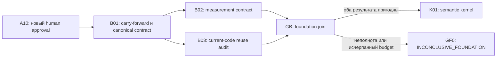

# Codeclew: оптимизированный базовый этап исследования

Дата: 9 августа 2026 года

Статус: `PROPOSED_AWAITING_HUMAN_APPROVAL`

Тип: successor-plan; завершённый план от 8 августа не изменяется

Язык исполнения: русский; идентификаторы и схемы — английские

## 1. Решение

Следующий запуск не повторяет старый `R01`. Он принимает содержательно
проверенный пакет `R01` как исторический вход нового плана и строит поверх него
короткий базовый этап:



Цель оптимизации — довести исследование до первого продукта-информативного
узла `K01`, затратив на базовый этап не более `140 000` noncached tokens,
`100` charged tool calls и не более `90` минут critical-path wall time. Если native
token telemetry недоступна, токены остаются `UNAVAILABLE`; bytes не заменяют
tokens, но charged-call/wall/context budgets продолжают действовать.

Сравнимый участок `B01` должен стоить не более `24` charged calls против `86`
producer-plus-verifier calls старого `R01`: целевое сокращение не менее `72%`.
Одноразовая подготовка исполнимого planning package `P10` учитывается отдельно:
all-in предел от design-only документа до GB равен `160k` noncached tokens и
`115` charged calls; повторные research runs P10 не выполняют.

## 2. Почему нужен новый digest и новый approval

Предыдущий approved DAG завершён корректно:

- commit: `dffd555e6562689cca04d457b82eb897d3bacc48`;
- plan digest:
  `83933d98913af3c4b016f674f73b76af3cfe4db190e30294ebb469d6d6cd6f93`;
- R01 raw content: `SUCCESS+NONE`, independent content verdict `ACCEPT`;
- R01 controller projection: `NO_PROGRESS+BUDGET_EXCEEDED`;
- terminal verdict: `INCONCLUSIVE_FOUNDATION`.

Новый план меняет critical path, budgets и gate semantics, поэтому старый
approval нельзя переносить. `A10` должен привязать новый plan digest к exact
historical input tuple:

```text
commit dffd555e6562689cca04d457b82eb897d3bacc48
R01 packet  539c752326d4a8526c141c320b41067e1b87adc379f3304cadeecbece31353b8
R01 receipt path
  evidence/graphs/83933d98913af3c4b016f674f73b76af3cfe4db190e30294ebb469d6d6cd6f93/receipts/R01/1/receipt.json
R01 receipt raw-file sha256
  7c3af3ec0d2390727502c38ef9ea9733c7e42f2d35c056940b5c2444f18bfe46
R01 internal canonical receiptDigest
  af4b6a54e9672785edffc6f1729396c9d42d3b53d89cf1457de6ee1f490223cb
R01 receipt digestScope
  RFC8785_CANONICAL_JSON_WITHOUT_RECEIPT_DIGEST
GF verification report
  evidence/graphs/83933d98913af3c4b016f674f73b76af3cfe4db190e30294ebb469d6d6cd6f93/receipts/GF/fresh-verification.md
  sha256 6bcfdb3dd50d502b9326a835b3fbfd85252e3cd76a7200dceb55fae928011be3
```

`A10` требует только явного сообщения пользователя в текущей Codex-сессии,
plan digest и проверку перечисленных refs. RSA/host attestation, два runtime
observer и доказательство криптографической личности не применяются.

До запроса A10 должен завершиться planning-only `P10`: materialization и
independent negative verification минимальных schemas/manifests/controller из
раздела 5.1. A10 привязывает их digests вместе с plan; непроверенные sidecars
нельзя добавлять после approval.

## 3. Факты, которые оптимизация обязана сохранить

Нельзя потерять полезность старого R01:

1. S0–S5 и их provenance/digests зафиксированы.
2. H01–H14, GP-001–GP-016, Q01–Q32, D01–D22 и T00–T23 существуют ровно по
   одному разу.
3. `UNVERIFIED` literature не может поддерживать gate.
4. H14 остаётся `UNTESTED_SCAFFOLD`.
5. Первый independent audit обнаружил реальные ошибки:
   stale plan digest, ложную HEAD provenance и асимметричные связи.
6. Исправленные связи и provenance нельзя восстановить из старой дефектной
   версии.
7. H01–H13 остаются `UNKNOWN_NOT_RUN`; новый план не повышает evidence class
   переносимых фактов.

Carry-forward — это явное решение нового человека над exact digest, а не
утверждение, что старый `R01` когда-либо открыл implementation edge.

## 4. Что удаляется из критического пути

| Старое обязательство R01 | Новое положение | Причина |
| --- | --- | --- |
| Повторно читать и пересказывать S0–S5 | Запрещено без source drift | Уже принято независимым verifier; нужен digest check, не новый summary |
| Ручная forward и reverse trace-таблица | Один canonical graph; views генерируются | Два источника правды породили asymmetry |
| Полностью разрешать opaque bibliography | Только citation, реально поддерживающие новый gate | `UNVERIFIED` уже исключены из gate |
| Проверять clickable evidence view | Убирается из базового этапа; остаётся historical R01 artifact | Не влияет на B02/B03/K01 |
| Проверять cross-language scaffold | Убирается из базового этапа; H14 остаётся `UNTESTED_SCAFFOLD` | Не влияет на primary product hypothesis |
| Формировать ответы 1–32 и deliverables 1–22 | Только historical terminal GF; GF0 ссылается на них | Не prerequisite разработки |
| Два runtime observer | Один deterministic controller invocation | Наблюдатели не поймали продуктовый дефект и создали launch noise |
| Встраивать все source bytes в controller case | Content-addressed refs | Старые cases заняли мегабайты и дублировали данные |
| Полный аудит после локальной правки | Запрещён; retry проверяет changed invariants | R01 retry доказал достаточность narrow verification |

Удалённые элементы не уничтожаются. Они остаются в commit `dffd555` как
historical/optional evidence и могут потребляться соответствующим downstream
узлом.

## 5. Единый источник правды

`B01` создаёт один `research-contract-v1.json`. JSON выбран намеренно: он
проверяется уже доступными `jq`/JSON tools и не требует нового YAML parser или
planning-side Ruby runtime. Только canonical JSON редактируется
человеком или агентом. Из него детерминированно генерируются:

- source/claim/hypothesis/gap views;
- reverse destination index;
- exact Q/D/T coverage report;
- compact Markdown summary;
- machine-readable gate inputs.

Generated views не коммитятся. CI запускает генератор повторно и требует
нулевой diff. Любая ручная правка generated view является ошибкой.

Однократная миграция дополнительно создаёт полный machine-readable
`migration-manifest-v1.json`. Для каждого принятого старого provenance field,
evidence class, status, falsifier и expanded edge он содержит:

```text
old artifact + record + field/edge + value hash
    -> new canonical record + field/edge + value hash
    | explicit retained-historical/drop reason
```

Importer обязан разобрать все строки принятых JSON/YAML/Markdown artifacts,
раскрыть ranges и завершиться ошибкой при любой непрочитанной строке, лишнем
поле или count mismatch. Поэтому initial migration доказывается полностью;
пять risk records ниже проверяют смысл, а не заменяют equivalence proof.

Минимальная запись contract:

```json
{
  "id": "SC-001",
  "evidenceClass": "SOURCE_GROUNDED",
  "sources": ["S0"],
  "hypotheses": ["H01", "H02", "H06"],
  "gaps": ["GP-001", "GP-002", "GP-006"],
  "destinations": ["B03", "K01", "E05", "E06", "GF"],
  "gateEligible": false,
  "falsifier": "..."
}
```

Canonical contract хранит expanded ID arrays. Диапазоны вроде `H01–H14` в
machine data запрещены: они допустимы только в generated prose.

### 5.1. Исполнимый bootstrap package P10

P10 — одноразовая подготовка plan package, не исследовательский node. Он
создаёт до A10:

```text
schemas/evidence/foundation-approval-v1.schema.json
schemas/evidence/foundation-packet-v1.schema.json
schemas/evidence/foundation-receipt-v1.schema.json
docs/superpowers/plans/codeclew-optimized-foundation-manifests-v1.json
scripts/verify-foundation-node.sh
```

Manifest содержит exact node IDs, allowed outcome/branch vocabulary, budgets,
pass predicates и outgoing edge matrix. Approval bundle после A10 находится в:

```text
evidence/graphs/${PLAN_DIGEST}/approval-bundle.json
```

Для каждого узла используются exact paths:

```text
evidence/graphs/${PLAN_DIGEST}/packets/${NODE}/${ATTEMPT}/packet.json
evidence/graphs/${PLAN_DIGEST}/receipts/${NODE}/${ATTEMPT}/receipt.json
evidence/graphs/${PLAN_DIGEST}/controller/${NODE}/${ATTEMPT}/result.json
```

`${PLAN_DIGEST}` — lowercase SHA-256 exact bytes этого Markdown plan;
`${NODE}` принадлежит `B01|B02|B03|GB`; `${ATTEMPT}` — `1|2`. После P10
placeholder `<new-plan>` запрещён во всех manifests и commands.

Единственная controller invocation:

```bash
./scripts/verify-foundation-node.sh \
  --plan docs/superpowers/plans/2026-08-09-codeclew-optimized-research-foundation-plan.md \
  --approval evidence/graphs/${PLAN_DIGEST}/approval-bundle.json \
  --manifest docs/superpowers/plans/codeclew-optimized-foundation-manifests-v1.json \
  --node ${NODE} \
  --packet evidence/graphs/${PLAN_DIGEST}/packets/${NODE}/${ATTEMPT}/packet.json \
  --receipt evidence/graphs/${PLAN_DIGEST}/receipts/${NODE}/${ATTEMPT}/receipt.json
```

Exit semantics:

```text
0   CONTROL_ACCEPT; stdout is canonical result JSON
2   CONTROL_REJECT; stdout contains stable rejectCode, no edge opens
3   INFRA_ERROR; retry only under infrastructure policy, no edge opens
64  invocation/usage error, no edge opens
```

Script записывает stdout byte-for-byte в controller result path и проверяет:
schema, approval/plan/manifest/source/model/topology/budget-policy digests,
node-specific budget digest, packet/receipt identity, independence, charged
calls/tokens/wall, retry ancestry и exact eligible edges. Source bytes в case
не копируются; resolver читает content-addressed refs из worktree.

P10 pass: positive cases B01/B02/B03/GB принимаются; mutations stale digest,
wrong node budget, illegal branch, non-independent verifier, dangling ref,
over-budget packet и unauthorized edge получают exact non-zero codes.

P10 budget: `20k` noncached, `4k` output, `15` charged calls, `20 min`,
`32 KiB` context. Его telemetry публикуется рядом с planning verification и
не смешивается с future node receipts.

## 6. Узлы оптимизированного базового этапа

### A10 — новый digest-bound human approval

**Evidence delta:** новый human decision для exact successor-plan и historical
input tuple.

**Pass:** одно явное сообщение пользователя; один read текущей session; один
mechanical digest check.

**Budget:** до `3` charged calls и `5 min`. Controller/observer agents не
создаются.

**Fail:** план остаётся proposed; `B01` закрыт.

### B01 — carry-forward и canonical research contract

**Вход:** approved A10, R01 packet/receipt и commit `dffd555`.

**Работа:**

1. Пересчитать exact historical refs.
2. Однократно мигрировать принятые source/hypothesis/gap/trace records в
   `research-contract-v1.json`; machine checker, а не второе ручное
   представление, доказывает set/ref closure.
3. Создать полный old→new `migration-manifest-v1.json` и доказать equality
   всех provenance/evidence-class/status/falsifier/expanded-edge значений.
4. Реализовать один generator/validator command.
5. Сгенерировать views во временную директорию и доказать determinism.
6. Независимый агент проверяет только semantic delta миграции и пять заранее
   фиксированных risk records: provenance `S1`, provenance `S3`, полный
   `SC-018 -> H01..H14`, `Q32 -> R01/GF0/GF` и `D17 -> K02`. Он не
   перечитывает S0–S5.

**Артефакты:**

```text
docs/research/codeclew/research-contract-v1.json
scripts/verify-research-contract.sh
evidence/graphs/${PLAN_DIGEST}/checks/B01/migration-manifest-v1.json
evidence/graphs/${PLAN_DIGEST}/checks/B01/report.json
```

**Pass predicate:**

- historical packet/receipt/digest exact;
- exact sets S0–S5, H01–H14, GP-001–GP-016, SC-001–SC-020,
  Q01–Q32, D01–D22, T00–T23;
- every ref resolves;
- every accepted old provenance/evidence-class/status/falsifier/expanded-edge
  value имеет ровно один equal new target либо approved retained/drop reason;
- unparsed old rows/fields `= 0`, unmapped new rows/fields `= 0`;
- reverse views reproduce from canonical edges with zero asymmetry;
- no `UNVERIFIED` record is gate-eligible;
- H01–H13 `UNKNOWN_NOT_RUN`, H14 `UNTESTED_SCAFFOLD`;
- two consecutive generations are byte-identical;
- independent semantic sample has zero mismatch.

**Branch codes:** `NONE`, `SOURCE_DRIFT`, `MIGRATION_MISMATCH`,
`NONDETERMINISTIC_VIEW`, `STOP_LOSS_TRIGGERED`, `BUDGET_EXCEEDED`.

**Budget:** `30k` noncached tokens, `6k` output tokens, `24` charged calls,
`20 min`, `32 KiB` max visible context. В budget входят orchestrator, producer,
verifier, validation, retry и wait calls.

**Stop-loss:** на `12` charged calls должен существовать schema-valid canonical
contract, полный migration manifest и первый deterministic report. Иначе узел
завершает `NO_PROGRESS+STOP_LOSS_TRIGGERED`; `BUDGET_EXCEEDED` используется
только при фактическом достижении ceiling. Scope не расширяется.

### B02 — measurement contract

**Зависимость:** B01 `SUCCESS+NONE`.

**Работа:** переиспользовать bootstrap schemas и негативные fixtures, создав
минимальный v1 contract для реальных сравнительных runs:

- native input/cached/output/noncached tokens;
- action/wait calls и event clock;
- model/topology/base/budget parity;
- correctness-first acceptance;
- exclusions, retries, missing-data и no-progress policy;
- corpus commitment и final-system lock.

GF 1–32/1–22 schemas, browser UI и cross-language contracts сюда не входят.

**Evidence delta:** будущий default/AST-index/Codeclew run нельзя принять без
сопоставимой стоимости, correctness и immutable task/system tuple.

**Pass predicate:** один positive fixture и минимальный negative suite
отвергают mismatched outcome, dangling ref, missing token telemetry laundering,
budget drift и topology mismatch. Native telemetry `UNAVAILABLE` не блокирует
semantic design, но навсегда запрещает token-win claim для таких runs.

**Budget:** `45k` noncached, `8k` output, `30` charged calls, `45 min`,
`32 KiB` context. Stop-loss на `15` calls: positive round-trip плюс хотя бы
три negative fixtures должны проходить.

**Branch codes:** `NONE`, `TOKEN_TELEMETRY_UNAVAILABLE`,
`BLOCK_MEASUREMENT_CONTRACT`, `STOP_LOSS_TRIGGERED`, `BUDGET_EXCEEDED`.

При недостижении half-budget milestone B02 выдаёт
`NO_PROGRESS+STOP_LOSS_TRIGGERED`, а не ложное `BUDGET_EXCEEDED`.

### B03 — current-code reuse audit

**Зависимость:** B01 `SUCCESS+NONE`; выполняется параллельно B02.

**Работа:** проверить существующие Rust core, Kotlin 2.1.21/2.3.0/2.4.10
workers, Gradle/Maven contour, SQLite index, Thread IR, transaction/CAS/recovery
и SThread skill. Навигация сначала использует Codeclew/structured facts;
fallback search записывается как evidence, а не скрывается.

**Артефакты:** одна code-linked capability matrix, один measured workload
report и один ADR `reuse | extend | replace`. Новая graph/OWL/hypergraph
служба запрещена без измеримого `>=25%` улучшения и без correctness loss.

**Evidence delta:** каждое предлагаемое изменение либо переиспользует
существующую capability, либо связано с воспроизводимым measured gap.

**Pass predicate:** independent verifier воспроизводит три representative
queries, одну update/invalidation path и один transaction/recovery path; ADR
соответствует измерениям; parallel source-of-truth не появляется.

Frozen representative fixtures на commit `dffd555`:

| ID | Query/operation | Expected result |
| --- | --- | --- |
| `B03-Q1` | Resolve `RepositoryIndex::stage_update` in `crates/sthread/src/index.rs` and its local dependency | Unique declaration; call to `update_from_root`; staged/private database precedes publication |
| `B03-Q2` | Resolve `graph::slice` in `crates/sthread/src/graph.rs` | Unique declaration; bounded node/deadline policy; DEF_USE implies PHI_INPUT; unsupported/external boundary remains partial |
| `B03-Q3` | Resolve `transaction::commit` in `crates/sthread/src/transaction.rs` | Unique declaration; Git target ref and repository-index snapshot are both checked; recovery/idempotency path is visible |
| `B03-U1` | Run one content-change `RepositoryIndex::update_from_root` fixture | Stable unchanged facts; typed invalidation for changed project/classpath/options/source inputs; reproducible index hash |
| `B03-T1` | Run transaction stale-snapshot/recovery fixture | Stale index requires reslice; validated candidate cannot publish through a mismatched target-ref CAS |

Worker-version reproduction additionally runs the existing Kotlin `2.1.21`
and Maven/Kotlin `2.3.0` integration tests and checks the exact `2.4.10` worker
mapping in `worker.rs`; nearest-version substitution is forbidden.

Frozen execution manifest (все команды запускаются из repository root):

| Probe | Exact fixture/test source | Exact command | Accept predicate |
| --- | --- | --- | --- |
| `B03-Q1` | `crates/sthread/src/index.rs::index::tests::staged_index_is_invisible_until_atomic_publish` | `cargo test -p sthread --lib index::tests::staged_index_is_invisible_until_atomic_publish -- --exact` | exit `0`; named test `ok`; capability matrix resolves ровно один `stage_update`, его call to `update_from_root` и publish-after-stage path |
| `B03-Q2` | embedded graph fixtures in `crates/sthread/src/graph.rs`; `fixtures/kotlin-basic` via `crates/sthread/tests/golden_language.rs` | `cargo test -p sthread --lib graph::tests::adds_phi_def_use_and_control_dependencies -- --exact`; `cargo test -p sthread --lib graph::tests::budget_is_explicitly_partial -- --exact`; `cargo test -p sthread --test golden_language k2_fir_golden_language_and_slice_matrix -- --exact` | all exit `0`; all three named tests `ok`; assertions retain PHI/DEF_USE/control deps, budget partiality and external-boundary partiality |
| `B03-Q3` | `fixtures/kotlin-basic` copied by `crates/sthread/tests/concurrency_matrix.rs::{mandatory_concurrency_matrix,callee_formatting_replays_and_same_import_merges_idempotently}` | `cargo test -p sthread --test concurrency_matrix mandatory_concurrency_matrix -- --exact`; `cargo test -p sthread --test concurrency_matrix callee_formatting_replays_and_same_import_merges_idempotently -- --exact` | both exit `0`; both named tests `ok`; assertions cover target-ref movement, stale reslice, recovered pre-CAS candidate and idempotent replay |
| `B03-U1` | embedded `A.kt` fixtures in three `crates/sthread/src/index.rs` tests | `cargo test -p sthread --lib index::tests::unchanged_files_are_not_rewritten -- --exact`; `cargo test -p sthread --lib index::tests::classifies_body_summary_signature_and_abi_invalidation -- --exact`; `cargo test -p sthread --lib index::tests::failed_stage_preserves_published_snapshot -- --exact` | all exit `0`; named tests `ok`; unchanged rewrite count is `0`, changed facts/invalidation set is exact, failed stage preserves published hash |
| `B03-T1` | `fixtures/kotlin-basic` copied by `crates/sthread/tests/concurrency_matrix.rs::{mandatory_concurrency_matrix,callee_formatting_replays_and_same_import_merges_idempotently}` | `cargo test -p sthread --test concurrency_matrix mandatory_concurrency_matrix -- --exact`; `cargo test -p sthread --test concurrency_matrix callee_formatting_replays_and_same_import_merges_idempotently -- --exact` | both exit `0`; both named tests `ok`; `StaleRequiresReslice`, target-ref CAS recovery actions and idempotency assertions pass |
| `B03-W1` | `fixtures/kotlin-2-1`; `crates/sthread/tests/kotlin21.rs::selects_matching_kotlin_21_worker_and_resolves_extension_names` | `cargo test -p sthread --test kotlin21 selects_matching_kotlin_21_worker_and_resolves_extension_names -- --exact` | exit `0`; named test `ok`; exact `2.1.21` and `2.4.10` worker/compiler assertions pass |
| `B03-W2` | `fixtures/kotlin-maven`; two named tests in `crates/sthread/tests/maven.rs` | `cargo test -p sthread --test maven opens_maven_kotlin_23_project_with_exact_worker_and_build_plan -- --exact`; `cargo test -p sthread --test maven indexes_and_resolves_maven_sources_with_k2 -- --exact` | both exit `0`; both named tests `ok`; Maven model and K2 resolution use exact `2.3.0` worker |

Semicolon separates sequential commands, not shell chaining: orchestrator emits
each as an individual charged action and records its own exit/output. P10
copies this table byte-for-byte into the machine manifest; изменение команды,
test ID, fixture path или predicate после A10 запрещено.

**Budget:** `55k` noncached, `10k` output, `35` charged calls, `50 min`,
`48 KiB` context. Stop-loss на `17` calls: capability matrix должна покрывать
все перечисленные existing subsystems и содержать хотя бы один воспроизводимый
measurement.

**Branch codes:** `NONE`, `NARROW_BASELINE_CONTOUR`,
`REWORK_ARCHITECTURE`, `BLOCK_BASELINE_REGRESSION`, `STOP_LOSS_TRIGGERED`,
`BUDGET_EXCEEDED`.

При недостижении half-budget milestone B03 выдаёт
`NO_PROGRESS+STOP_LOSS_TRIGGERED`.

### GB — foundation join

**Вход:** exact accepted receipts B02 и B03.

**Работа:** только mechanical join. Общие
`plan/source/model/topology/budget-policy` digests B02 и B03 должны совпадать.
Индивидуальный `budgetDigest` каждого receipt сравнивается со своей строкой
approved plan; B02 и B03 budget digests не обязаны и не могут быть равны.
Новое исследование запрещено.

Exact success matrix:

| B02 accepted packet | B03 accepted packet | GB branch | K01 |
| --- | --- | --- | --- |
| `SUCCESS+NONE` | `SUCCESS+NONE` | `NONE` | открыт |
| `SUCCESS+TOKEN_TELEMETRY_UNAVAILABLE` | `SUCCESS+NONE` | `TOKEN_CLAIMS_UNAVAILABLE` | открыт; token-win запрещён |
| `SUCCESS+NONE` | `SUCCESS+NARROW_BASELINE_CONTOUR` | `NARROW_BASELINE_CONTOUR` | открыт на narrowed contour |
| `SUCCESS+TOKEN_TELEMETRY_UNAVAILABLE` | `SUCCESS+NARROW_BASELINE_CONTOUR` | `NARROW_BASELINE_AND_TOKEN_CLAIMS_UNAVAILABLE` | открыт на narrowed contour; token-win запрещён |

Любая другая outcome/branch комбинация не открывает K01.

**Terminal output:** `INCONCLUSIVE_FOUNDATION`, если contract/correctness/reuse
evidence неполны, сработал stop-loss или один из budgets исчерпан. GB направляет
его в `GF0`, который создаёт компактное current-run terminal decision и
ссылается на уже принятые historical GF answers 1–32/deliverables 1–22. Новый
полный GF-report на этом раннем выходе не генерируется.

**Budget:** `10k` noncached, `2k` output, `8` charged calls, `10 min`,
`16 KiB` context. Независимый agent здесь не перечитывает B01–B03: он проверяет
только receipts, join mapping и отсутствие implementation edge на terminal
branch.

### 6.1. Exact outcome/branch/edge contract

| Node | Packet outcome + branch | Eligible edge |
| --- | --- | --- |
| B01 | `SUCCESS+NONE` | `B01->B02`, `B01->B03` |
| B01 | `BLOCKED+SOURCE_DRIFT` | `B01->GF0` после exhausted/terminal normalization |
| B01 | `BLOCKED+MIGRATION_MISMATCH` | `B01->GF0` после exhausted/terminal normalization |
| B01 | `BLOCKED+NONDETERMINISTIC_VIEW` | `B01->GF0` после exhausted/terminal normalization |
| B01 | `NO_PROGRESS+STOP_LOSS_TRIGGERED` | `B01->GF0` |
| B01 | `NO_PROGRESS+BUDGET_EXCEEDED` | `B01->GF0` |
| B02 | `SUCCESS+NONE` | `B02->GB` |
| B02 | `SUCCESS+TOKEN_TELEMETRY_UNAVAILABLE` | `B02->GB` |
| B02 | `BLOCKED+BLOCK_MEASUREMENT_CONTRACT` | `B02->GF0` после exhausted/terminal normalization |
| B02 | `NO_PROGRESS+STOP_LOSS_TRIGGERED` | `B02->GF0` |
| B02 | `NO_PROGRESS+BUDGET_EXCEEDED` | `B02->GF0` |
| B03 | `SUCCESS+NONE` | `B03->GB` |
| B03 | `SUCCESS+NARROW_BASELINE_CONTOUR` | `B03->GB` |
| B03 | `BLOCKED+REWORK_ARCHITECTURE` | `B03->GF0` после exhausted/terminal normalization |
| B03 | `BLOCKED+BLOCK_BASELINE_REGRESSION` | `B03->GF0` после exhausted/terminal normalization |
| B03 | `NO_PROGRESS+STOP_LOSS_TRIGGERED` | `B03->GF0` |
| B03 | `NO_PROGRESS+BUDGET_EXCEEDED` | `B03->GF0` |
| GB | `SUCCESS+NONE` | `GB->K01` |
| GB | `SUCCESS+TOKEN_CLAIMS_UNAVAILABLE` | `GB->K01` |
| GB | `SUCCESS+NARROW_BASELINE_CONTOUR` | `GB->K01` |
| GB | `SUCCESS+NARROW_BASELINE_AND_TOKEN_CLAIMS_UNAVAILABLE` | `GB->K01` |
| GB | `SUCCESS+INCONCLUSIVE_FOUNDATION` | `GB->GF0` only |

Каждая строка выше становится отдельной строкой machine manifest. Generic
execution/infra failures никогда не открывают K01.

## 7. Общий бюджет

| Узел | Noncached tokens | Output tokens | Charged calls | Wall | Context |
| --- | ---: | ---: | ---: | ---: | ---: |
| A10 | `n/a` | `n/a` | `3` | `5 min` | `8 KiB` |
| B01 | `30k` | `6k` | `24` | `20 min` | `32 KiB` |
| B02 | `45k` | `8k` | `30` | `45 min` | `32 KiB` |
| B03 | `55k` | `10k` | `35` | `50 min` | `48 KiB` |
| GB | `10k` | `2k` | `8` | `10 min` | `16 KiB` |
| **Всего** | **`140k`** | **`26k`** | **`100`** | **`<=85 min critical path`** | **`48 KiB max`** |

Одноразовый P10 добавляет `20k` noncached, `4k` output, `15` calls и `20 min`.
All-in preparation + one research run: `160k`, `30k`, `115` calls и не более
`105 min`; следующие runs остаются в execution budget `140k/26k/100/85 min`.

Старый bootstrap budget R01+R02+R03 составлял `400k` noncached tokens и
`190` tool calls. Execution-only предел сокращает token budget на `65%` и call
budget примерно на `47%`; all-in first-run предел — на `60%` и примерно `39%`.
Сравнимый source-freeze участок сокращается на `72%`.

`Charged call` — любой emitted tool call, включая exec/edit/browser/agent,
controller и wait. В receipt action и wait calls показываются раздельно, но
оба входят в ceiling. Это сохраняет прямую сопоставимость с историческими
`86` calls и не позволяет спрятать orchestration overhead.

## 8. Правило эффективности каждого гейта

После каждого узла receipt обязан содержать:

```text
accepted evidence delta
hypothesis/gap affected
producer/verifier/orchestrator action and wait calls
charged total and wall time
native input/cached/output/noncached tokens or UNAVAILABLE
defect prevented by gate
retry scope and changed invariant set
gate verdict: KEEP | NARROW | SIMPLIFY | REMOVE | STOP
one applied change to the next node
```

Gate сохраняется в следующей версии только если он:

1. поймал реальный дефект; или
2. механически защищает correctness/safety invariant с известным
   counterexample; или
3. создаёт artifact, который читает непосредственный successor.

Gate, который лишь повторяет accepted predecessor и не меняет evidence,
получает `SIMPLIFY` или `REMOVE`.

Метрики базового этапа:

- `evidence-producing action ratio >= 0.60` среди non-wait calls;
- `duplicate source reads = 0` после B01, если source digest не изменился;
- narrow retry `<= 30%` charged calls первоначального audit;
- discarded permanent artifacts `= 0`;
- manual derived-view edits `= 0`;
- каждый research node B01–B03 закрывает/сужает хотя бы один зарегистрированный
  gap; human A10 и mechanical GB от этого требования освобождены;
- B01 достигает `>=72%` call reduction относительно старого R01.

Три перечисленные diagnostics (`evidence-producing action ratio`, duplicate
source reads, discarded permanent artifacts) до принятия B02 являются advisory и не могут
открывать/закрывать B01. B02 фиксирует event schema: каждый call получает
`ACTION|WAIT` и для ACTION одну категорию
`EVIDENCE|VALIDATION|ORCHESTRATION|REWORK|DISCARDED`; source read имеет
`path+sha256`, permanent artifact — `path+consumedBy`. После B02 эти метрики
вычисляются механически и становятся gate-eligible.

## 9. Верификация без церемониального overhead

Каждый узел использует ровно три слоя:

1. **Mechanical:** один repo-local command проверяет schema, digests, sets,
   refs, budgets и determinism.
2. **Independent semantic:** отдельный агент читает только changed semantic
   decisions и machine report; он не повторяет mechanical traversal.
3. **Controller:** один invocation проверяет packet/receipt/eligible edge.

Запрещено:

- два runtime observer для одного локального состояния;
- копировать source bytes в controller case;
- использовать разные forward/reverse truth sources;
- повторять browser smoke после изменения enum/hash;
- повторять полный source audit после локальной правки;
- оценивать tokens через bytes;
- повышать budget после просмотра outcome.

Retry разрешён один раз только если:

- failure fingerprint изменяем;
- changed paths и changed invariants перечислены;
- remaining charged-call/token/wall budget положителен;
- verifier получает только delta packet.

Retry ceiling равен
`floor(initial_attempt_charged_calls * 0.30)` и одновременно ограничен
оставшимся node budget. При результате `0` retry запрещён. Initial attempt —
все charged calls от node start до первого independent verdict включительно.

## 10. Гипотезы оптимизации

| ID | Гипотеза | PASS | Falsifier |
| --- | --- | --- | --- |
| OF1 | Accepted R01 evidence можно безопасно перенести без полного reread. | B01 exact-set/digest/determinism PASS и semantic sample `0` mismatches. | Любой потерянный/изменённый accepted record или source drift. |
| OF2 | Canonical graph устраняет trace-repair workload. | Два поколения byte-identical; asymmetry конструктивно невозможна. | Нужна ручная reverse-table правка. |
| OF3 | Удаление нецелевых артефактов не ослабляет B02/B03/K01. | Ни один immediate successor не читает bibliography/UI/cross-language artifacts. | Successor требует удалённый artifact для своего pass predicate. |
| OF4 | Новый B01 существенно дешевле R01. | `<=24` charged calls и `>=72%` reduction; correctness не ниже. | `>24` calls либо independent mismatch. |
| OF5 | Независимый аудит остаётся полезным после сужения. | Он ловит semantic defect либо подтверждает changed decision в `<=10` calls. | Повторяет только mechanical checks или превышает budget. |
| OF6 | Базовый этап способен дойти до K01. | B02+B03 входят в четыре exact success combinations, GB открывает `GB->K01` в общем budget. | Terminalization до K01 по причине process overhead. |

OF4 и OF6 — обязательные критерии успеха оптимизации. Если OF6 опровергнута
второй раз именно process overhead, текущая доказательная архитектура
останавливается и заменяется обычным preregistered experiment protocol без
per-node proof packets.

## 11. Пошаговый порядок для оркестратора

1. Выполнить P10, независимо проверить sidecars и опубликовать их digests.
2. Получить новый human approval на exact digest документа, sidecars и
   historical input tuple.
3. Запустить B01 одним producer; не создавать дополнительные discovery agents.
4. На половине B01 budget проверить stop-loss.
5. Запустить одного independent B01 verifier с canonical report и changed
   records, не с полным transcript.
6. После B01 параллельно запустить B02 и B03.
7. Для B01–B03 применять половинный stop-loss и delta-only retry.
8. Выполнить GB одним mechanical join и коротким независимым edge audit.
9. Если GB открывает K01, начать первый product-semantic node; если terminal,
   направить GB в GF0 и выпустить только compact current-run decision со
   ссылкой на historical GF 1–32/1–22.

## 12. Критерий approval и начала исполнения

Этот документ пока design-only и не разрешает B01. Для запуска пользователь
должен явно одобрить:

- carry-forward accepted R01 content despite its old budget terminalization;
- новый DAG A10/B01/B02/B03/GB;
- budgets и stop-loss rules;
- перенос bibliography/UI/cross-language из critical path;
- замену двух runtime observers одним deterministic controller invocation.

До approval выполняется P10. Затем создаётся новый plan digest и минимальный
approval bundle, привязанный к plan, sidecars и historical tuple. Старые
receipts остаются immutable historical inputs.
