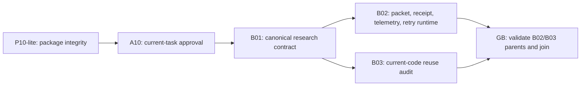

# Codeclew: amendment P10-lite

Дата: 9 августа 2026 года

Статус: `PROPOSED_AWAITING_HUMAN_APPROVAL`

Base plan SHA-256:
`80f2b7308c0e4eb51c6376931591dc389d0c08e6d7dc75a4ab757b7395506a34`

Rejected P10 evidence:
`docs/experiments/codeclew-p10-execution-2026-08-09.md` at
`65431d7bc58401e09f9733c14c4106fde6270d07fac0b49043664ad588f322fa`.

## 1. Решение

P10 заменяется на `P10-lite`. DAG `A10 -> B01 -> B02/B03 -> GB` и критерии
K01/GF0 не меняются. Меняется только ownership доказательств до A10.



## 2. P10-lite обязан доказать

Только следующие инварианты:

1. Exact bytes base plan, amendment, lite manifest, lite controller, rejected
   P10 report и frozen runtime prototype связаны approval bundle.
2. Approval ссылается на одно user-authored событие текущей Codex-задачи;
   RSA/host attestation и runtime observers отсутствуют.
3. Controller вычисляет собственный raw SHA и требует его в approval bundle.
4. Frozen prototype manifest имеет raw SHA
   `0a6bf73f5a1fd795272c76afc19dc35d59106cae29c8e6395ab03487cfeee539`
   и `planContractDigest`
   `cd50b780bdf5a0ea04f2ae48fa3a44523743760f43268fd3ecd7d8cb2eb2f5a3`.
   Это сохраняет статические 22 rows, 4 budgets и 7 B03 probes, но не принимает
   runtime validator prototype.
5. Любое несовпадение digest, artifact set или event shape закрывает B01.

P10-lite не валидирует EvidencePacket/VerificationReceipt, telemetry, retry
ancestry, B02/B03 parents или GB outcome. Он не имеет права утверждать
correctness этих механизмов.

## 3. Перенос ответственности

| Доказательство | Новый owner | Pass evidence |
| --- | --- | --- |
| Packet/receipt Draft 2020 instance contract | B02 | Полный repo-owned validator и negative fixtures |
| Native-token branch coupling | B02 | `false -> TOKEN_TELEMETRY_UNAVAILABLE`, token claim forbidden |
| Retry cumulative calls/tokens/wall | B02 | Prior receipts + exact remaining-budget equations |
| B02/B03 receipt integrity и four-way join | GB | Content-addressed parent replay и exact matrix |
| Parent/retry TOCTOU closure | B02/GB | Snapshot or recheck immediately before publication |

Текущие `foundation-*-v1.schema.json`, full manifest и
`verify-foundation-node.sh` остаются `REJECTED_PROTOTYPE`. Их можно читать как
negative evidence, но нельзя использовать для открытия edge.

## 4. Исполнимый package

```text
docs/superpowers/plans/codeclew-p10-lite-manifest-v1.json
scripts/verify-p10-lite.sh
```

Controller normal invocation:

```bash
./scripts/verify-p10-lite.sh \
  --plan docs/superpowers/plans/2026-08-09-codeclew-optimized-research-foundation-plan.md \
  --amendment docs/superpowers/plans/2026-08-09-codeclew-p10-lite-amendment.md \
  --manifest docs/superpowers/plans/codeclew-p10-lite-manifest-v1.json \
  --approval evidence/graphs/AMENDMENT_DIGEST/approval-bundle.json
```

Exit semantics: `0 CONTROL_ACCEPT`, `2 CONTROL_REJECT`, `3 INFRA_ERROR`,
`64 USAGE_ERROR`. TEST_ONLY принимается только внутренним `--self-test`.

## 5. Gate и бюджет pilot

P10-lite package принимается, если:

- self-test принимает один positive case;
- stale plan/amendment/manifest/controller/report/prototype, wrong artifact set,
  invalid current-task event, extra field и external TEST_ONLY получают exact
  reject codes;
- свежий независимый агент воспроизводит проверки и возвращает `ACCEPT`;
- никакой runtime packet/receipt/GB claim не появляется.

Pilot измеряет стоимость без повышения старого P10 ceiling задним числом.
Кандидат для будущих runs: не более `12` all-team charged calls. Если pilot
дороже, новый ceiling не утверждается, а amendment возвращается на упрощение.

## 6. Approval

До явного сообщения пользователя amendment остаётся proposed. После approval
A10 создаёт bundle, который привязывает exact digests шести artifacts и
user-event текущей Codex-задачи. Один факт approval достаточен; дополнительных
observer/attestation нет.
